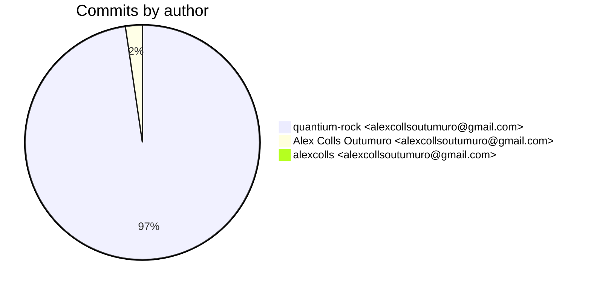
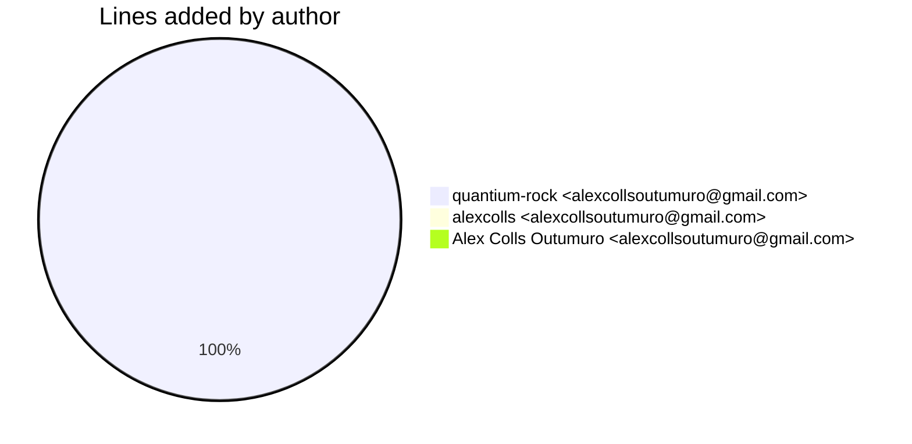
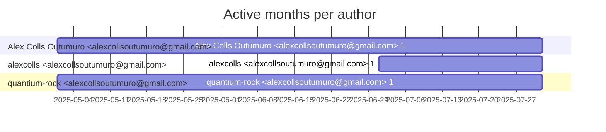

# Git Evaluation — ExtractionPipeline-lab

Repo: `/home/quantium/labs/oriane/_deprecated/ExtractionPipeline-lab`

## Summary

| Metric | Value |
|---|---:|
| Current tracked files | 14740 |
| Current lines of code (tracked) | 5705980 |
| Commits (total) | 130 |
| Commits (merges) | 4 |
| Commits (non-merges) | 126 |
| Unique authors | 1 |
| First commit | 2025-05-16T12:29:52+02:00 |
| Last commit | 2025-07-28T16:47:30+02:00 |
| Active days | 29 |
| Span days | 74 |
| Avg commits/day | 1.7568 |
| Lines added (sum) | 4897360 |
| Lines deleted (sum) | 396945 |
| Files touched (sum of numstat rows) | 24813 |
| Estimated hours (session-based) | 341.92 |

## Developer leaderboard

| Developer | Commits | Hours | Added | Deleted | Files | Active days | First | Last | Avg size | Median size | Stars |
|---|---:|---:|---:|---:|---:|---:|---|---|---:|---:|:--:
| quantium-rock <alexcollsoutumuro@gmail.com> | 126 | 334.72 | 4896791 | 396581 | 24800 | 27 | 2025-05-16T12:40:00+02:00 | 2025-07-18T16:25:42+02:00 | 42010.89 | 379.5 | ★★★★★ |
| Alex Colls Outumuro <alexcollsoutumuro@gmail.com> | 3 | 4.5 | 35 | 1 | 3 | 3 | 2025-05-16T12:29:52+02:00 | 2025-07-28T16:47:30+02:00 | 12.0 | 2.0 | ☆☆☆☆☆ |
| alexcolls <alexcollsoutumuro@gmail.com> | 1 | 2.7 | 534 | 363 | 10 | 1 | 2025-07-05T20:13:29+02:00 | 2025-07-05T20:13:29+02:00 | 897.0 | 897.0 | ☆☆☆☆☆ |

## Commits by author

## Lines added by author

## Effort estimation model

This report estimates effort using a session + commit-weighted heuristic:
- Split commits per author into sessions where the gap > SESSION_GAP_MINUTES.
- Per session, sum per-commit minutes: base + sqrt(lines)/10 * MINUTES_PER_100_LINES + files * MINUTES_PER_FILE.
- Enforce MIN_SESSION_MINUTES minimum per session.
- Sum per day with MAX_HOURS_PER_DAY cap; multiply by CALIBRATION_FACTOR.

Parameters:

| Param | Value |
|---|---:|
| SESSION_GAP_MINUTES | 90 |
| MAX_HOURS_PER_DAY | 10.0 |
| MIN_SESSION_MINUTES | 45.0 |
| MINUTES_PER_COMMIT_BASE | 15.0 |
| MINUTES_PER_100_LINES | 12.0 |
| MINUTES_PER_FILE | 3.0 |
| CALIBRATION_FACTOR | 2.0 |

## Monthly activity

| Month | Commits | Added | Deleted | Files | Chart |
|---|---:|---:|---:|---:|:---|
| 2025-05 | 38 | 404754 | 367883 | 8941 | ########################### |
| 2025-06 | 35 | 135805 | 19793 | 606 | ######################### |
| 2025-07 | 57 | 4356801 | 9269 | 15266 | ######################################## |

## Author activity timeline

## Highlights

- Longest active streak: 6 days (2025-07-05 to 2025-07-10)
- Best day by commits: 2025-07-07 — 13 commits
- Best day by lines added: 2025-07-18 — 3971103 lines

