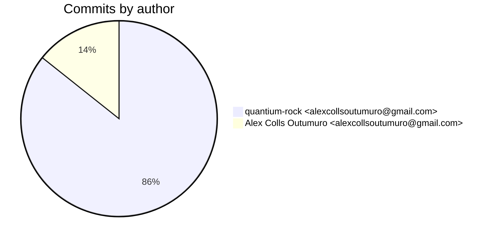
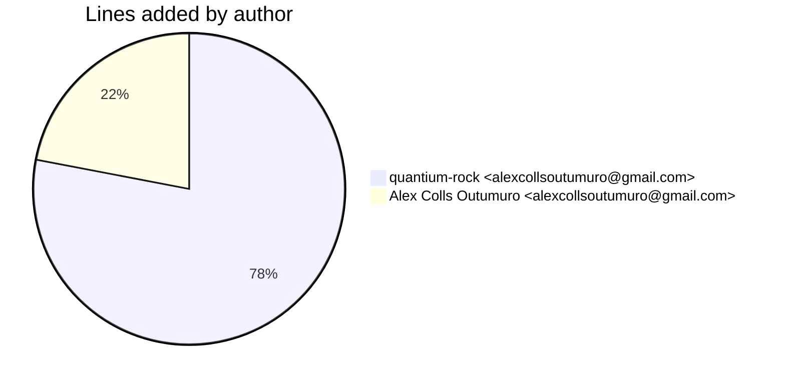
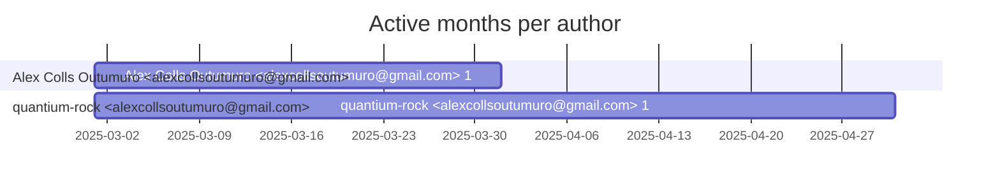

# Git Evaluation — FramesComparer-lambda

Repo: `/home/quantium/labs/oriane/_deprecated/FramesComparer-lambda`

## Summary

| Metric | Value |
|---|---:|
| Current tracked files | 9 |
| Current lines of code (tracked) | 656 |
| Commits (total) | 7 |
| Commits (merges) | 0 |
| Commits (non-merges) | 7 |
| Unique authors | 1 |
| First commit | 2025-03-30T23:52:32+02:00 |
| Last commit | 2025-04-03T03:54:49+02:00 |
| Active days | 3 |
| Span days | 5 |
| Avg commits/day | 1.4 |
| Lines added (sum) | 796 |
| Lines deleted (sum) | 140 |
| Files touched (sum of numstat rows) | 15 |
| Estimated hours (session-based) | 8.63 |

## Developer leaderboard

| Developer | Commits | Hours | Added | Deleted | Files | Active days | First | Last | Avg size | Median size | Stars |
|---|---:|---:|---:|---:|---:|---:|---|---|---:|---:|:--:
| quantium-rock <alexcollsoutumuro@gmail.com> | 6 | 7.13 | 621 | 140 | 13 | 2 | 2025-03-31T08:51:20+02:00 | 2025-04-03T03:54:49+02:00 | 126.83 | 77.5 | ★★★★★ |
| Alex Colls Outumuro <alexcollsoutumuro@gmail.com> | 1 | 1.5 | 175 | 0 | 2 | 1 | 2025-03-30T23:52:32+02:00 | 2025-03-30T23:52:32+02:00 | 175.0 | 175.0 | ★☆☆☆☆ |

## Commits by author

## Lines added by author

## Effort estimation model

This report estimates effort using a session + commit-weighted heuristic:
- Split commits per author into sessions where the gap > SESSION_GAP_MINUTES.
- Per session, sum per-commit minutes: base + sqrt(lines)/10 * MINUTES_PER_100_LINES + files * MINUTES_PER_FILE.
- Enforce MIN_SESSION_MINUTES minimum per session.
- Sum per day with MAX_HOURS_PER_DAY cap; multiply by CALIBRATION_FACTOR.

Parameters:

| Param | Value |
|---|---:|
| SESSION_GAP_MINUTES | 90 |
| MAX_HOURS_PER_DAY | 10.0 |
| MIN_SESSION_MINUTES | 45.0 |
| MINUTES_PER_COMMIT_BASE | 15.0 |
| MINUTES_PER_100_LINES | 12.0 |
| MINUTES_PER_FILE | 3.0 |
| CALIBRATION_FACTOR | 2.0 |

## Monthly activity

| Month | Commits | Added | Deleted | Files | Chart |
|---|---:|---:|---:|---:|:---|
| 2025-03 | 6 | 782 | 125 | 13 | ######################################## |
| 2025-04 | 1 | 14 | 15 | 2 | ####### |

## Author activity timeline

## Highlights

- Longest active streak: 2 days (2025-03-30 to 2025-03-31)
- Best day by commits: 2025-03-31 — 5 commits
- Best day by lines added: 2025-03-31 — 607 lines

