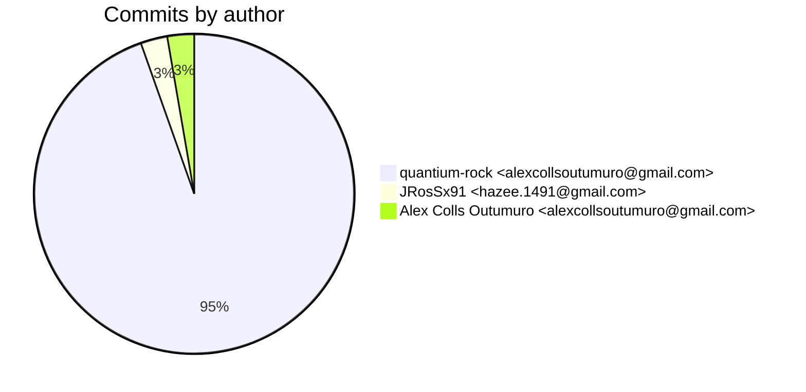
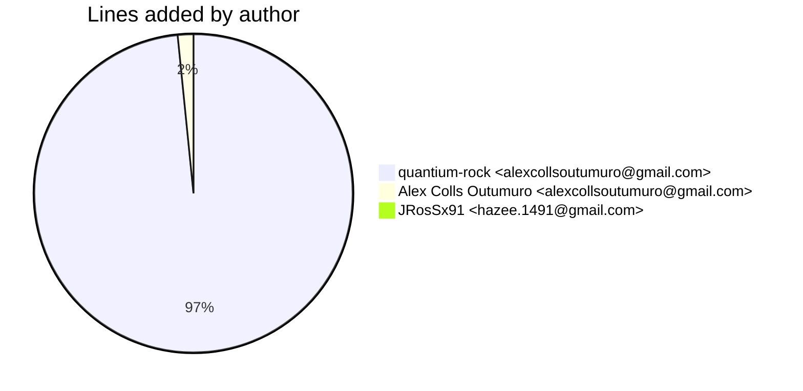
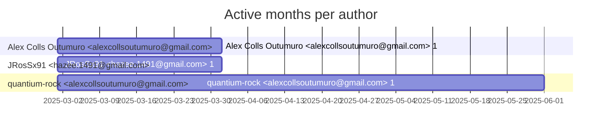

# Git Evaluation — InstagramContentCollector-lambda

Repo: `/home/quantium/labs/oriane/_deprecated/InstagramContentCollector-lambda`

## Summary

| Metric | Value |
|---|---:|
| Current tracked files | 23 |
| Current lines of code (tracked) | 8381 |
| Commits (total) | 37 |
| Commits (merges) | 0 |
| Commits (non-merges) | 37 |
| Unique authors | 2 |
| First commit | 2025-03-21T10:39:55+01:00 |
| Last commit | 2025-05-27T20:23:56+02:00 |
| Active days | 11 |
| Span days | 68 |
| Avg commits/day | 0.5441 |
| Lines added (sum) | 8760 |
| Lines deleted (sum) | 1715 |
| Files touched (sum of numstat rows) | 84 |
| Estimated hours (session-based) | 24.6 |

## Schedule footprint

| Metric | Count |
|---|---:|
| Weekend days active (Sat/Sun) | 2 |
| Weekday days active | 9 |
| Night days active | 1 |
| Daytime days active | 10 |
| Days with both day & night activity | 0 |
| Day-only days | 10 |
| Night-only days | 1 |

## Developer leaderboard

| Developer | Commits | Hours | Wknd days | Night days | Day days | Both | Added | Deleted | Files | Active days | First | Last | Avg size | Median size | Stars |
|---|---:|---:|---:|---:|---:|---:|---:|---:|---:|---:|---|---|---:|---:|:--:
| quantium-rock <alexcollsoutumuro@gmail.com> | 35 | 23.1 | 2 | 1 | 9 | 0 | 8540 | 1603 | 81 | 10 | 2025-03-21T15:43:06+01:00 | 2025-05-27T20:23:56+02:00 | 289.8 | 15.0 | ★★★★★ |
| JRosSx91 <hazee.1491@gmail.com> | 1 | 0.75 | 0 | 0 | 1 | 0 | 82 | 112 | 1 | 1 | 2025-03-24T18:06:43+01:00 | 2025-03-24T18:06:43+01:00 | 194.0 | 194.0 | ☆☆☆☆☆ |
| Alex Colls Outumuro <alexcollsoutumuro@gmail.com> | 1 | 0.75 | 0 | 0 | 1 | 0 | 138 | 0 | 2 | 1 | 2025-03-21T10:39:55+01:00 | 2025-03-21T10:39:55+01:00 | 138.0 | 138.0 | ☆☆☆☆☆ |

## Commits by author

## Lines added by author

## Effort estimation model

This report estimates effort using a session + commit-weighted heuristic:
- Split commits per author into sessions where the gap > SESSION_GAP_MINUTES.
- Per session, sum per-commit minutes: base + sqrt(lines)/10 * MINUTES_PER_100_LINES + files * MINUTES_PER_FILE.
- Enforce MIN_SESSION_MINUTES minimum per session.
- Sum per day with MAX_HOURS_PER_DAY cap; multiply by CALIBRATION_FACTOR.

Parameters:

| Param | Value |
|---|---:|
| SESSION_GAP_MINUTES | 90 |
| MAX_HOURS_PER_DAY | 10.0 |
| MIN_SESSION_MINUTES | 30.0 |
| MINUTES_PER_COMMIT_BASE | 12.0 |
| MINUTES_PER_100_LINES | 8.0 |
| MINUTES_PER_FILE | 2.0 |
| CALIBRATION_FACTOR | 1.5 |

## Monthly activity

| Month | Commits | Added | Deleted | Files | Chart |
|---|---:|---:|---:|---:|:---|
| 2025-03 | 23 | 7590 | 995 | 49 | ######################################## |
| 2025-04 | 10 | 1093 | 670 | 28 | ################# |
| 2025-05 | 4 | 77 | 50 | 7 | ####### |

## Author activity timeline

## Highlights

- Longest active streak: 4 days (2025-03-23 to 2025-03-26)
- Best day by commits: 2025-03-23 — 15 commits
- Best day by lines added: 2025-03-23 — 6452 lines

