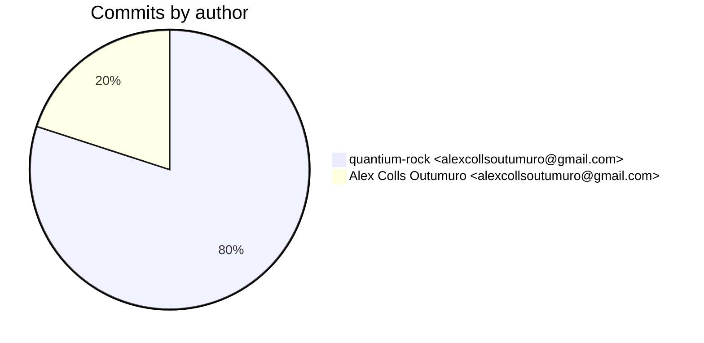
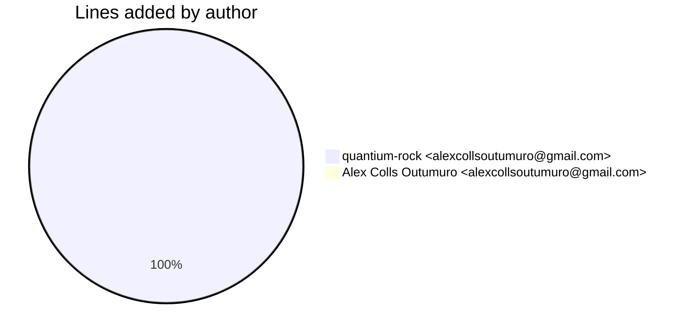
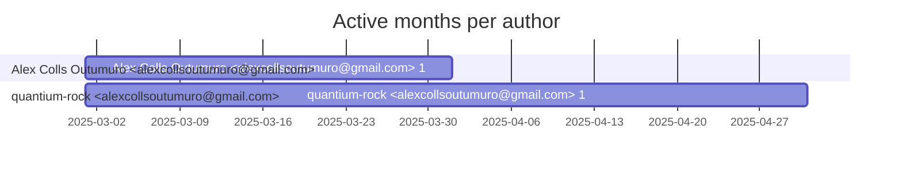

# Git Evaluation — InstagramTests

Repo: `/home/quantium/labs/oriane/_deprecated/InstagramTests`

## Summary

| Metric | Value |
|---|---:|
| Current tracked files | 62 |
| Current lines of code (tracked) | 343704 |
| Commits (total) | 5 |
| Commits (merges) | 0 |
| Commits (non-merges) | 5 |
| Unique authors | 1 |
| First commit | 2025-03-12T18:25:02+01:00 |
| Last commit | 2025-04-06T11:48:48+02:00 |
| Active days | 4 |
| Span days | 26 |
| Avg commits/day | 0.1923 |
| Lines added (sum) | 10649 |
| Lines deleted (sum) | 111 |
| Files touched (sum of numstat rows) | 65 |
| Estimated hours (session-based) | 8.36 |

## Schedule footprint

| Metric | Count |
|---|---:|
| Weekend days active (Sat/Sun) | 1 |
| Weekday days active | 3 |
| Night days active | 0 |
| Daytime days active | 4 |
| Days with both day & night activity | 0 |
| Day-only days | 4 |
| Night-only days | 0 |

## Developer leaderboard

| Developer | Commits | Hours | Wknd days | Night days | Day days | Both | Added | Deleted | Files | Active days | First | Last | Avg size | Median size | Stars |
|---|---:|---:|---:|---:|---:|---:|---:|---:|---:|---:|---|---|---:|---:|:--:
| quantium-rock <alexcollsoutumuro@gmail.com> | 4 | 7.61 | 1 | 0 | 3 | 0 | 10648 | 111 | 64 | 3 | 2025-03-13T18:57:05+01:00 | 2025-04-06T11:48:48+02:00 | 2689.75 | 2131.5 | ★★★★★ |
| Alex Colls Outumuro <alexcollsoutumuro@gmail.com> | 1 | 0.75 | 0 | 0 | 1 | 0 | 1 | 0 | 1 | 1 | 2025-03-12T18:25:02+01:00 | 2025-03-12T18:25:02+01:00 | 1.0 | 1.0 | ☆☆☆☆☆ |

## Commits by author

## Lines added by author

## Effort estimation model

This report estimates effort using a session + commit-weighted heuristic:
- Split commits per author into sessions where the gap > SESSION_GAP_MINUTES.
- Per session, sum per-commit minutes: base + sqrt(lines)/10 * MINUTES_PER_100_LINES + files * MINUTES_PER_FILE.
- Enforce MIN_SESSION_MINUTES minimum per session.
- Sum per day with MAX_HOURS_PER_DAY cap; multiply by CALIBRATION_FACTOR.

Parameters:

| Param | Value |
|---|---:|
| SESSION_GAP_MINUTES | 90 |
| MAX_HOURS_PER_DAY | 10.0 |
| MIN_SESSION_MINUTES | 30.0 |
| MINUTES_PER_COMMIT_BASE | 12.0 |
| MINUTES_PER_100_LINES | 8.0 |
| MINUTES_PER_FILE | 2.0 |
| CALIBRATION_FACTOR | 1.5 |

## Monthly activity

| Month | Commits | Added | Deleted | Files | Chart |
|---|---:|---:|---:|---:|:---|
| 2025-03 | 2 | 6495 | 0 | 14 | ########################### |
| 2025-04 | 3 | 4154 | 111 | 51 | ######################################## |

## Author activity timeline

## Highlights

- Longest active streak: 2 days (2025-03-12 to 2025-03-13)
- Best day by commits: 2025-04-06 — 2 commits
- Best day by lines added: 2025-03-13 — 6494 lines

