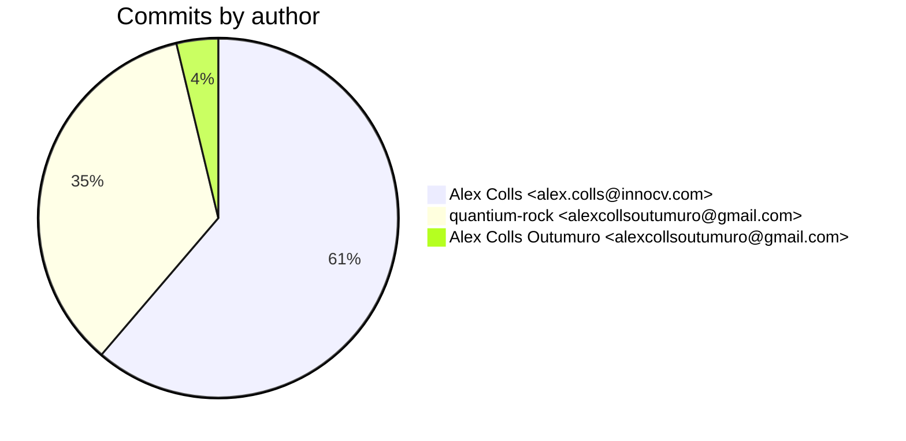
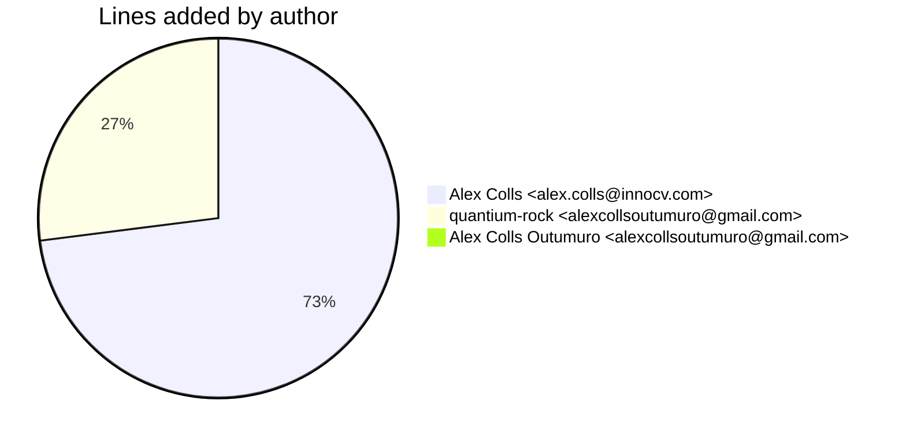
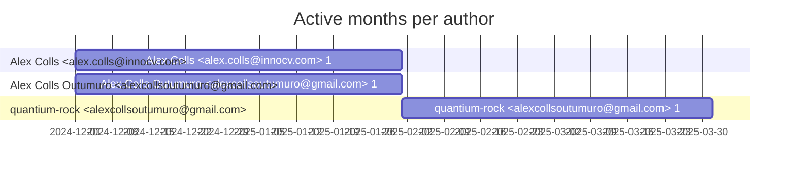

# Git Evaluation — OrianeCoreAI-python

Repo: `/home/quantium/labs/oriane/_deprecated/OrianeCoreAI-python`

## Summary

| Metric | Value |
|---|---:|
| Current tracked files | 50 |
| Current lines of code (tracked) | 3853 |
| Commits (total) | 80 |
| Commits (merges) | 8 |
| Commits (non-merges) | 72 |
| Unique authors | 2 |
| First commit | 2024-12-20T17:39:28+01:00 |
| Last commit | 2025-03-18T12:44:10+01:00 |
| Active days | 12 |
| Span days | 89 |
| Avg commits/day | 0.8989 |
| Lines added (sum) | 11720 |
| Lines deleted (sum) | 12182 |
| Files touched (sum of numstat rows) | 299 |
| Estimated hours (session-based) | 55.15 |

## Schedule footprint

| Metric | Count |
|---|---:|
| Weekend days active (Sat/Sun) | 4 |
| Weekday days active | 8 |
| Night days active | 3 |
| Daytime days active | 11 |
| Days with both day & night activity | 3 |
| Day-only days | 8 |
| Night-only days | 0 |

## Developer leaderboard

| Developer | Commits | Hours | Wknd days | Night days | Day days | Both | Added | Deleted | Files | Active days | First | Last | Avg size | Median size | Stars |
|---|---:|---:|---:|---:|---:|---:|---:|---:|---:|---:|---|---|---:|---:|:--:
| Alex Colls <alex.colls@innocv.com> | 49 | 35.51 | 3 | 2 | 4 | 2 | 8554 | 11121 | 198 | 5 | 2024-12-20T21:14:08+01:00 | 2025-01-26T20:04:17+01:00 | 401.53 | 17.0 | ★★★★★ |
| quantium-rock <alexcollsoutumuro@gmail.com> | 28 | 18.14 | 1 | 1 | 6 | 1 | 3165 | 1061 | 100 | 7 | 2025-02-08T11:42:39+01:00 | 2025-03-18T12:44:10+01:00 | 150.93 | 8.0 | ★★★☆☆ |
| Alex Colls Outumuro <alexcollsoutumuro@gmail.com> | 3 | 1.5 | 1 | 0 | 2 | 0 | 1 | 0 | 1 | 2 | 2024-12-20T17:39:28+01:00 | 2025-01-26T16:18:16+01:00 | 0.33 | 0.0 | ☆☆☆☆☆ |

## Commits by author

## Lines added by author

## Effort estimation model

This report estimates effort using a session + commit-weighted heuristic:
- Split commits per author into sessions where the gap > SESSION_GAP_MINUTES.
- Per session, sum per-commit minutes: base + sqrt(lines)/10 * MINUTES_PER_100_LINES + files * MINUTES_PER_FILE.
- Enforce MIN_SESSION_MINUTES minimum per session.
- Sum per day with MAX_HOURS_PER_DAY cap; multiply by CALIBRATION_FACTOR.

Parameters:

| Param | Value |
|---|---:|
| SESSION_GAP_MINUTES | 90 |
| MAX_HOURS_PER_DAY | 10.0 |
| MIN_SESSION_MINUTES | 30.0 |
| MINUTES_PER_COMMIT_BASE | 12.0 |
| MINUTES_PER_100_LINES | 8.0 |
| MINUTES_PER_FILE | 2.0 |
| CALIBRATION_FACTOR | 1.5 |

## Monthly activity

| Month | Commits | Added | Deleted | Files | Chart |
|---|---:|---:|---:|---:|:---|
| 2024-12 | 3 | 4599 | 0 | 12 | ## |
| 2025-01 | 49 | 3956 | 11121 | 187 | ######################################## |
| 2025-02 | 5 | 175 | 21 | 10 | #### |
| 2025-03 | 23 | 2990 | 1040 | 90 | ################### |

## Author activity timeline

## Highlights

- Longest active streak: 2 days (2025-01-25 to 2025-01-26)
- Best day by commits: 2025-01-12 — 22 commits
- Best day by lines added: 2024-12-20 — 4599 lines

