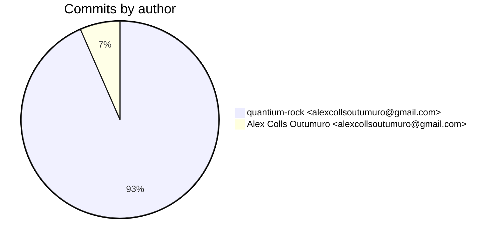
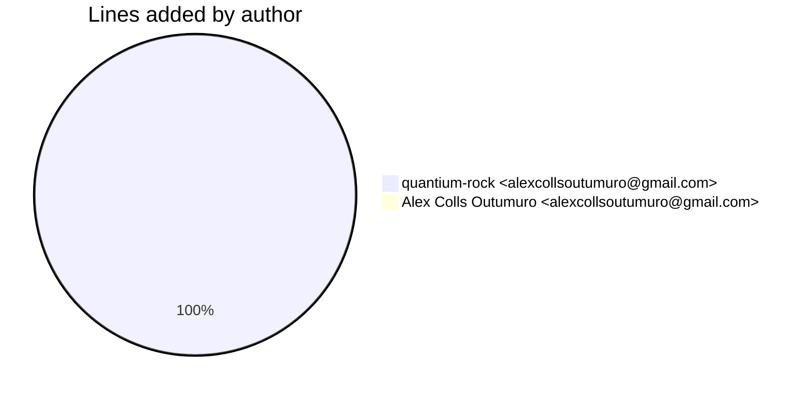
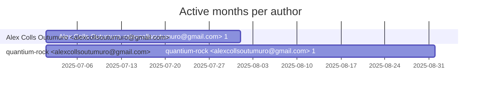

# Git Evaluation — OrianeDevOpsCLI-bash

Repo: `/home/quantium/labs/oriane/_deprecated/OrianeDevOpsCLI-bash`

## Summary

| Metric | Value |
|---|---:|
| Current tracked files | 240 |
| Current lines of code (tracked) | 45982 |
| Commits (total) | 61 |
| Commits (merges) | 5 |
| Commits (non-merges) | 56 |
| Unique authors | 1 |
| First commit | 2025-07-17T21:42:59+02:00 |
| Last commit | 2025-08-01T14:01:10+02:00 |
| Active days | 10 |
| Span days | 16 |
| Avg commits/day | 3.8125 |
| Lines added (sum) | 65134 |
| Lines deleted (sum) | 8386 |
| Files touched (sum of numstat rows) | 1026 |
| Estimated hours (session-based) | 105.14 |

## Developer leaderboard

| Developer | Commits | Hours | Added | Deleted | Files | Active days | First | Last | Avg size | Median size | Stars |
|---|---:|---:|---:|---:|---:|---:|---|---|---:|---:|:--:
| quantium-rock <alexcollsoutumuro@gmail.com> | 57 | 100.64 | 65132 | 8386 | 1025 | 9 | 2025-07-19T23:07:10+02:00 | 2025-08-01T14:01:10+02:00 | 1289.79 | 178.0 | ★★★★★ |
| Alex Colls Outumuro <alexcollsoutumuro@gmail.com> | 4 | 4.5 | 2 | 0 | 1 | 3 | 2025-07-17T21:42:59+02:00 | 2025-07-27T16:39:59+02:00 | 0.5 | 0.0 | ☆☆☆☆☆ |

## Commits by author

## Lines added by author

## Effort estimation model

This report estimates effort using a session + commit-weighted heuristic:
- Split commits per author into sessions where the gap > SESSION_GAP_MINUTES.
- Per session, sum per-commit minutes: base + sqrt(lines)/10 * MINUTES_PER_100_LINES + files * MINUTES_PER_FILE.
- Enforce MIN_SESSION_MINUTES minimum per session.
- Sum per day with MAX_HOURS_PER_DAY cap; multiply by CALIBRATION_FACTOR.

Parameters:

| Param | Value |
|---|---:|
| SESSION_GAP_MINUTES | 90 |
| MAX_HOURS_PER_DAY | 10.0 |
| MIN_SESSION_MINUTES | 45.0 |
| MINUTES_PER_COMMIT_BASE | 15.0 |
| MINUTES_PER_100_LINES | 12.0 |
| MINUTES_PER_FILE | 3.0 |
| CALIBRATION_FACTOR | 2.0 |

## Monthly activity

| Month | Commits | Added | Deleted | Files | Chart |
|---|---:|---:|---:|---:|:---|
| 2025-07 | 60 | 65084 | 8337 | 1024 | ######################################## |
| 2025-08 | 1 | 50 | 49 | 2 | # |

## Author activity timeline

## Highlights

- Longest active streak: 5 days (2025-07-19 to 2025-07-23)
- Best day by commits: 2025-07-22 — 15 commits
- Best day by lines added: 2025-07-22 — 44875 lines

