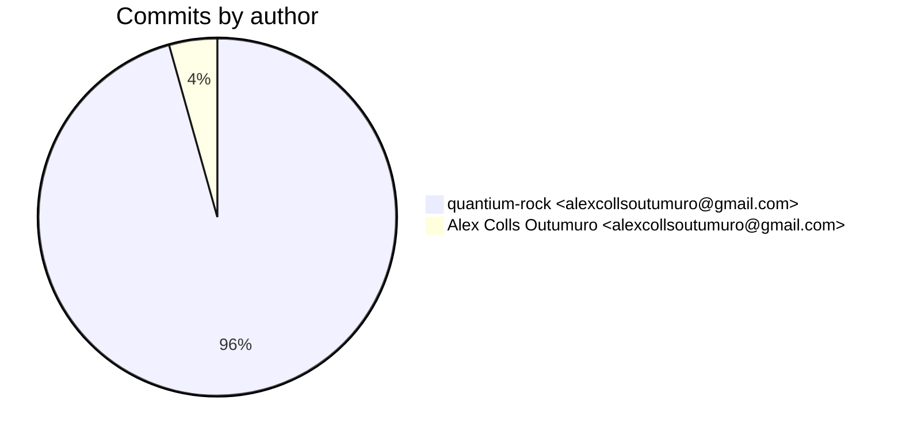
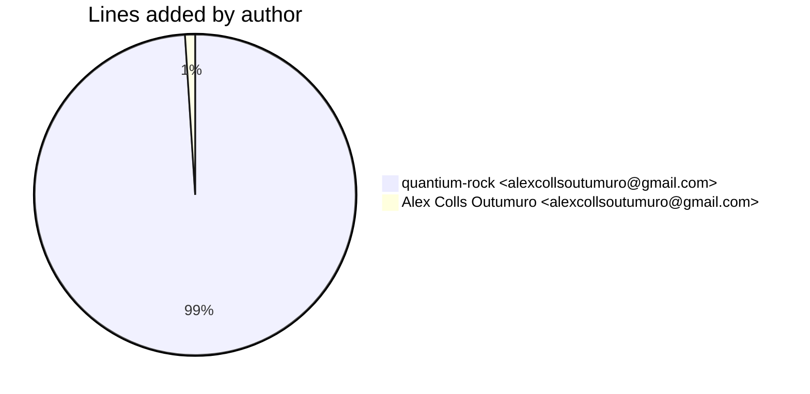
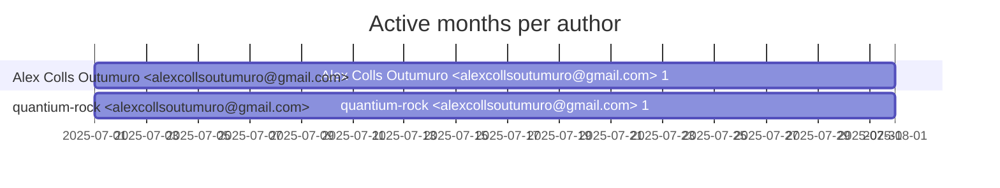

# Git Evaluation — OrianeExtractionSDK-python

Repo: `/home/quantium/labs/oriane/_deprecated/OrianeExtractionSDK-python`

## Summary

| Metric | Value |
|---|---:|
| Current tracked files | 89 |
| Current lines of code (tracked) | 242529 |
| Commits (total) | 23 |
| Commits (merges) | 1 |
| Commits (non-merges) | 22 |
| Unique authors | 1 |
| First commit | 2025-07-17T21:25:58+02:00 |
| Last commit | 2025-07-28T22:21:14+02:00 |
| Active days | 10 |
| Span days | 12 |
| Avg commits/day | 1.9167 |
| Lines added (sum) | 20596 |
| Lines deleted (sum) | 8057 |
| Files touched (sum of numstat rows) | 369 |
| Estimated hours (session-based) | 25.9 |

## Schedule footprint

| Metric | Count |
|---|---:|
| Weekend days active (Sat/Sun) | 3 |
| Weekday days active | 7 |
| Night days active | 3 |
| Daytime days active | 5 |
| Days with both day & night activity | 1 |
| Day-only days | 4 |
| Night-only days | 2 |

## Developer leaderboard

| Developer | Commits | Hours | Wknd days | Night days | Day days | Both | Added | Deleted | Files | Active days | First | Last | Avg size | Median size | Stars |
|---|---:|---:|---:|---:|---:|---:|---:|---:|---:|---:|---|---|---:|---:|:--:
| quantium-rock <alexcollsoutumuro@gmail.com> | 22 | 25.15 | 3 | 3 | 5 | 1 | 20387 | 8057 | 367 | 9 | 2025-07-18T10:38:29+02:00 | 2025-07-28T22:21:14+02:00 | 1292.91 | 79.5 | ★★★★★ |
| Alex Colls Outumuro <alexcollsoutumuro@gmail.com> | 1 | 0.75 | 0 | 0 | 0 | 0 | 209 | 0 | 2 | 1 | 2025-07-17T21:25:58+02:00 | 2025-07-17T21:25:58+02:00 | 209.0 | 209.0 | ☆☆☆☆☆ |

## Commits by author

## Lines added by author

## Effort estimation model

This report estimates effort using a session + commit-weighted heuristic:
- Split commits per author into sessions where the gap > SESSION_GAP_MINUTES.
- Per session, sum per-commit minutes: base + sqrt(lines)/10 * MINUTES_PER_100_LINES + files * MINUTES_PER_FILE.
- Enforce MIN_SESSION_MINUTES minimum per session.
- Sum per day with MAX_HOURS_PER_DAY cap; multiply by CALIBRATION_FACTOR.

Parameters:

| Param | Value |
|---|---:|
| SESSION_GAP_MINUTES | 90 |
| MAX_HOURS_PER_DAY | 10.0 |
| MIN_SESSION_MINUTES | 30.0 |
| MINUTES_PER_COMMIT_BASE | 12.0 |
| MINUTES_PER_100_LINES | 8.0 |
| MINUTES_PER_FILE | 2.0 |
| CALIBRATION_FACTOR | 1.5 |

## Monthly activity

| Month | Commits | Added | Deleted | Files | Chart |
|---|---:|---:|---:|---:|:---|
| 2025-07 | 23 | 20596 | 8057 | 369 | ######################################## |

## Author activity timeline

## Highlights

- Longest active streak: 8 days (2025-07-17 to 2025-07-24)
- Best day by commits: 2025-07-18 — 8 commits
- Best day by lines added: 2025-07-18 — 19187 lines

