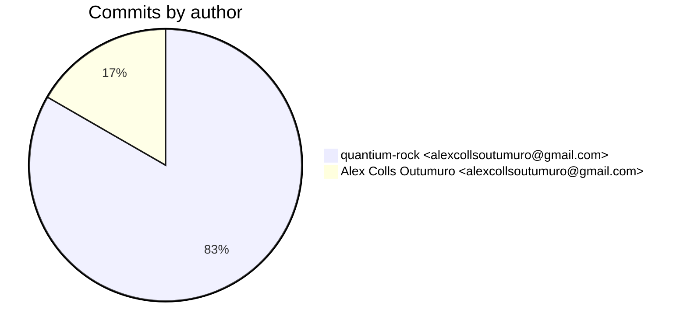
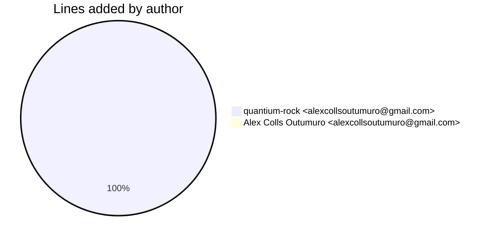
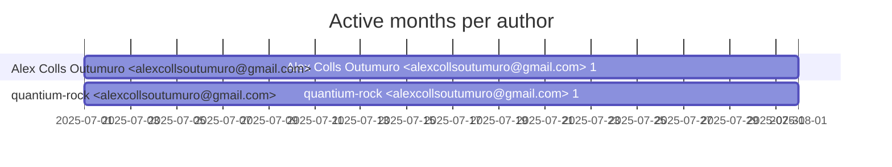

# Git Evaluation — OrianeInfra-bash

Repo: `/home/quantium/labs/oriane/_deprecated/OrianeInfra-bash`

## Summary

| Metric | Value |
|---|---:|
| Current tracked files | 48 |
| Current lines of code (tracked) | 6558 |
| Commits (total) | 6 |
| Commits (merges) | 0 |
| Commits (non-merges) | 6 |
| Unique authors | 1 |
| First commit | 2025-07-28T12:04:52+02:00 |
| Last commit | 2025-07-29T17:56:29+02:00 |
| Active days | 2 |
| Span days | 2 |
| Avg commits/day | 3.0 |
| Lines added (sum) | 21119 |
| Lines deleted (sum) | 14561 |
| Files touched (sum of numstat rows) | 302 |
| Estimated hours (session-based) | 38.64 |

## Developer leaderboard

| Developer | Commits | Hours | Added | Deleted | Files | Active days | First | Last | Avg size | Median size | Stars |
|---|---:|---:|---:|---:|---:|---:|---|---|---:|---:|:--:
| quantium-rock <alexcollsoutumuro@gmail.com> | 5 | 37.14 | 21118 | 14561 | 301 | 2 | 2025-07-28T17:14:01+02:00 | 2025-07-29T17:56:29+02:00 | 7135.8 | 6101.0 | ★★★★★ |
| Alex Colls Outumuro <alexcollsoutumuro@gmail.com> | 1 | 1.5 | 1 | 0 | 1 | 1 | 2025-07-28T12:04:52+02:00 | 2025-07-28T12:04:52+02:00 | 1.0 | 1.0 | ☆☆☆☆☆ |

## Commits by author

## Lines added by author

## Effort estimation model

This report estimates effort using a session + commit-weighted heuristic:
- Split commits per author into sessions where the gap > SESSION_GAP_MINUTES.
- Per session, sum per-commit minutes: base + sqrt(lines)/10 * MINUTES_PER_100_LINES + files * MINUTES_PER_FILE.
- Enforce MIN_SESSION_MINUTES minimum per session.
- Sum per day with MAX_HOURS_PER_DAY cap; multiply by CALIBRATION_FACTOR.

Parameters:

| Param | Value |
|---|---:|
| SESSION_GAP_MINUTES | 90 |
| MAX_HOURS_PER_DAY | 10.0 |
| MIN_SESSION_MINUTES | 45.0 |
| MINUTES_PER_COMMIT_BASE | 15.0 |
| MINUTES_PER_100_LINES | 12.0 |
| MINUTES_PER_FILE | 3.0 |
| CALIBRATION_FACTOR | 2.0 |

## Monthly activity

| Month | Commits | Added | Deleted | Files | Chart |
|---|---:|---:|---:|---:|:---|
| 2025-07 | 6 | 21119 | 14561 | 302 | ######################################## |

## Author activity timeline

## Highlights

- Longest active streak: 2 days (2025-07-28 to 2025-07-29)
- Best day by commits: 2025-07-28 — 3 commits
- Best day by lines added: 2025-07-28 — 14724 lines

