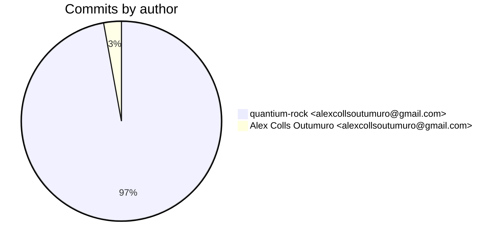
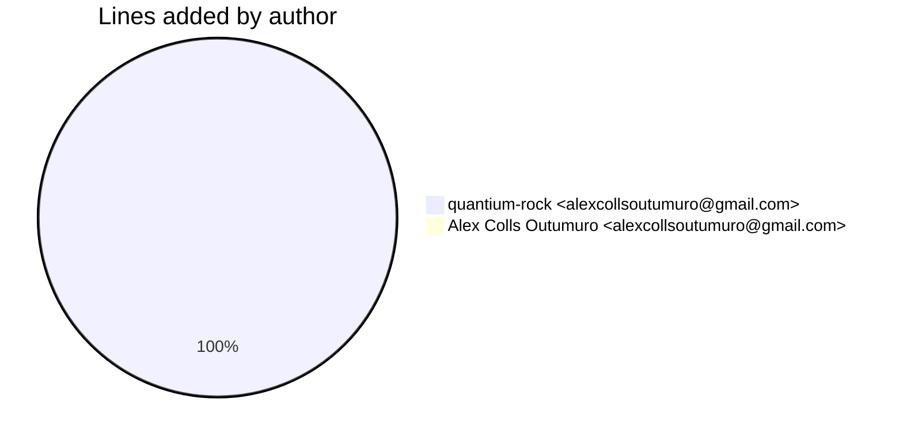
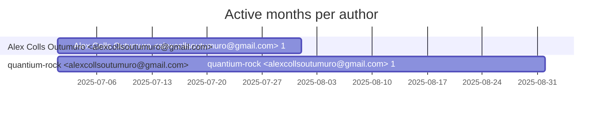

# Git Evaluation — OrianePipeline-fastapi

Repo: `/home/quantium/labs/oriane/_deprecated/OrianePipeline-fastapi`

## Summary

| Metric | Value |
|---|---:|
| Current tracked files | 182 |
| Current lines of code (tracked) | 30411 |
| Commits (total) | 70 |
| Commits (merges) | 2 |
| Commits (non-merges) | 68 |
| Unique authors | 1 |
| First commit | 2025-07-17T21:18:10+02:00 |
| Last commit | 2025-08-06T06:55:32+02:00 |
| Active days | 13 |
| Span days | 21 |
| Avg commits/day | 3.3333 |
| Lines added (sum) | 175711 |
| Lines deleted (sum) | 145169 |
| Files touched (sum of numstat rows) | 1568 |
| Estimated hours (session-based) | 111.0 |

## Schedule footprint

| Metric | Count |
|---|---:|
| Weekend days active (Sat/Sun) | 3 |
| Weekday days active | 10 |
| Night days active | 6 |
| Daytime days active | 8 |
| Days with both day & night activity | 4 |
| Day-only days | 4 |
| Night-only days | 2 |

## Developer leaderboard

| Developer | Commits | Hours | Wknd days | Night days | Day days | Both | Added | Deleted | Files | Active days | First | Last | Avg size | Median size | Stars |
|---|---:|---:|---:|---:|---:|---:|---:|---:|---:|---:|---|---|---:|---:|:--:
| quantium-rock <alexcollsoutumuro@gmail.com> | 68 | 109.5 | 3 | 6 | 8 | 4 | 175502 | 145169 | 1566 | 12 | 2025-07-18T10:46:05+02:00 | 2025-08-06T06:55:32+02:00 | 4715.75 | 586.0 | ★★★★★ |
| Alex Colls Outumuro <alexcollsoutumuro@gmail.com> | 2 | 1.5 | 1 | 0 | 0 | 0 | 209 | 0 | 2 | 2 | 2025-07-17T21:18:10+02:00 | 2025-07-27T20:57:15+02:00 | 104.5 | 104.5 | ☆☆☆☆☆ |

## Commits by author

## Lines added by author

## Effort estimation model

This report estimates effort using a session + commit-weighted heuristic:
- Split commits per author into sessions where the gap > SESSION_GAP_MINUTES.
- Per session, sum per-commit minutes: base + sqrt(lines)/10 * MINUTES_PER_100_LINES + files * MINUTES_PER_FILE.
- Enforce MIN_SESSION_MINUTES minimum per session.
- Sum per day with MAX_HOURS_PER_DAY cap; multiply by CALIBRATION_FACTOR.

Parameters:

| Param | Value |
|---|---:|
| SESSION_GAP_MINUTES | 90 |
| MAX_HOURS_PER_DAY | 10.0 |
| MIN_SESSION_MINUTES | 30.0 |
| MINUTES_PER_COMMIT_BASE | 12.0 |
| MINUTES_PER_100_LINES | 8.0 |
| MINUTES_PER_FILE | 2.0 |
| CALIBRATION_FACTOR | 1.5 |

## Monthly activity

| Month | Commits | Added | Deleted | Files | Chart |
|---|---:|---:|---:|---:|:---|
| 2025-07 | 69 | 174796 | 145079 | 1546 | ######################################## |
| 2025-08 | 1 | 915 | 90 | 22 | # |

## Author activity timeline

## Highlights

- Longest active streak: 8 days (2025-07-17 to 2025-07-24)
- Best day by commits: 2025-07-24 — 11 commits
- Best day by lines added: 2025-07-22 — 69322 lines

