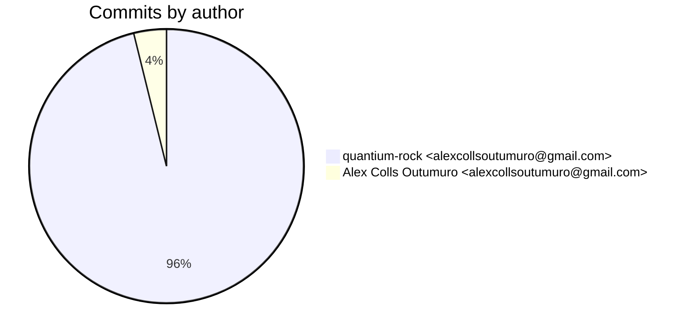
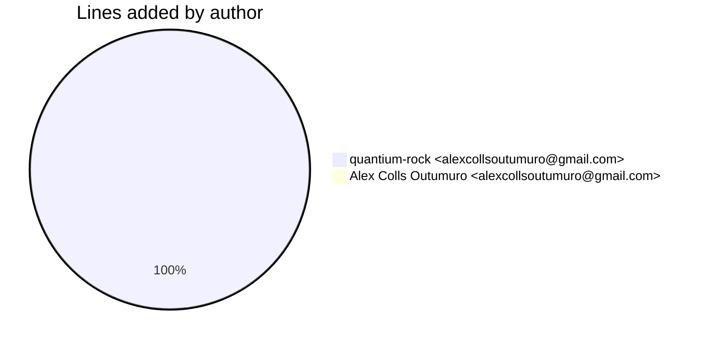
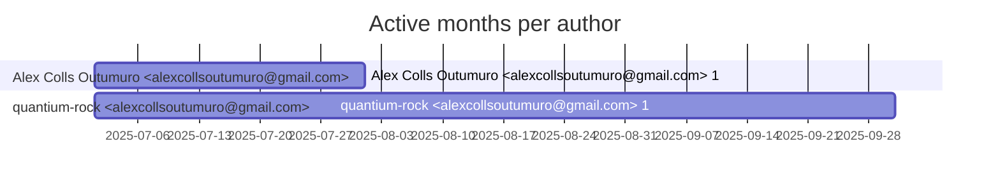

# Git Evaluation — OrianeSearch-fastapi

Repo: `/home/quantium/labs/oriane/_deprecated/OrianeSearch-fastapi`

## Summary

| Metric | Value |
|---|---:|
| Current tracked files | 156 |
| Current lines of code (tracked) | 244685 |
| Commits (total) | 26 |
| Commits (merges) | 1 |
| Commits (non-merges) | 25 |
| Unique authors | 1 |
| First commit | 2025-07-17T21:23:42+02:00 |
| Last commit | 2025-09-10T23:16:55+02:00 |
| Active days | 7 |
| Span days | 56 |
| Avg commits/day | 0.4643 |
| Lines added (sum) | 111265 |
| Lines deleted (sum) | 96151 |
| Files touched (sum of numstat rows) | 780 |
| Estimated hours (session-based) | 85.34 |

## Developer leaderboard

| Developer | Commits | Hours | Added | Deleted | Files | Active days | First | Last | Avg size | Median size | Stars |
|---|---:|---:|---:|---:|---:|---:|---|---|---:|---:|:--:
| quantium-rock <alexcollsoutumuro@gmail.com> | 25 | 83.84 | 111056 | 96151 | 778 | 6 | 2025-07-19T10:40:39+02:00 | 2025-09-10T23:16:55+02:00 | 8288.28 | 242.0 | ★★★★★ |
| Alex Colls Outumuro <alexcollsoutumuro@gmail.com> | 1 | 1.5 | 209 | 0 | 2 | 1 | 2025-07-17T21:23:42+02:00 | 2025-07-17T21:23:42+02:00 | 209.0 | 209.0 | ☆☆☆☆☆ |

## Commits by author

## Lines added by author

## Effort estimation model

This report estimates effort using a session + commit-weighted heuristic:
- Split commits per author into sessions where the gap > SESSION_GAP_MINUTES.
- Per session, sum per-commit minutes: base + sqrt(lines)/10 * MINUTES_PER_100_LINES + files * MINUTES_PER_FILE.
- Enforce MIN_SESSION_MINUTES minimum per session.
- Sum per day with MAX_HOURS_PER_DAY cap; multiply by CALIBRATION_FACTOR.

Parameters:

| Param | Value |
|---|---:|
| SESSION_GAP_MINUTES | 90 |
| MAX_HOURS_PER_DAY | 10.0 |
| MIN_SESSION_MINUTES | 45.0 |
| MINUTES_PER_COMMIT_BASE | 15.0 |
| MINUTES_PER_100_LINES | 12.0 |
| MINUTES_PER_FILE | 3.0 |
| CALIBRATION_FACTOR | 2.0 |

## Monthly activity

| Month | Commits | Added | Deleted | Files | Chart |
|---|---:|---:|---:|---:|:---|
| 2025-07 | 23 | 106839 | 91292 | 588 | ######################################## |
| 2025-08 | 1 | 4387 | 4394 | 189 | ## |
| 2025-09 | 2 | 39 | 465 | 3 | ### |

## Author activity timeline

## Highlights

- Longest active streak: 3 days (2025-07-19 to 2025-07-21)
- Best day by commits: 2025-07-19 — 11 commits
- Best day by lines added: 2025-07-20 — 78917 lines

