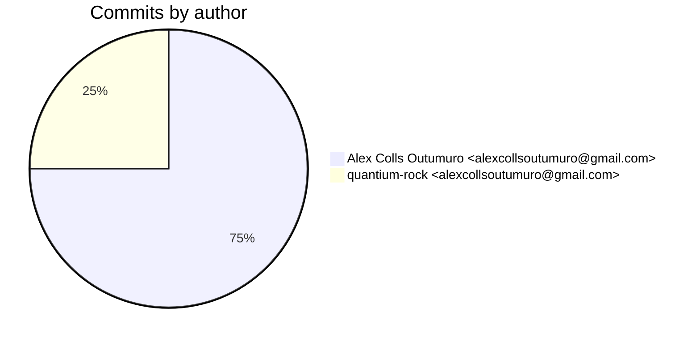
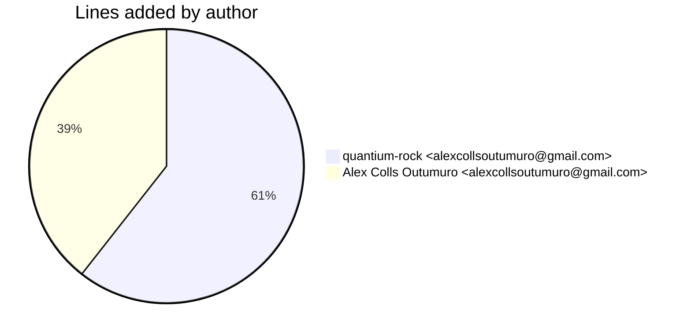
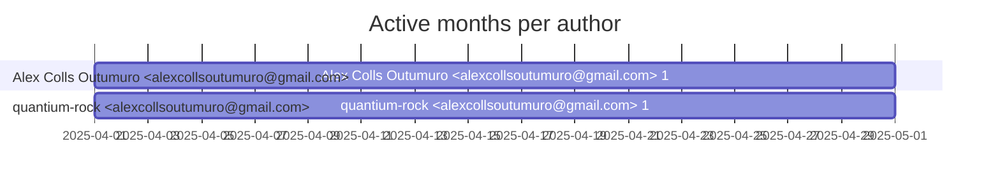

# Git Evaluation — ViT_SAM-model

Repo: `/home/quantium/labs/oriane/_deprecated/ViT_SAM-model`

## Summary

| Metric | Value |
|---|---:|
| Current tracked files | 6 |
| Current lines of code (tracked) | 446 |
| Commits (total) | 4 |
| Commits (merges) | 0 |
| Commits (non-merges) | 4 |
| Unique authors | 1 |
| First commit | 2025-04-05T13:17:21+02:00 |
| Last commit | 2025-04-06T12:07:44+02:00 |
| Active days | 2 |
| Span days | 2 |
| Avg commits/day | 2.0 |
| Lines added (sum) | 449 |
| Lines deleted (sum) | 3 |
| Files touched (sum of numstat rows) | 10 |
| Estimated hours (session-based) | 4.3 |

## Developer leaderboard

| Developer | Commits | Hours | Added | Deleted | Files | Active days | First | Last | Avg size | Median size | Stars |
|---|---:|---:|---:|---:|---:|---:|---|---|---:|---:|:--:
| Alex Colls Outumuro <alexcollsoutumuro@gmail.com> | 3 | 2.54 | 177 | 2 | 4 | 1 | 2025-04-05T13:17:21+02:00 | 2025-04-05T13:19:00+02:00 | 59.67 | 2.0 | ★★★★★ |
| quantium-rock <alexcollsoutumuro@gmail.com> | 1 | 1.76 | 272 | 1 | 6 | 1 | 2025-04-06T12:07:44+02:00 | 2025-04-06T12:07:44+02:00 | 273.0 | 273.0 | ★★★☆☆ |

## Commits by author

## Lines added by author

## Effort estimation model

This report estimates effort using a session + commit-weighted heuristic:
- Split commits per author into sessions where the gap > SESSION_GAP_MINUTES.
- Per session, sum per-commit minutes: base + sqrt(lines)/10 * MINUTES_PER_100_LINES + files * MINUTES_PER_FILE.
- Enforce MIN_SESSION_MINUTES minimum per session.
- Sum per day with MAX_HOURS_PER_DAY cap; multiply by CALIBRATION_FACTOR.

Parameters:

| Param | Value |
|---|---:|
| SESSION_GAP_MINUTES | 90 |
| MAX_HOURS_PER_DAY | 10.0 |
| MIN_SESSION_MINUTES | 45.0 |
| MINUTES_PER_COMMIT_BASE | 15.0 |
| MINUTES_PER_100_LINES | 12.0 |
| MINUTES_PER_FILE | 3.0 |
| CALIBRATION_FACTOR | 2.0 |

## Monthly activity

| Month | Commits | Added | Deleted | Files | Chart |
|---|---:|---:|---:|---:|:---|
| 2025-04 | 4 | 449 | 3 | 10 | ######################################## |

## Author activity timeline

## Highlights

- Longest active streak: 2 days (2025-04-05 to 2025-04-06)
- Best day by commits: 2025-04-05 — 3 commits
- Best day by lines added: 2025-04-06 — 272 lines

