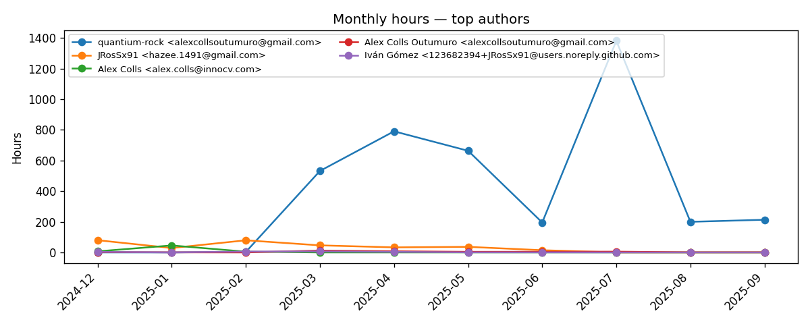

# Oriane — Git evaluation dashboard

Repos analyzed: 37  |  Total hours: 2095.98  |  Total commits: 2203  |  Unique authors: 9

## Charts


## Repositories by estimated hours

| Rank | Repository | Hours | Commits | Authors | First | Last | Added | Deleted | Files | Avg commits/day | LOC (files) | Weekends | Weekdays | Night days | Day days | Both |
|---:|---|---:|---:|---:|---|---|---:|---:|---:|---:|---:|---:|---:|---:|---:|---:|
| 1 | `/home/quantium/labs/oriane/orn-admin-api` | 343.36 | 441 | 4 | 2024-12-10T09:59:05+01:00 | 2025-09-09T20:49:10+02:00 | 120376 | 88133 | 1668 | 1.6095 | 0 (0) | 26 | 75 | 28 | 86 | 18 |
| 2 | `/home/quantium/labs/oriane/orn-admin-web` | 320.67 | 461 | 4 | 2024-12-11T12:55:53+01:00 | 2025-09-09T17:21:55+02:00 | 84119 | 59776 | 1552 | 1.6886 | 0 (0) | 21 | 68 | 21 | 80 | 16 |
| 3 | `/home/quantium/labs/oriane/orn-experience-app` | 227.67 | 240 | 4 | 2025-05-20T19:47:54+02:00 | 2025-09-12T04:04:02+02:00 | 89459 | 63918 | 1796 | 2.069 | 0 (0) | 7 | 33 | 15 | 35 | 11 |
| 4 | `/home/quantium/labs/oriane/_deprecated/ExtractionPipeline-lab` | 220.66 | 130 | 1 | 2025-05-16T12:29:52+02:00 | 2025-07-28T16:47:30+02:00 | 4897360 | 396945 | 24813 | 1.7568 | 0 (0) | 4 | 25 | 9 | 20 | 3 |
| 5 | `/home/quantium/labs/oriane/orn-processor-etls` | 147.34 | 87 | 2 | 2025-08-06T09:35:48+02:00 | 2025-09-08T12:52:42+02:00 | 72067 | 36305 | 1865 | 2.5588 | 0 (0) | 2 | 18 | 7 | 16 | 5 |
| 6 | `/home/quantium/labs/oriane/_deprecated/OrianePipeline-fastapi` | 111.0 | 70 | 1 | 2025-07-17T21:18:10+02:00 | 2025-08-06T06:55:32+02:00 | 175711 | 145169 | 1568 | 3.3333 | 0 (0) | 3 | 10 | 6 | 8 | 4 |
| 7 | `/home/quantium/labs/oriane/_deprecated/OrianeDevOpsCLI-bash` | 69.96 | 61 | 1 | 2025-07-17T21:42:59+02:00 | 2025-08-01T14:01:10+02:00 | 65134 | 8386 | 1026 | 3.8125 | 0 (0) | 3 | 7 | 5 | 5 | 3 |
| 8 | `/home/quantium/labs/oriane/_deprecated/OrianeVectorDB-qdrant` | 62.86 | 47 | 1 | 2025-07-17T21:54:02+02:00 | 2025-07-30T10:39:45+02:00 | 73047 | 38067 | 1136 | 3.3571 | 0 (0) | 2 | 7 | 6 | 5 | 3 |
| 9 | `/home/quantium/labs/oriane/_deprecated/OrianeSearch-fastapi` | 59.19 | 26 | 1 | 2025-07-17T21:23:42+02:00 | 2025-09-10T23:16:55+02:00 | 111265 | 96151 | 780 | 0.4643 | 0 (0) | 2 | 5 | 4 | 4 | 2 |
| 10 | `/home/quantium/labs/oriane/_deprecated/OrianeCoreAI-python` | 55.15 | 80 | 2 | 2024-12-20T17:39:28+01:00 | 2025-03-18T12:44:10+01:00 | 11720 | 12182 | 299 | 0.8989 | 0 (0) | 4 | 8 | 3 | 11 | 3 |
| 11 | `/home/quantium/labs/oriane/_deprecated/VideoFramesSceneExtractor-lambda` | 53.95 | 39 | 1 | 2025-04-24T11:41:42+02:00 | 2025-05-12T17:21:01+02:00 | 1245928 | 1241311 | 11410 | 2.0526 | 0 (0) | 2 | 9 | 3 | 9 | 1 |
| 12 | `/home/quantium/labs/oriane/orn-search-api` | 45.85 | 178 | 1 | 2025-09-10T11:55:06+02:00 | 2025-09-12T20:12:32+02:00 | 91334 | 75729 | 687 | 59.3333 | 0 (0) | 0 | 3 | 2 | 3 | 2 |
| 13 | `/home/quantium/labs/oriane/_deprecated/VideoFramesExtractor-lambda` | 39.32 | 47 | 1 | 2025-03-14T15:21:23+01:00 | 2025-04-30T11:50:16+02:00 | 296055 | 148163 | 887 | 0.9792 | 0 (0) | 3 | 7 | 0 | 10 | 0 |
| 14 | `/home/quantium/labs/oriane/_deprecated/EmbeddingsExtraction` | 34.9 | 10 | 1 | 2025-06-18T16:29:57+02:00 | 2025-06-25T09:20:23+02:00 | 18012 | 12860 | 495 | 1.25 | 0 (0) | 0 | 4 | 0 | 4 | 0 |
| 15 | `/home/quantium/labs/oriane/_deprecated/SSCD-model` | 32.97 | 43 | 1 | 2025-04-03T03:20:27+02:00 | 2025-05-28T00:55:26+02:00 | 60464 | 763 | 127 | 0.7679 | 0 (0) | 4 | 10 | 4 | 8 | 1 |
| 16 | `/home/quantium/labs/oriane/orn-acquisition-lambdas` | 29.98 | 41 | 1 | 2025-08-17T12:42:10+02:00 | 2025-09-09T22:07:44+02:00 | 12005 | 2138 | 117 | 1.7083 | 0 (0) | 1 | 3 | 2 | 4 | 2 |
| 17 | `/home/quantium/labs/oriane/_deprecated/VideoFramesExtractorBulk-lambda` | 27.04 | 18 | 1 | 2025-03-26T08:53:24+01:00 | 2025-04-30T11:49:35+02:00 | 101585 | 99564 | 45 | 0.5 | 0 (0) | 2 | 4 | 1 | 5 | 0 |
| 18 | `/home/quantium/labs/oriane/_deprecated/OrianeExtractionSDK-python` | 25.9 | 23 | 1 | 2025-07-17T21:25:58+02:00 | 2025-07-28T22:21:14+02:00 | 20596 | 8057 | 369 | 1.9167 | 0 (0) | 3 | 7 | 3 | 5 | 1 |
| 19 | `/home/quantium/labs/oriane/_deprecated/InstagramContentCollector-lambda` | 24.6 | 37 | 2 | 2025-03-21T10:39:55+01:00 | 2025-05-27T20:23:56+02:00 | 8760 | 1715 | 84 | 0.5441 | 0 (0) | 2 | 9 | 1 | 10 | 0 |
| 20 | `/home/quantium/labs/oriane/_deprecated/OrianeInfra-bash` | 24.29 | 6 | 1 | 2025-07-28T12:04:52+02:00 | 2025-07-29T17:56:29+02:00 | 21119 | 14561 | 302 | 3.0 | 0 (0) | 0 | 2 | 1 | 2 | 1 |
| 21 | `/home/quantium/labs/oriane/_deprecated/InstagramVideoDownloader-lambda` | 18.44 | 11 | 1 | 2025-03-14T11:20:34+01:00 | 2025-03-19T11:32:01+01:00 | 697960 | 254972 | 5099 | 1.8333 | 0 (0) | 0 | 3 | 0 | 3 | 0 |
| 22 | `/home/quantium/labs/oriane/_deprecated/OrianeCoreAI-mojo` | 15.75 | 6 | 1 | 2025-03-04T23:11:23+01:00 | 2025-03-05T00:18:00+01:00 | 301105 | 1 | 842 | 3.0 | 0 (0) | 0 | 2 | 1 | 0 | 0 |
| 23 | `/home/quantium/labs/oriane/_deprecated/opencv-cuda` | 15.0 | 2 | 1 | 2025-05-16T12:17:02+02:00 | 2025-05-16T12:34:35+02:00 | 247837 | 0 | 440 | 2.0 | 0 (0) | 0 | 1 | 0 | 1 | 0 |
| 24 | `/home/quantium/labs/oriane/_deprecated/FrameComparisonModel-lambda` | 12.79 | 24 | 1 | 2025-03-18T12:42:33+01:00 | 2025-03-30T22:42:37+02:00 | 1707 | 174 | 52 | 1.8462 | 0 (0) | 1 | 3 | 1 | 3 | 0 |
| 25 | `/home/quantium/labs/oriane/_deprecated/InstagramVideoDownloaderBulk-lambda` | 11.55 | 10 | 1 | 2025-03-20T14:45:37+01:00 | 2025-03-24T11:03:30+01:00 | 52436 | 193 | 29 | 2.0 | 0 (0) | 0 | 3 | 0 | 3 | 0 |
| 26 | `/home/quantium/labs/oriane/_deprecated/VideoCropper-lambda` | 11.22 | 1 | 1 | 2025-05-16T12:32:12+02:00 | 2025-05-16T12:32:12+02:00 | 34683 | 0 | 144 | 1.0 | 0 (0) | 0 | 1 | 0 | 1 | 0 |
| 27 | `/home/quantium/labs/oriane/orn-processor-applications` | 10.39 | 15 | 2 | 2025-08-08T20:11:09+02:00 | 2025-09-02T20:50:08+02:00 | 718 | 138 | 59 | 0.5769 | 0 (0) | 1 | 7 | 5 | 3 | 0 |
| 28 | `/home/quantium/labs/oriane/_deprecated/InstagramTests` | 8.36 | 5 | 1 | 2025-03-12T18:25:02+01:00 | 2025-04-06T11:48:48+02:00 | 10649 | 111 | 65 | 0.1923 | 0 (0) | 1 | 3 | 0 | 4 | 0 |
| 29 | `/home/quantium/labs/oriane/_deprecated/ViT-model` | 6.93 | 6 | 1 | 2025-04-05T13:09:07+02:00 | 2025-04-06T23:36:53+02:00 | 29351 | 2 | 10 | 3.0 | 0 (0) | 2 | 0 | 1 | 1 | 0 |
| 30 | `/home/quantium/labs/oriane/_deprecated/FramesEmbeddingsExtractor-lambda` | 6.6 | 9 | 1 | 2025-04-30T12:08:09+02:00 | 2025-05-07T11:12:41+02:00 | 1590 | 447 | 27 | 1.125 | 0 (0) | 1 | 2 | 1 | 3 | 1 |
| 31 | `/home/quantium/labs/oriane/orn-platform-clusters` | 6.35 | 8 | 1 | 2025-08-08T18:43:11+02:00 | 2025-08-17T02:55:58+02:00 | 573 | 18 | 24 | 0.8 | 0 (0) | 1 | 4 | 3 | 3 | 0 |
| 32 | `/home/quantium/labs/oriane/orn-platform-applications` | 5.28 | 5 | 1 | 2025-08-08T18:45:37+02:00 | 2025-08-15T19:23:22+02:00 | 851 | 6 | 40 | 0.625 | 0 (0) | 0 | 3 | 1 | 2 | 0 |
| 33 | `/home/quantium/labs/oriane/_deprecated/FramesComparer-lambda` | 4.56 | 7 | 1 | 2025-03-30T23:52:32+02:00 | 2025-04-03T03:54:49+02:00 | 796 | 140 | 15 | 1.4 | 0 (0) | 1 | 2 | 2 | 1 | 0 |
| 34 | `/home/quantium/labs/oriane/_deprecated/ViT_SAM-model` | 2.35 | 4 | 1 | 2025-04-05T13:17:21+02:00 | 2025-04-06T12:07:44+02:00 | 449 | 3 | 10 | 2.0 | 0 (0) | 2 | 0 | 0 | 2 | 0 |
| 35 | `/home/quantium/labs/oriane/_deprecated/SAM-model` | 2.25 | 3 | 1 | 2025-04-05T13:09:44+02:00 | 2025-04-06T11:55:00+02:00 | 382 | 0 | 5 | 1.5 | 0 (0) | 2 | 0 | 0 | 2 | 0 |
| 36 | `/home/quantium/labs/oriane/orn-experience-applications` | 0.75 | 1 | 1 | 2025-09-11T10:09:35+02:00 | 2025-09-11T10:09:35+02:00 | 1 | 0 | 1 | 1.0 | 0 (0) | 0 | 1 | 0 | 1 | 0 |
| 37 | `/home/quantium/labs/oriane/_deprecated/migration-supabase-to-aws` | 0.75 | 1 | 1 | 2025-05-23T15:07:15+02:00 | 2025-05-23T15:07:15+02:00 | 175 | 0 | 2 | 1.0 | 0 (0) | 0 | 1 | 0 | 1 | 0 |

## Hours per month — all repos

| Month | Hours | Chart |
|---|---:|:---|
| 2024-12 | 92.28 | ### |
| 2025-01 | 75.26 | ## |
| 2025-02 | 93.42 | ### |
| 2025-03 | 597.56 | ################# |
| 2025-04 | 835.07 | ######################## |
| 2025-05 | 704.75 | #################### |
| 2025-06 | 214.67 | ###### |
| 2025-07 | 1391.11 | ######################################## |
| 2025-08 | 228.81 | ####### |
| 2025-09 | 220.16 | ###### |


## Developers by estimated hours (across repos)

| Rank | Developer | Hours | Commits | Repos | Added | Deleted | Files | Active days |
|---:|---|---:|---:|---|---:|---:|---:|---:|
| 1 | quantium-rock <alexcollsoutumuro@gmail.com> | 1559.24 ★★★★★ | 1489 | /home/quantium/labs/oriane/_deprecated/EmbeddingsExtraction, /home/quantium/labs/oriane/_deprecated/ExtractionPipeline-lab, /home/quantium/labs/oriane/_deprecated/FrameComparisonModel-lambda, /home/quantium/labs/oriane/_deprecated/FramesComparer-lambda, /home/quantium/labs/oriane/_deprecated/FramesEmbeddingsExtractor-lambda, /home/quantium/labs/oriane/_deprecated/InstagramContentCollector-lambda, /home/quantium/labs/oriane/_deprecated/InstagramTests, /home/quantium/labs/oriane/_deprecated/InstagramVideoDownloader-lambda, /home/quantium/labs/oriane/_deprecated/InstagramVideoDownloaderBulk-lambda, /home/quantium/labs/oriane/_deprecated/OrianeCoreAI-mojo, /home/quantium/labs/oriane/_deprecated/OrianeCoreAI-python, /home/quantium/labs/oriane/_deprecated/OrianeDevOpsCLI-bash, /home/quantium/labs/oriane/_deprecated/OrianeExtractionSDK-python, /home/quantium/labs/oriane/_deprecated/OrianeInfra-bash, /home/quantium/labs/oriane/_deprecated/OrianePipeline-fastapi, /home/quantium/labs/oriane/_deprecated/OrianeSearch-fastapi, /home/quantium/labs/oriane/_deprecated/OrianeVectorDB-qdrant, /home/quantium/labs/oriane/_deprecated/SAM-model, /home/quantium/labs/oriane/_deprecated/SSCD-model, /home/quantium/labs/oriane/_deprecated/ViT-model, /home/quantium/labs/oriane/_deprecated/ViT_SAM-model, /home/quantium/labs/oriane/_deprecated/VideoCropper-lambda, /home/quantium/labs/oriane/_deprecated/VideoFramesExtractor-lambda, /home/quantium/labs/oriane/_deprecated/VideoFramesExtractorBulk-lambda, /home/quantium/labs/oriane/_deprecated/VideoFramesSceneExtractor-lambda, /home/quantium/labs/oriane/_deprecated/opencv-cuda, /home/quantium/labs/oriane/orn-acquisition-lambdas, /home/quantium/labs/oriane/orn-admin-api, /home/quantium/labs/oriane/orn-admin-web, /home/quantium/labs/oriane/orn-experience-app, /home/quantium/labs/oriane/orn-processor-etls, /home/quantium/labs/oriane/orn-search-api | 8822338 | 2664061 | 55405 | 307 |
| 2 | JRosSx91 <hazee.1491@gmail.com> | 333.76 ★☆☆☆☆ | 418 | /home/quantium/labs/oriane/_deprecated/InstagramContentCollector-lambda, /home/quantium/labs/oriane/orn-admin-api, /home/quantium/labs/oriane/orn-admin-web, /home/quantium/labs/oriane/orn-experience-app | 114157 | 108822 | 1853 | 135 |
| 3 | Alex Colls <alex.colls@innocv.com> | 61.94 ☆☆☆☆☆ | 91 | /home/quantium/labs/oriane/_deprecated/OrianeCoreAI-python, /home/quantium/labs/oriane/orn-admin-api, /home/quantium/labs/oriane/orn-admin-web | 11054 | 11457 | 315 | 22 |
| 4 | Alex Colls Outumuro <alexcollsoutumuro@gmail.com> | 55.19 ☆☆☆☆☆ | 86 | /home/quantium/labs/oriane/_deprecated/EmbeddingsExtraction, /home/quantium/labs/oriane/_deprecated/ExtractionPipeline-lab, /home/quantium/labs/oriane/_deprecated/FrameComparisonModel-lambda, /home/quantium/labs/oriane/_deprecated/FramesComparer-lambda, /home/quantium/labs/oriane/_deprecated/FramesEmbeddingsExtractor-lambda, /home/quantium/labs/oriane/_deprecated/InstagramContentCollector-lambda, /home/quantium/labs/oriane/_deprecated/InstagramTests, /home/quantium/labs/oriane/_deprecated/InstagramVideoDownloader-lambda, /home/quantium/labs/oriane/_deprecated/InstagramVideoDownloaderBulk-lambda, /home/quantium/labs/oriane/_deprecated/OrianeCoreAI-mojo, /home/quantium/labs/oriane/_deprecated/OrianeCoreAI-python, /home/quantium/labs/oriane/_deprecated/OrianeDevOpsCLI-bash, /home/quantium/labs/oriane/_deprecated/OrianeExtractionSDK-python, /home/quantium/labs/oriane/_deprecated/OrianeInfra-bash, /home/quantium/labs/oriane/_deprecated/OrianePipeline-fastapi, /home/quantium/labs/oriane/_deprecated/OrianeSearch-fastapi, /home/quantium/labs/oriane/_deprecated/OrianeVectorDB-qdrant, /home/quantium/labs/oriane/_deprecated/SAM-model, /home/quantium/labs/oriane/_deprecated/SSCD-model, /home/quantium/labs/oriane/_deprecated/ViT-model, /home/quantium/labs/oriane/_deprecated/ViT_SAM-model, /home/quantium/labs/oriane/_deprecated/VideoFramesExtractor-lambda, /home/quantium/labs/oriane/_deprecated/VideoFramesExtractorBulk-lambda, /home/quantium/labs/oriane/_deprecated/VideoFramesSceneExtractor-lambda, /home/quantium/labs/oriane/_deprecated/migration-supabase-to-aws, /home/quantium/labs/oriane/orn-acquisition-lambdas, /home/quantium/labs/oriane/orn-admin-api, /home/quantium/labs/oriane/orn-admin-web, /home/quantium/labs/oriane/orn-experience-app, /home/quantium/labs/oriane/orn-search-api | 4243 | 2653 | 69 | 63 |
| 5 | Iván Gómez <123682394+JRosSx91@users.noreply.github.com> | 42.00 ☆☆☆☆☆ | 69 | /home/quantium/labs/oriane/orn-admin-api, /home/quantium/labs/oriane/orn-admin-web, /home/quantium/labs/oriane/orn-experience-app | 2 | 0 | 2 | 47 |
| 6 | Thibaut Hadjean <sasha.hadjean@gmail.com> | 26.30 ☆☆☆☆☆ | 33 | /home/quantium/labs/oriane/orn-experience-app, /home/quantium/labs/oriane/orn-processor-applications, /home/quantium/labs/oriane/orn-processor-etls | 3572 | 3000 | 166 | 22 |
| 7 | Thibaut Hadjean <thibaut@oriane.xyz> | 10.13 ☆☆☆☆☆ | 11 | /home/quantium/labs/oriane/orn-platform-applications, /home/quantium/labs/oriane/orn-platform-clusters | 1420 | 24 | 62 | 8 |
| 8 | alexcolls <alexcollsoutumuro@gmail.com> | 4.41 ☆☆☆☆☆ | 2 | /home/quantium/labs/oriane/_deprecated/ExtractionPipeline-lab, /home/quantium/labs/oriane/orn-experience-app | 586 | 16081 | 14 | 2 |
| 9 | thibaut-oriane <thibaut@oriane.xyz> | 3.00 ☆☆☆☆☆ | 4 | /home/quantium/labs/oriane/orn-experience-applications, /home/quantium/labs/oriane/orn-platform-applications, /home/quantium/labs/oriane/orn-platform-clusters, /home/quantium/labs/oriane/orn-processor-applications | 7 | 0 | 4 | 4 |

## Top months across repos

| Rank | Month | Hours | Commits | Added | Deleted |
|---:|---|---:|---:|---:|---:|
| 1 | 2025-07 | 1391.11 | 326 | 4861723 | 331936 |
| 2 | 2025-04 | 835.07 | 334 | 1461155 | 1371258 |
| 3 | 2025-05 | 704.75 | 193 | 758423 | 398585 |
| 4 | 2025-03 | 597.56 | 333 | 1396087 | 416587 |
| 5 | 2025-08 | 228.81 | 178 | 84353 | 59495 |
| 6 | 2025-09 | 220.16 | 297 | 125443 | 97903 |
| 7 | 2025-06 | 214.67 | 161 | 179830 | 57132 |
| 8 | 2025-02 | 93.42 | 126 | 51809 | 43943 |
| 9 | 2024-12 | 92.28 | 125 | 29265 | 16667 |
| 10 | 2025-01 | 75.26 | 130 | 9291 | 12592 |

## Monthly commits - distribution (top 5 repos, recent months)


## Hours by repo (top 15)


## Per-author schedule charts (top 5 by hours)


```mermaid
pie title Day vs Night — Iván Gómez <123682394+JRosSx91@users.noreply.github.com>
    "Day" : 38
    "Night" : 5
```

```mermaid
pie title Weekend vs Weekday — Iván Gómez <123682394+JRosSx91@users.noreply.github.com>
    "Weekend" : 6
    "Weekday" : 41
```

## Monthly hours (ASCII sparkline)

### Top repos
```
Months: 2024-12, 2025-01, 2025-02, 2025-03, 2025-04, 2025-05, 2025-06, 2025-07, 2025-08, 2025-09
orn-admin-api            ▇▃▅█▇█▂▁▂▄  (311.8h)
orn-admin-web            ▄▃▅▄█▃▁▁▁▂  (296.1h)
orn-experience-app       ▁▁▁▁▁▃█▄▃▂  (230.9h)
ExtractionPipeline-lab   ▁▁▁▁▁▅▂█▁▁  (1456.0h)
orn-processor-etls       ▁▁▁▁▁▁▁▁█▁  (158.9h)
```

### Top authors
```
Months: 2024-12, 2025-01, 2025-02, 2025-03, 2025-04, 2025-05, 2025-06, 2025-07, 2025-08, 2025-09
quantium-rock <alexcollsoutumuro@gmail.com> ▁▁▁▄▅▄▂█▂▂  (3980.3h)
JRosSx91 <hazee.1491@gmail.com> █▄█▅▄▄▂▁▁▁  (318.5h)
Alex Colls <alex.colls@innocv.com> ▂█▂▁▁▁▁▁▁▁  (57.9h)
Alex Colls Outumuro <alexcollsoutumuro@gmail.com> ▂▁▁█▅▃▃▄▁▁  (37.1h)
Iván Gómez <123682394+JRosSx91@users.noreply.github.com> ▅▁▇█▅▂▁▁▁▁  (20.8h)
```




## Daily hours (ASCII sparkline) — last 60 days

### Top repos
```
Dates: 2025-06-25, 2025-06-26, 2025-06-27, 2025-06-30, 2025-07-01, 2025-07-05, 2025-07-06, 2025-07-07, 2025-07-08, 2025-07-09, 2025-07-10, 2025-07-14, 2025-07-15, 2025-07-16, 2025-07-17, 2025-07-18, 2025-07-19, 2025-07-20, 2025-07-21, 2025-07-22, 2025-07-23, 2025-07-24, 2025-07-25, 2025-07-27, 2025-07-28, 2025-07-29, 2025-07-30, 2025-08-01, 2025-08-06, 2025-08-07, 2025-08-08, 2025-08-11, 2025-08-12, 2025-08-13, 2025-08-14, 2025-08-15, 2025-08-16, 2025-08-17, 2025-08-18, 2025-08-19, 2025-08-20, 2025-08-21, 2025-08-25, 2025-08-26, 2025-08-27, 2025-08-28, 2025-08-29, 2025-08-30, 2025-09-01, 2025-09-02, 2025-09-03, 2025-09-04, 2025-09-05, 2025-09-06, 2025-09-07, 2025-09-08, 2025-09-09, 2025-09-10, 2025-09-11, 2025-09-12
ExtractionPipeline-lab   ▁▁▁▁▁▁▁▂▁▁▁▁▁▁▁█▁▁▁▁▁▁▁▁▁▁▁▁▁▁▁▁▁▁▁▁▁▁▁▁▁▁▁▁▁▁▁▁▁▁▁▁▁▁▁▁▁▁▁▁  (921.1h)
OrianePipeline-fastapi   ▁▁▁▁▁▁▁▁▁▁▁▁▁▁▁▃▂▁▄█▃▃▁▄▂▅▁▁▁▁▁▁▁▁▁▁▁▁▁▁▁▁▁▁▁▁▁▁▁▁▁▁▁▁▁▁▁▁▁▁  (159.0h)
orn-processor-etls       ▁▁▁▁▁▁▁▁▁▁▁▁▁▁▁▁▁▁▁▁▁▁▁▁▁▁▁▁▃▄▃▆▄▅█▂▄▁▁▃▄▅▆▁▁▂▁▁▁▁▁▁▁▁▁▁▁▁▁▁  (158.9h)
orn-search-api           ▁▁▁▁▁▁▁▁▁▁▁▁▁▁▁▁▁▁▁▁▁▁▁▁▁▁▁▁▁▁▁▁▁▁▁▁▁▁▁▁▁▁▁▁▁▁▁▁▁▁▁▁▁▁▁▁▁▄█▂  (134.6h)
OrianeDevOpsCLI-bash     ▁▁▁▁▁▁▁▁▁▁▁▁▁▁▁▁▂▁▄█▁▁▁▄▁▆▂▁▁▁▁▁▁▁▁▁▁▁▁▁▁▁▁▁▁▁▁▁▁▁▁▁▁▁▁▁▁▁▁▁  (97.1h)
```

### Top authors
```
Dates: 2025-06-25, 2025-06-26, 2025-06-27, 2025-06-30, 2025-07-01, 2025-07-05, 2025-07-06, 2025-07-07, 2025-07-08, 2025-07-09, 2025-07-10, 2025-07-14, 2025-07-15, 2025-07-16, 2025-07-17, 2025-07-18, 2025-07-19, 2025-07-20, 2025-07-21, 2025-07-22, 2025-07-23, 2025-07-24, 2025-07-25, 2025-07-27, 2025-07-28, 2025-07-29, 2025-07-30, 2025-08-01, 2025-08-06, 2025-08-07, 2025-08-08, 2025-08-11, 2025-08-12, 2025-08-13, 2025-08-14, 2025-08-15, 2025-08-16, 2025-08-17, 2025-08-18, 2025-08-19, 2025-08-20, 2025-08-21, 2025-08-25, 2025-08-26, 2025-08-27, 2025-08-28, 2025-08-29, 2025-08-30, 2025-09-01, 2025-09-02, 2025-09-03, 2025-09-04, 2025-09-05, 2025-09-06, 2025-09-07, 2025-09-08, 2025-09-09, 2025-09-10, 2025-09-11, 2025-09-12
quantium-rock <alexcollsoutumuro@gmail.com> ▁▁▁▁▁▁▁▂▁▁▁▁▁▁▁█▁▁▂▂▁▁▁▁▁▂▁▁▁▁▁▁▁▁▁▁▁▁▁▁▁▁▁▁▁▁▁▁▁▁▁▁▁▁▁▁▁▁▂▁  (1848.4h)
Thibaut Hadjean <sasha.hadjean@gmail.com> ▁▁▁▁▁▁▁▁▁▁▁▁▁▁▁▁▁▁▁▁▁▁▁▁▁▁▁▁▁▁▂▁▂▃▁█▁▃▁▂▁▁▃▁▂▇▂▁▂▂▁▃▂▁▁▂▁▁▁▁  (24.6h)
Thibaut Hadjean <thibaut@oriane.xyz> ▁▁▁▁▁▁▁▁▁▁▁▁▁▁▁▁▁▁▁▁▁▁▁▁▁▁▁▁▁▁█▁▁▃▂▂▁▂▁▁▁▁▁▁▁▁▁▁▁▁▁▁▁▁▁▁▁▁▁▁  (8.0h)
Alex Colls Outumuro <alexcollsoutumuro@gmail.com> ▁▁▁▂▁▁▁▁▁▁▁▁▁▁█▁▁▁▁▂▁▁▁▄▃▁▁▁▁▁▁▁▁▁▁▁▁▃▁▁▁▁▁▁▁▁▁▁▁▁▁▁▁▁▁▁▁▃▁▁  (6.9h)
alexcolls <alexcollsoutumuro@gmail.com> ▁▁▁▁▁█▁▁▁▁▁▁▁▁▁▁▁▁▁▁▁▁▁▁▁▁▁▁▁▁▁▁▁▁▁▁▁▁▁▁▁▁▁▁▁▁▁▁▁▁▁▁▁▁▁▁▁▁▁▁  (4.4h)
```


## Per-repo breakdowns

### orn-admin-api

- Path: `/home/quantium/labs/oriane/orn-admin-api`
- Hours: 343.36 | Commits: 441 | Authors: 4
- First: 2024-12-10T09:59:05+01:00 | Last: 2025-09-09T20:49:10+02:00
- Added: 120376 | Deleted: 88133 | Files: 1668
- Current LOC: 0 (files 0)
- Weekends: 26 | Weekdays: 75 | Night days: 28 | Day days: 86 | Both: 18

#### Top authors in repo

| Developer | Hours | Commits | Wknd | Night | Day | Both | Added | Deleted | Files | Active days |
|---|---:|---:|---:|---:|---:|---:|---:|---:|---:|---:|
| JRosSx91 <hazee.1491@gmail.com> | 154.85 | 181 | 13 | 13 | 55 | 7 | 45383 | 58475 | 916 | 64 |
| quantium-rock <alexcollsoutumuro@gmail.com> | 142.31 | 185 | 12 | 13 | 42 | 9 | 74139 | 29473 | 675 | 52 |
| Iván Gómez <123682394+JRosSx91@users.noreply.github.com> | 20.4 | 34 | 4 | 2 | 18 | 0 | 1 | 0 | 1 | 22 |
| Alex Colls <alex.colls@innocv.com> | 14.84 | 23 | 4 | 2 | 7 | 1 | 853 | 185 | 76 | 9 |
| Alex Colls Outumuro <alexcollsoutumuro@gmail.com> | 10.95 | 18 | 1 | 2 | 12 | 2 | 0 | 0 | 0 | 12 |

#### Monthly activity

| Month | Commits | Added | Deleted | Files | Chart |
|---|---:|---:|---:|---:|:---|
| 2024-12 | 64 | 14545 | 11557 | 374 | ######################## |
| 2025-01 | 25 | 968 | 269 | 68 | ######### |
| 2025-02 | 58 | 15065 | 11536 | 150 | ##################### |
| 2025-03 | 108 | 15166 | 2337 | 236 | ######################################## |
| 2025-04 | 79 | 9005 | 18922 | 209 | ############################# |
| 2025-05 | 50 | 43587 | 25183 | 438 | ################### |
| 2025-06 | 11 | 3675 | 555 | 48 | #### |
| 2025-07 | 2 | 5 | 2 | 4 | # |
| 2025-08 | 10 | 1210 | 347 | 29 | #### |
| 2025-09 | 34 | 17150 | 17425 | 112 | ############# |

### orn-admin-web

- Path: `/home/quantium/labs/oriane/orn-admin-web`
- Hours: 320.67 | Commits: 461 | Authors: 4
- First: 2024-12-11T12:55:53+01:00 | Last: 2025-09-09T17:21:55+02:00
- Added: 84119 | Deleted: 59776 | Files: 1552
- Current LOC: 0 (files 0)
- Weekends: 21 | Weekdays: 68 | Night days: 21 | Day days: 80 | Both: 16

#### Top authors in repo

| Developer | Hours | Commits | Wknd | Night | Day | Both | Added | Deleted | Files | Active days |
|---|---:|---:|---:|---:|---:|---:|---:|---:|---:|---:|
| JRosSx91 <hazee.1491@gmail.com> | 158.83 | 212 | 10 | 13 | 53 | 8 | 61486 | 49412 | 838 | 60 |
| quantium-rock <alexcollsoutumuro@gmail.com> | 122.65 | 186 | 6 | 9 | 36 | 6 | 20985 | 10213 | 672 | 40 |
| Iván Gómez <123682394+JRosSx91@users.noreply.github.com> | 20.1 | 33 | 2 | 2 | 19 | 0 | 1 | 0 | 1 | 23 |
| Alex Colls <alex.colls@innocv.com> | 11.59 | 19 | 5 | 1 | 7 | 1 | 1647 | 151 | 41 | 8 |
| Alex Colls Outumuro <alexcollsoutumuro@gmail.com> | 7.5 | 11 | 0 | 1 | 8 | 0 | 0 | 0 | 0 | 10 |

#### Monthly activity

| Month | Commits | Added | Deleted | Files | Chart |
|---|---:|---:|---:|---:|:---|
| 2024-12 | 58 | 10121 | 5110 | 213 | ############### |
| 2025-01 | 56 | 4367 | 1202 | 128 | ############## |
| 2025-02 | 63 | 36569 | 32386 | 310 | ################ |
| 2025-03 | 70 | 12068 | 8325 | 205 | ################## |
| 2025-04 | 159 | 13970 | 11401 | 519 | ######################################## |
| 2025-05 | 36 | 6683 | 1237 | 148 | ######### |
| 2025-09 | 19 | 341 | 115 | 29 | ##### |

### orn-experience-app

- Path: `/home/quantium/labs/oriane/orn-experience-app`
- Hours: 227.67 | Commits: 240 | Authors: 4
- First: 2025-05-20T19:47:54+02:00 | Last: 2025-09-12T04:04:02+02:00
- Added: 89459 | Deleted: 63918 | Files: 1796
- Current LOC: 0 (files 0)
- Weekends: 7 | Weekdays: 33 | Night days: 15 | Day days: 35 | Both: 11

#### Top authors in repo

| Developer | Hours | Commits | Wknd | Night | Day | Both | Added | Deleted | Files | Active days |
|---|---:|---:|---:|---:|---:|---:|---:|---:|---:|---:|
| quantium-rock <alexcollsoutumuro@gmail.com> | 195.52 | 203 | 4 | 11 | 30 | 7 | 81439 | 44470 | 1662 | 36 |
| JRosSx91 <hazee.1491@gmail.com> | 19.33 | 24 | 3 | 5 | 6 | 3 | 7206 | 823 | 98 | 10 |
| Alex Colls Outumuro <alexcollsoutumuro@gmail.com> | 5.54 | 8 | 0 | 0 | 3 | 0 | 18 | 2641 | 4 | 4 |
| alexcolls <alexcollsoutumuro@gmail.com> | 3.01 | 1 | 1 | 0 | 1 | 0 | 52 | 15718 | 4 | 1 |
| Thibaut Hadjean <sasha.hadjean@gmail.com> | 2.77 | 2 | 0 | 0 | 2 | 0 | 744 | 266 | 28 | 2 |

#### Monthly activity

| Month | Commits | Added | Deleted | Files | Chart |
|---|---:|---:|---:|---:|:---|
| 2025-05 | 24 | 15530 | 2543 | 353 | ######### |
| 2025-06 | 105 | 22338 | 23924 | 965 | ######################################## |
| 2025-07 | 39 | 43436 | 17272 | 249 | ############### |
| 2025-08 | 53 | 3423 | 18308 | 132 | #################### |
| 2025-09 | 19 | 4732 | 1871 | 97 | ####### |

### ExtractionPipeline-lab

- Path: `/home/quantium/labs/oriane/_deprecated/ExtractionPipeline-lab`
- Hours: 220.66 | Commits: 130 | Authors: 1
- First: 2025-05-16T12:29:52+02:00 | Last: 2025-07-28T16:47:30+02:00
- Added: 4897360 | Deleted: 396945 | Files: 24813
- Current LOC: 0 (files 0)
- Weekends: 4 | Weekdays: 25 | Night days: 9 | Day days: 20 | Both: 3

#### Top authors in repo

| Developer | Hours | Commits | Wknd | Night | Day | Both | Added | Deleted | Files | Active days |
|---|---:|---:|---:|---:|---:|---:|---:|---:|---:|---:|
| quantium-rock <alexcollsoutumuro@gmail.com> | 217.01 | 126 | 3 | 9 | 19 | 3 | 4896791 | 396581 | 24800 | 27 |
| Alex Colls Outumuro <alexcollsoutumuro@gmail.com> | 2.25 | 3 | 0 | 0 | 3 | 0 | 35 | 1 | 3 | 3 |
| alexcolls <alexcollsoutumuro@gmail.com> | 1.4 | 1 | 1 | 0 | 0 | 0 | 534 | 363 | 10 | 1 |

#### Monthly activity

| Month | Commits | Added | Deleted | Files | Chart |
|---|---:|---:|---:|---:|:---|
| 2025-05 | 38 | 404754 | 367883 | 8941 | ########################### |
| 2025-06 | 35 | 135805 | 19793 | 606 | ######################### |
| 2025-07 | 57 | 4356801 | 9269 | 15266 | ######################################## |

### orn-processor-etls

- Path: `/home/quantium/labs/oriane/orn-processor-etls`
- Hours: 147.34 | Commits: 87 | Authors: 2
- First: 2025-08-06T09:35:48+02:00 | Last: 2025-09-08T12:52:42+02:00
- Added: 72067 | Deleted: 36305 | Files: 1865
- Current LOC: 0 (files 0)
- Weekends: 2 | Weekdays: 18 | Night days: 7 | Day days: 16 | Both: 5

#### Top authors in repo

| Developer | Hours | Commits | Wknd | Night | Day | Both | Added | Deleted | Files | Active days |
|---|---:|---:|---:|---:|---:|---:|---:|---:|---:|---:|
| quantium-rock <alexcollsoutumuro@gmail.com> | 133.45 | 70 | 1 | 3 | 11 | 3 | 69955 | 33709 | 1785 | 12 |
| Thibaut Hadjean <sasha.hadjean@gmail.com> | 13.89 | 17 | 1 | 6 | 6 | 0 | 2112 | 2596 | 80 | 12 |

#### Monthly activity

| Month | Commits | Added | Deleted | Files | Chart |
|---|---:|---:|---:|---:|:---|
| 2025-08 | 85 | 72033 | 36160 | 1849 | ######################################## |
| 2025-09 | 2 | 34 | 145 | 16 | # |

### OrianePipeline-fastapi

- Path: `/home/quantium/labs/oriane/_deprecated/OrianePipeline-fastapi`
- Hours: 111.0 | Commits: 70 | Authors: 1
- First: 2025-07-17T21:18:10+02:00 | Last: 2025-08-06T06:55:32+02:00
- Added: 175711 | Deleted: 145169 | Files: 1568
- Current LOC: 0 (files 0)
- Weekends: 3 | Weekdays: 10 | Night days: 6 | Day days: 8 | Both: 4

#### Top authors in repo

| Developer | Hours | Commits | Wknd | Night | Day | Both | Added | Deleted | Files | Active days |
|---|---:|---:|---:|---:|---:|---:|---:|---:|---:|---:|
| quantium-rock <alexcollsoutumuro@gmail.com> | 109.5 | 68 | 3 | 6 | 8 | 4 | 175502 | 145169 | 1566 | 12 |
| Alex Colls Outumuro <alexcollsoutumuro@gmail.com> | 1.5 | 2 | 1 | 0 | 0 | 0 | 209 | 0 | 2 | 2 |

#### Monthly activity

| Month | Commits | Added | Deleted | Files | Chart |
|---|---:|---:|---:|---:|:---|
| 2025-07 | 69 | 174796 | 145079 | 1546 | ######################################## |
| 2025-08 | 1 | 915 | 90 | 22 | # |

### OrianeDevOpsCLI-bash

- Path: `/home/quantium/labs/oriane/_deprecated/OrianeDevOpsCLI-bash`
- Hours: 69.96 | Commits: 61 | Authors: 1
- First: 2025-07-17T21:42:59+02:00 | Last: 2025-08-01T14:01:10+02:00
- Added: 65134 | Deleted: 8386 | Files: 1026
- Current LOC: 0 (files 0)
- Weekends: 3 | Weekdays: 7 | Night days: 5 | Day days: 5 | Both: 3

#### Top authors in repo

| Developer | Hours | Commits | Wknd | Night | Day | Both | Added | Deleted | Files | Active days |
|---|---:|---:|---:|---:|---:|---:|---:|---:|---:|---:|
| quantium-rock <alexcollsoutumuro@gmail.com> | 67.71 | 57 | 3 | 5 | 5 | 3 | 65132 | 8386 | 1025 | 9 |
| Alex Colls Outumuro <alexcollsoutumuro@gmail.com> | 2.25 | 4 | 1 | 1 | 1 | 0 | 2 | 0 | 1 | 3 |

#### Monthly activity

| Month | Commits | Added | Deleted | Files | Chart |
|---|---:|---:|---:|---:|:---|
| 2025-07 | 60 | 65084 | 8337 | 1024 | ######################################## |
| 2025-08 | 1 | 50 | 49 | 2 | # |

### OrianeVectorDB-qdrant

- Path: `/home/quantium/labs/oriane/_deprecated/OrianeVectorDB-qdrant`
- Hours: 62.86 | Commits: 47 | Authors: 1
- First: 2025-07-17T21:54:02+02:00 | Last: 2025-07-30T10:39:45+02:00
- Added: 73047 | Deleted: 38067 | Files: 1136
- Current LOC: 0 (files 0)
- Weekends: 2 | Weekdays: 7 | Night days: 6 | Day days: 5 | Both: 3

#### Top authors in repo

| Developer | Hours | Commits | Wknd | Night | Day | Both | Added | Deleted | Files | Active days |
|---|---:|---:|---:|---:|---:|---:|---:|---:|---:|---:|
| quantium-rock <alexcollsoutumuro@gmail.com> | 61.36 | 45 | 2 | 6 | 5 | 3 | 73045 | 38067 | 1135 | 8 |
| Alex Colls Outumuro <alexcollsoutumuro@gmail.com> | 1.5 | 2 | 1 | 0 | 1 | 0 | 2 | 0 | 1 | 2 |

#### Monthly activity

| Month | Commits | Added | Deleted | Files | Chart |
|---|---:|---:|---:|---:|:---|
| 2025-07 | 47 | 73047 | 38067 | 1136 | ######################################## |

### OrianeSearch-fastapi

- Path: `/home/quantium/labs/oriane/_deprecated/OrianeSearch-fastapi`
- Hours: 59.19 | Commits: 26 | Authors: 1
- First: 2025-07-17T21:23:42+02:00 | Last: 2025-09-10T23:16:55+02:00
- Added: 111265 | Deleted: 96151 | Files: 780
- Current LOC: 0 (files 0)
- Weekends: 2 | Weekdays: 5 | Night days: 4 | Day days: 4 | Both: 2

#### Top authors in repo

| Developer | Hours | Commits | Wknd | Night | Day | Both | Added | Deleted | Files | Active days |
|---|---:|---:|---:|---:|---:|---:|---:|---:|---:|---:|
| quantium-rock <alexcollsoutumuro@gmail.com> | 58.44 | 25 | 2 | 4 | 4 | 2 | 111056 | 96151 | 778 | 6 |
| Alex Colls Outumuro <alexcollsoutumuro@gmail.com> | 0.75 | 1 | 0 | 0 | 0 | 0 | 209 | 0 | 2 | 1 |

#### Monthly activity

| Month | Commits | Added | Deleted | Files | Chart |
|---|---:|---:|---:|---:|:---|
| 2025-07 | 23 | 106839 | 91292 | 588 | ######################################## |
| 2025-08 | 1 | 4387 | 4394 | 189 | ## |
| 2025-09 | 2 | 39 | 465 | 3 | ### |

### OrianeCoreAI-python

- Path: `/home/quantium/labs/oriane/_deprecated/OrianeCoreAI-python`
- Hours: 55.15 | Commits: 80 | Authors: 2
- First: 2024-12-20T17:39:28+01:00 | Last: 2025-03-18T12:44:10+01:00
- Added: 11720 | Deleted: 12182 | Files: 299
- Current LOC: 0 (files 0)
- Weekends: 4 | Weekdays: 8 | Night days: 3 | Day days: 11 | Both: 3

#### Top authors in repo

| Developer | Hours | Commits | Wknd | Night | Day | Both | Added | Deleted | Files | Active days |
|---|---:|---:|---:|---:|---:|---:|---:|---:|---:|---:|
| Alex Colls <alex.colls@innocv.com> | 35.51 | 49 | 3 | 2 | 4 | 2 | 8554 | 11121 | 198 | 5 |
| quantium-rock <alexcollsoutumuro@gmail.com> | 18.14 | 28 | 1 | 1 | 6 | 1 | 3165 | 1061 | 100 | 7 |
| Alex Colls Outumuro <alexcollsoutumuro@gmail.com> | 1.5 | 3 | 1 | 0 | 2 | 0 | 1 | 0 | 1 | 2 |

#### Monthly activity

| Month | Commits | Added | Deleted | Files | Chart |
|---|---:|---:|---:|---:|:---|
| 2024-12 | 3 | 4599 | 0 | 12 | ## |
| 2025-01 | 49 | 3956 | 11121 | 187 | ######################################## |
| 2025-02 | 5 | 175 | 21 | 10 | #### |
| 2025-03 | 23 | 2990 | 1040 | 90 | ################### |

### VideoFramesSceneExtractor-lambda

- Path: `/home/quantium/labs/oriane/_deprecated/VideoFramesSceneExtractor-lambda`
- Hours: 53.95 | Commits: 39 | Authors: 1
- First: 2025-04-24T11:41:42+02:00 | Last: 2025-05-12T17:21:01+02:00
- Added: 1245928 | Deleted: 1241311 | Files: 11410
- Current LOC: 0 (files 0)
- Weekends: 2 | Weekdays: 9 | Night days: 3 | Day days: 9 | Both: 1

#### Top authors in repo

| Developer | Hours | Commits | Wknd | Night | Day | Both | Added | Deleted | Files | Active days |
|---|---:|---:|---:|---:|---:|---:|---:|---:|---:|---:|
| quantium-rock <alexcollsoutumuro@gmail.com> | 52.45 | 37 | 2 | 3 | 9 | 1 | 1245752 | 1241310 | 11407 | 11 |
| Alex Colls Outumuro <alexcollsoutumuro@gmail.com> | 1.5 | 2 | 0 | 0 | 1 | 0 | 176 | 1 | 3 | 1 |

#### Monthly activity

| Month | Commits | Added | Deleted | Files | Chart |
|---|---:|---:|---:|---:|:---|
| 2025-04 | 25 | 1242645 | 1240427 | 11237 | ######################################## |
| 2025-05 | 14 | 3283 | 884 | 173 | ###################### |

### orn-search-api

- Path: `/home/quantium/labs/oriane/orn-search-api`
- Hours: 45.85 | Commits: 178 | Authors: 1
- First: 2025-09-10T11:55:06+02:00 | Last: 2025-09-12T20:12:32+02:00
- Added: 91334 | Deleted: 75729 | Files: 687
- Current LOC: 0 (files 0)
- Weekends: 0 | Weekdays: 3 | Night days: 2 | Day days: 3 | Both: 2

#### Top authors in repo

| Developer | Hours | Commits | Wknd | Night | Day | Both | Added | Deleted | Files | Active days |
|---|---:|---:|---:|---:|---:|---:|---:|---:|---:|---:|
| quantium-rock <alexcollsoutumuro@gmail.com> | 45.0 | 177 | 0 | 2 | 2 | 1 | 90924 | 75729 | 684 | 3 |
| Alex Colls Outumuro <alexcollsoutumuro@gmail.com> | 0.85 | 1 | 0 | 0 | 1 | 0 | 410 | 0 | 3 | 1 |

#### Monthly activity

| Month | Commits | Added | Deleted | Files | Chart |
|---|---:|---:|---:|---:|:---|
| 2025-09 | 178 | 91334 | 75729 | 687 | ######################################## |

### VideoFramesExtractor-lambda

- Path: `/home/quantium/labs/oriane/_deprecated/VideoFramesExtractor-lambda`
- Hours: 39.32 | Commits: 47 | Authors: 1
- First: 2025-03-14T15:21:23+01:00 | Last: 2025-04-30T11:50:16+02:00
- Added: 296055 | Deleted: 148163 | Files: 887
- Current LOC: 0 (files 0)
- Weekends: 3 | Weekdays: 7 | Night days: 0 | Day days: 10 | Both: 0

#### Top authors in repo

| Developer | Hours | Commits | Wknd | Night | Day | Both | Added | Deleted | Files | Active days |
|---|---:|---:|---:|---:|---:|---:|---:|---:|---:|---:|
| quantium-rock <alexcollsoutumuro@gmail.com> | 36.48 | 41 | 3 | 0 | 10 | 0 | 295699 | 148159 | 879 | 10 |
| Alex Colls Outumuro <alexcollsoutumuro@gmail.com> | 2.84 | 6 | 1 | 0 | 2 | 0 | 356 | 4 | 8 | 2 |

#### Monthly activity

| Month | Commits | Added | Deleted | Files | Chart |
|---|---:|---:|---:|---:|:---|
| 2025-03 | 44 | 296049 | 148157 | 884 | ######################################## |
| 2025-04 | 3 | 6 | 6 | 3 | ### |

### EmbeddingsExtraction

- Path: `/home/quantium/labs/oriane/_deprecated/EmbeddingsExtraction`
- Hours: 34.9 | Commits: 10 | Authors: 1
- First: 2025-06-18T16:29:57+02:00 | Last: 2025-06-25T09:20:23+02:00
- Added: 18012 | Deleted: 12860 | Files: 495
- Current LOC: 0 (files 0)
- Weekends: 0 | Weekdays: 4 | Night days: 0 | Day days: 4 | Both: 0

#### Top authors in repo

| Developer | Hours | Commits | Wknd | Night | Day | Both | Added | Deleted | Files | Active days |
|---|---:|---:|---:|---:|---:|---:|---:|---:|---:|---:|
| quantium-rock <alexcollsoutumuro@gmail.com> | 34.15 | 9 | 0 | 0 | 4 | 0 | 17817 | 12860 | 493 | 4 |
| Alex Colls Outumuro <alexcollsoutumuro@gmail.com> | 0.75 | 1 | 0 | 0 | 1 | 0 | 195 | 0 | 2 | 1 |

#### Monthly activity

| Month | Commits | Added | Deleted | Files | Chart |
|---|---:|---:|---:|---:|:---|
| 2025-06 | 10 | 18012 | 12860 | 495 | ######################################## |

### SSCD-model

- Path: `/home/quantium/labs/oriane/_deprecated/SSCD-model`
- Hours: 32.97 | Commits: 43 | Authors: 1
- First: 2025-04-03T03:20:27+02:00 | Last: 2025-05-28T00:55:26+02:00
- Added: 60464 | Deleted: 763 | Files: 127
- Current LOC: 0 (files 0)
- Weekends: 4 | Weekdays: 10 | Night days: 4 | Day days: 8 | Both: 1

#### Top authors in repo

| Developer | Hours | Commits | Wknd | Night | Day | Both | Added | Deleted | Files | Active days |
|---|---:|---:|---:|---:|---:|---:|---:|---:|---:|---:|
| quantium-rock <alexcollsoutumuro@gmail.com> | 32.22 | 42 | 4 | 4 | 8 | 1 | 60288 | 763 | 125 | 14 |
| Alex Colls Outumuro <alexcollsoutumuro@gmail.com> | 0.75 | 1 | 0 | 1 | 0 | 0 | 176 | 0 | 2 | 1 |

#### Monthly activity

| Month | Commits | Added | Deleted | Files | Chart |
|---|---:|---:|---:|---:|:---|
| 2025-04 | 28 | 60065 | 405 | 97 | ######################################## |
| 2025-05 | 15 | 399 | 358 | 30 | ##################### |

### orn-acquisition-lambdas

- Path: `/home/quantium/labs/oriane/orn-acquisition-lambdas`
- Hours: 29.98 | Commits: 41 | Authors: 1
- First: 2025-08-17T12:42:10+02:00 | Last: 2025-09-09T22:07:44+02:00
- Added: 12005 | Deleted: 2138 | Files: 117
- Current LOC: 0 (files 0)
- Weekends: 1 | Weekdays: 3 | Night days: 2 | Day days: 4 | Both: 2

#### Top authors in repo

| Developer | Hours | Commits | Wknd | Night | Day | Both | Added | Deleted | Files | Active days |
|---|---:|---:|---:|---:|---:|---:|---:|---:|---:|---:|
| quantium-rock <alexcollsoutumuro@gmail.com> | 29.23 | 40 | 0 | 2 | 3 | 2 | 11797 | 2138 | 115 | 3 |
| Alex Colls Outumuro <alexcollsoutumuro@gmail.com> | 0.75 | 1 | 1 | 0 | 1 | 0 | 208 | 0 | 2 | 1 |

#### Monthly activity

| Month | Commits | Added | Deleted | Files | Chart |
|---|---:|---:|---:|---:|:---|
| 2025-08 | 1 | 208 | 0 | 2 | # |
| 2025-09 | 40 | 11797 | 2138 | 115 | ######################################## |

### VideoFramesExtractorBulk-lambda

- Path: `/home/quantium/labs/oriane/_deprecated/VideoFramesExtractorBulk-lambda`
- Hours: 27.04 | Commits: 18 | Authors: 1
- First: 2025-03-26T08:53:24+01:00 | Last: 2025-04-30T11:49:35+02:00
- Added: 101585 | Deleted: 99564 | Files: 45
- Current LOC: 0 (files 0)
- Weekends: 2 | Weekdays: 4 | Night days: 1 | Day days: 5 | Both: 0

#### Top authors in repo

| Developer | Hours | Commits | Wknd | Night | Day | Both | Added | Deleted | Files | Active days |
|---|---:|---:|---:|---:|---:|---:|---:|---:|---:|---:|
| quantium-rock <alexcollsoutumuro@gmail.com> | 26.29 | 17 | 2 | 1 | 5 | 0 | 101448 | 99564 | 43 | 6 |
| Alex Colls Outumuro <alexcollsoutumuro@gmail.com> | 0.75 | 1 | 0 | 0 | 1 | 0 | 137 | 0 | 2 | 1 |

#### Monthly activity

| Month | Commits | Added | Deleted | Files | Chart |
|---|---:|---:|---:|---:|:---|
| 2025-03 | 6 | 1739 | 268 | 23 | #################### |
| 2025-04 | 12 | 99846 | 99296 | 22 | ######################################## |

### OrianeExtractionSDK-python

- Path: `/home/quantium/labs/oriane/_deprecated/OrianeExtractionSDK-python`
- Hours: 25.9 | Commits: 23 | Authors: 1
- First: 2025-07-17T21:25:58+02:00 | Last: 2025-07-28T22:21:14+02:00
- Added: 20596 | Deleted: 8057 | Files: 369
- Current LOC: 0 (files 0)
- Weekends: 3 | Weekdays: 7 | Night days: 3 | Day days: 5 | Both: 1

#### Top authors in repo

| Developer | Hours | Commits | Wknd | Night | Day | Both | Added | Deleted | Files | Active days |
|---|---:|---:|---:|---:|---:|---:|---:|---:|---:|---:|
| quantium-rock <alexcollsoutumuro@gmail.com> | 25.15 | 22 | 3 | 3 | 5 | 1 | 20387 | 8057 | 367 | 9 |
| Alex Colls Outumuro <alexcollsoutumuro@gmail.com> | 0.75 | 1 | 0 | 0 | 0 | 0 | 209 | 0 | 2 | 1 |

#### Monthly activity

| Month | Commits | Added | Deleted | Files | Chart |
|---|---:|---:|---:|---:|:---|
| 2025-07 | 23 | 20596 | 8057 | 369 | ######################################## |

### InstagramContentCollector-lambda

- Path: `/home/quantium/labs/oriane/_deprecated/InstagramContentCollector-lambda`
- Hours: 24.6 | Commits: 37 | Authors: 2
- First: 2025-03-21T10:39:55+01:00 | Last: 2025-05-27T20:23:56+02:00
- Added: 8760 | Deleted: 1715 | Files: 84
- Current LOC: 0 (files 0)
- Weekends: 2 | Weekdays: 9 | Night days: 1 | Day days: 10 | Both: 0

#### Top authors in repo

| Developer | Hours | Commits | Wknd | Night | Day | Both | Added | Deleted | Files | Active days |
|---|---:|---:|---:|---:|---:|---:|---:|---:|---:|---:|
| quantium-rock <alexcollsoutumuro@gmail.com> | 23.1 | 35 | 2 | 1 | 9 | 0 | 8540 | 1603 | 81 | 10 |
| JRosSx91 <hazee.1491@gmail.com> | 0.75 | 1 | 0 | 0 | 1 | 0 | 82 | 112 | 1 | 1 |
| Alex Colls Outumuro <alexcollsoutumuro@gmail.com> | 0.75 | 1 | 0 | 0 | 1 | 0 | 138 | 0 | 2 | 1 |

#### Monthly activity

| Month | Commits | Added | Deleted | Files | Chart |
|---|---:|---:|---:|---:|:---|
| 2025-03 | 23 | 7590 | 995 | 49 | ######################################## |
| 2025-04 | 10 | 1093 | 670 | 28 | ################# |
| 2025-05 | 4 | 77 | 50 | 7 | ####### |

### OrianeInfra-bash

- Path: `/home/quantium/labs/oriane/_deprecated/OrianeInfra-bash`
- Hours: 24.29 | Commits: 6 | Authors: 1
- First: 2025-07-28T12:04:52+02:00 | Last: 2025-07-29T17:56:29+02:00
- Added: 21119 | Deleted: 14561 | Files: 302
- Current LOC: 0 (files 0)
- Weekends: 0 | Weekdays: 2 | Night days: 1 | Day days: 2 | Both: 1

#### Top authors in repo

| Developer | Hours | Commits | Wknd | Night | Day | Both | Added | Deleted | Files | Active days |
|---|---:|---:|---:|---:|---:|---:|---:|---:|---:|---:|
| quantium-rock <alexcollsoutumuro@gmail.com> | 23.54 | 5 | 0 | 1 | 2 | 1 | 21118 | 14561 | 301 | 2 |
| Alex Colls Outumuro <alexcollsoutumuro@gmail.com> | 0.75 | 1 | 0 | 0 | 1 | 0 | 1 | 0 | 1 | 1 |

#### Monthly activity

| Month | Commits | Added | Deleted | Files | Chart |
|---|---:|---:|---:|---:|:---|
| 2025-07 | 6 | 21119 | 14561 | 302 | ######################################## |

### InstagramVideoDownloader-lambda

- Path: `/home/quantium/labs/oriane/_deprecated/InstagramVideoDownloader-lambda`
- Hours: 18.44 | Commits: 11 | Authors: 1
- First: 2025-03-14T11:20:34+01:00 | Last: 2025-03-19T11:32:01+01:00
- Added: 697960 | Deleted: 254972 | Files: 5099
- Current LOC: 0 (files 0)
- Weekends: 0 | Weekdays: 3 | Night days: 0 | Day days: 3 | Both: 0

#### Top authors in repo

| Developer | Hours | Commits | Wknd | Night | Day | Both | Added | Deleted | Files | Active days |
|---|---:|---:|---:|---:|---:|---:|---:|---:|---:|---:|
| quantium-rock <alexcollsoutumuro@gmail.com> | 17.69 | 10 | 0 | 0 | 3 | 0 | 697784 | 254972 | 5097 | 3 |
| Alex Colls Outumuro <alexcollsoutumuro@gmail.com> | 0.75 | 1 | 0 | 0 | 1 | 0 | 176 | 0 | 2 | 1 |

#### Monthly activity

| Month | Commits | Added | Deleted | Files | Chart |
|---|---:|---:|---:|---:|:---|
| 2025-03 | 11 | 697960 | 254972 | 5099 | ######################################## |

### OrianeCoreAI-mojo

- Path: `/home/quantium/labs/oriane/_deprecated/OrianeCoreAI-mojo`
- Hours: 15.75 | Commits: 6 | Authors: 1
- First: 2025-03-04T23:11:23+01:00 | Last: 2025-03-05T00:18:00+01:00
- Added: 301105 | Deleted: 1 | Files: 842
- Current LOC: 0 (files 0)
- Weekends: 0 | Weekdays: 2 | Night days: 1 | Day days: 0 | Both: 0

#### Top authors in repo

| Developer | Hours | Commits | Wknd | Night | Day | Both | Added | Deleted | Files | Active days |
|---|---:|---:|---:|---:|---:|---:|---:|---:|---:|---:|
| quantium-rock <alexcollsoutumuro@gmail.com> | 15.0 | 4 | 0 | 1 | 0 | 0 | 301102 | 1 | 840 | 2 |
| Alex Colls Outumuro <alexcollsoutumuro@gmail.com> | 0.75 | 2 | 0 | 1 | 0 | 0 | 3 | 0 | 2 | 2 |

#### Monthly activity

| Month | Commits | Added | Deleted | Files | Chart |
|---|---:|---:|---:|---:|:---|
| 2025-03 | 6 | 301105 | 1 | 842 | ######################################## |

### opencv-cuda

- Path: `/home/quantium/labs/oriane/_deprecated/opencv-cuda`
- Hours: 15.0 | Commits: 2 | Authors: 1
- First: 2025-05-16T12:17:02+02:00 | Last: 2025-05-16T12:34:35+02:00
- Added: 247837 | Deleted: 0 | Files: 440
- Current LOC: 0 (files 0)
- Weekends: 0 | Weekdays: 1 | Night days: 0 | Day days: 1 | Both: 0

#### Top authors in repo

| Developer | Hours | Commits | Wknd | Night | Day | Both | Added | Deleted | Files | Active days |
|---|---:|---:|---:|---:|---:|---:|---:|---:|---:|---:|
| quantium-rock <alexcollsoutumuro@gmail.com> | 15.0 | 2 | 0 | 0 | 1 | 0 | 247837 | 0 | 440 | 1 |

#### Monthly activity

| Month | Commits | Added | Deleted | Files | Chart |
|---|---:|---:|---:|---:|:---|
| 2025-05 | 2 | 247837 | 0 | 440 | ######################################## |

### FrameComparisonModel-lambda

- Path: `/home/quantium/labs/oriane/_deprecated/FrameComparisonModel-lambda`
- Hours: 12.79 | Commits: 24 | Authors: 1
- First: 2025-03-18T12:42:33+01:00 | Last: 2025-03-30T22:42:37+02:00
- Added: 1707 | Deleted: 174 | Files: 52
- Current LOC: 0 (files 0)
- Weekends: 1 | Weekdays: 3 | Night days: 1 | Day days: 3 | Both: 0

#### Top authors in repo

| Developer | Hours | Commits | Wknd | Night | Day | Both | Added | Deleted | Files | Active days |
|---|---:|---:|---:|---:|---:|---:|---:|---:|---:|---:|
| quantium-rock <alexcollsoutumuro@gmail.com> | 10.7 | 20 | 1 | 1 | 3 | 0 | 1355 | 172 | 46 | 4 |
| Alex Colls Outumuro <alexcollsoutumuro@gmail.com> | 2.09 | 4 | 0 | 0 | 1 | 0 | 352 | 2 | 6 | 1 |

#### Monthly activity

| Month | Commits | Added | Deleted | Files | Chart |
|---|---:|---:|---:|---:|:---|
| 2025-03 | 24 | 1707 | 174 | 52 | ######################################## |

### InstagramVideoDownloaderBulk-lambda

- Path: `/home/quantium/labs/oriane/_deprecated/InstagramVideoDownloaderBulk-lambda`
- Hours: 11.55 | Commits: 10 | Authors: 1
- First: 2025-03-20T14:45:37+01:00 | Last: 2025-03-24T11:03:30+01:00
- Added: 52436 | Deleted: 193 | Files: 29
- Current LOC: 0 (files 0)
- Weekends: 0 | Weekdays: 3 | Night days: 0 | Day days: 3 | Both: 0

#### Top authors in repo

| Developer | Hours | Commits | Wknd | Night | Day | Both | Added | Deleted | Files | Active days |
|---|---:|---:|---:|---:|---:|---:|---:|---:|---:|---:|
| quantium-rock <alexcollsoutumuro@gmail.com> | 10.05 | 8 | 0 | 0 | 3 | 0 | 52259 | 191 | 26 | 3 |
| Alex Colls Outumuro <alexcollsoutumuro@gmail.com> | 1.5 | 2 | 0 | 0 | 2 | 0 | 177 | 2 | 3 | 2 |

#### Monthly activity

| Month | Commits | Added | Deleted | Files | Chart |
|---|---:|---:|---:|---:|:---|
| 2025-03 | 10 | 52436 | 193 | 29 | ######################################## |

### VideoCropper-lambda

- Path: `/home/quantium/labs/oriane/_deprecated/VideoCropper-lambda`
- Hours: 11.22 | Commits: 1 | Authors: 1
- First: 2025-05-16T12:32:12+02:00 | Last: 2025-05-16T12:32:12+02:00
- Added: 34683 | Deleted: 0 | Files: 144
- Current LOC: 0 (files 0)
- Weekends: 0 | Weekdays: 1 | Night days: 0 | Day days: 1 | Both: 0

#### Top authors in repo

| Developer | Hours | Commits | Wknd | Night | Day | Both | Added | Deleted | Files | Active days |
|---|---:|---:|---:|---:|---:|---:|---:|---:|---:|---:|
| quantium-rock <alexcollsoutumuro@gmail.com> | 11.22 | 1 | 0 | 0 | 1 | 0 | 34683 | 0 | 144 | 1 |

#### Monthly activity

| Month | Commits | Added | Deleted | Files | Chart |
|---|---:|---:|---:|---:|:---|
| 2025-05 | 1 | 34683 | 0 | 144 | ######################################## |

### orn-processor-applications

- Path: `/home/quantium/labs/oriane/orn-processor-applications`
- Hours: 10.39 | Commits: 15 | Authors: 2
- First: 2025-08-08T20:11:09+02:00 | Last: 2025-09-02T20:50:08+02:00
- Added: 718 | Deleted: 138 | Files: 59
- Current LOC: 0 (files 0)
- Weekends: 1 | Weekdays: 7 | Night days: 5 | Day days: 3 | Both: 0

#### Top authors in repo

| Developer | Hours | Commits | Wknd | Night | Day | Both | Added | Deleted | Files | Active days |
|---|---:|---:|---:|---:|---:|---:|---:|---:|---:|---:|
| Thibaut Hadjean <sasha.hadjean@gmail.com> | 9.64 | 14 | 1 | 5 | 3 | 0 | 716 | 138 | 58 | 8 |
| thibaut-oriane <thibaut@oriane.xyz> | 0.75 | 1 | 0 | 0 | 0 | 0 | 2 | 0 | 1 | 1 |

#### Monthly activity

| Month | Commits | Added | Deleted | Files | Chart |
|---|---:|---:|---:|---:|:---|
| 2025-08 | 13 | 703 | 123 | 54 | ######################################## |
| 2025-09 | 2 | 15 | 15 | 5 | ###### |

### InstagramTests

- Path: `/home/quantium/labs/oriane/_deprecated/InstagramTests`
- Hours: 8.36 | Commits: 5 | Authors: 1
- First: 2025-03-12T18:25:02+01:00 | Last: 2025-04-06T11:48:48+02:00
- Added: 10649 | Deleted: 111 | Files: 65
- Current LOC: 0 (files 0)
- Weekends: 1 | Weekdays: 3 | Night days: 0 | Day days: 4 | Both: 0

#### Top authors in repo

| Developer | Hours | Commits | Wknd | Night | Day | Both | Added | Deleted | Files | Active days |
|---|---:|---:|---:|---:|---:|---:|---:|---:|---:|---:|
| quantium-rock <alexcollsoutumuro@gmail.com> | 7.61 | 4 | 1 | 0 | 3 | 0 | 10648 | 111 | 64 | 3 |
| Alex Colls Outumuro <alexcollsoutumuro@gmail.com> | 0.75 | 1 | 0 | 0 | 1 | 0 | 1 | 0 | 1 | 1 |

#### Monthly activity

| Month | Commits | Added | Deleted | Files | Chart |
|---|---:|---:|---:|---:|:---|
| 2025-03 | 2 | 6495 | 0 | 14 | ########################### |
| 2025-04 | 3 | 4154 | 111 | 51 | ######################################## |

### ViT-model

- Path: `/home/quantium/labs/oriane/_deprecated/ViT-model`
- Hours: 6.93 | Commits: 6 | Authors: 1
- First: 2025-04-05T13:09:07+02:00 | Last: 2025-04-06T23:36:53+02:00
- Added: 29351 | Deleted: 2 | Files: 10
- Current LOC: 0 (files 0)
- Weekends: 2 | Weekdays: 0 | Night days: 1 | Day days: 1 | Both: 0

#### Top authors in repo

| Developer | Hours | Commits | Wknd | Night | Day | Both | Added | Deleted | Files | Active days |
|---|---:|---:|---:|---:|---:|---:|---:|---:|---:|---:|
| quantium-rock <alexcollsoutumuro@gmail.com> | 6.18 | 5 | 2 | 1 | 1 | 0 | 29176 | 2 | 8 | 2 |
| Alex Colls Outumuro <alexcollsoutumuro@gmail.com> | 0.75 | 1 | 1 | 0 | 1 | 0 | 175 | 0 | 2 | 1 |

#### Monthly activity

| Month | Commits | Added | Deleted | Files | Chart |
|---|---:|---:|---:|---:|:---|
| 2025-04 | 6 | 29351 | 2 | 10 | ######################################## |

### FramesEmbeddingsExtractor-lambda

- Path: `/home/quantium/labs/oriane/_deprecated/FramesEmbeddingsExtractor-lambda`
- Hours: 6.6 | Commits: 9 | Authors: 1
- First: 2025-04-30T12:08:09+02:00 | Last: 2025-05-07T11:12:41+02:00
- Added: 1590 | Deleted: 447 | Files: 27
- Current LOC: 0 (files 0)
- Weekends: 1 | Weekdays: 2 | Night days: 1 | Day days: 3 | Both: 1

#### Top authors in repo

| Developer | Hours | Commits | Wknd | Night | Day | Both | Added | Deleted | Files | Active days |
|---|---:|---:|---:|---:|---:|---:|---:|---:|---:|---:|
| quantium-rock <alexcollsoutumuro@gmail.com> | 5.85 | 8 | 1 | 1 | 2 | 1 | 1415 | 447 | 25 | 2 |
| Alex Colls Outumuro <alexcollsoutumuro@gmail.com> | 0.75 | 1 | 0 | 0 | 1 | 0 | 175 | 0 | 2 | 1 |

#### Monthly activity

| Month | Commits | Added | Deleted | Files | Chart |
|---|---:|---:|---:|---:|:---|
| 2025-04 | 1 | 175 | 0 | 2 | ##### |
| 2025-05 | 8 | 1415 | 447 | 25 | ######################################## |

### orn-platform-clusters

- Path: `/home/quantium/labs/oriane/orn-platform-clusters`
- Hours: 6.35 | Commits: 8 | Authors: 1
- First: 2025-08-08T18:43:11+02:00 | Last: 2025-08-17T02:55:58+02:00
- Added: 573 | Deleted: 18 | Files: 24
- Current LOC: 0 (files 0)
- Weekends: 1 | Weekdays: 4 | Night days: 3 | Day days: 3 | Both: 0

#### Top authors in repo

| Developer | Hours | Commits | Wknd | Night | Day | Both | Added | Deleted | Files | Active days |
|---|---:|---:|---:|---:|---:|---:|---:|---:|---:|---:|
| Thibaut Hadjean <thibaut@oriane.xyz> | 5.6 | 7 | 1 | 3 | 3 | 0 | 571 | 18 | 23 | 5 |
| thibaut-oriane <thibaut@oriane.xyz> | 0.75 | 1 | 0 | 0 | 1 | 0 | 2 | 0 | 1 | 1 |

#### Monthly activity

| Month | Commits | Added | Deleted | Files | Chart |
|---|---:|---:|---:|---:|:---|
| 2025-08 | 8 | 573 | 18 | 24 | ######################################## |

### orn-platform-applications

- Path: `/home/quantium/labs/oriane/orn-platform-applications`
- Hours: 5.28 | Commits: 5 | Authors: 1
- First: 2025-08-08T18:45:37+02:00 | Last: 2025-08-15T19:23:22+02:00
- Added: 851 | Deleted: 6 | Files: 40
- Current LOC: 0 (files 0)
- Weekends: 0 | Weekdays: 3 | Night days: 1 | Day days: 2 | Both: 0

#### Top authors in repo

| Developer | Hours | Commits | Wknd | Night | Day | Both | Added | Deleted | Files | Active days |
|---|---:|---:|---:|---:|---:|---:|---:|---:|---:|---:|
| Thibaut Hadjean <thibaut@oriane.xyz> | 4.53 | 4 | 0 | 1 | 2 | 0 | 849 | 6 | 39 | 3 |
| thibaut-oriane <thibaut@oriane.xyz> | 0.75 | 1 | 0 | 0 | 1 | 0 | 2 | 0 | 1 | 1 |

#### Monthly activity

| Month | Commits | Added | Deleted | Files | Chart |
|---|---:|---:|---:|---:|:---|
| 2025-08 | 5 | 851 | 6 | 40 | ######################################## |

### FramesComparer-lambda

- Path: `/home/quantium/labs/oriane/_deprecated/FramesComparer-lambda`
- Hours: 4.56 | Commits: 7 | Authors: 1
- First: 2025-03-30T23:52:32+02:00 | Last: 2025-04-03T03:54:49+02:00
- Added: 796 | Deleted: 140 | Files: 15
- Current LOC: 0 (files 0)
- Weekends: 1 | Weekdays: 2 | Night days: 2 | Day days: 1 | Both: 0

#### Top authors in repo

| Developer | Hours | Commits | Wknd | Night | Day | Both | Added | Deleted | Files | Active days |
|---|---:|---:|---:|---:|---:|---:|---:|---:|---:|---:|
| quantium-rock <alexcollsoutumuro@gmail.com> | 3.81 | 6 | 0 | 1 | 1 | 0 | 621 | 140 | 13 | 2 |
| Alex Colls Outumuro <alexcollsoutumuro@gmail.com> | 0.75 | 1 | 1 | 1 | 0 | 0 | 175 | 0 | 2 | 1 |

#### Monthly activity

| Month | Commits | Added | Deleted | Files | Chart |
|---|---:|---:|---:|---:|:---|
| 2025-03 | 6 | 782 | 125 | 13 | ######################################## |
| 2025-04 | 1 | 14 | 15 | 2 | ####### |

### ViT_SAM-model

- Path: `/home/quantium/labs/oriane/_deprecated/ViT_SAM-model`
- Hours: 2.35 | Commits: 4 | Authors: 1
- First: 2025-04-05T13:17:21+02:00 | Last: 2025-04-06T12:07:44+02:00
- Added: 449 | Deleted: 3 | Files: 10
- Current LOC: 0 (files 0)
- Weekends: 2 | Weekdays: 0 | Night days: 0 | Day days: 2 | Both: 0

#### Top authors in repo

| Developer | Hours | Commits | Wknd | Night | Day | Both | Added | Deleted | Files | Active days |
|---|---:|---:|---:|---:|---:|---:|---:|---:|---:|---:|
| Alex Colls Outumuro <alexcollsoutumuro@gmail.com> | 1.42 | 3 | 1 | 0 | 1 | 0 | 177 | 2 | 4 | 1 |
| quantium-rock <alexcollsoutumuro@gmail.com> | 0.93 | 1 | 1 | 0 | 1 | 0 | 272 | 1 | 6 | 1 |

#### Monthly activity

| Month | Commits | Added | Deleted | Files | Chart |
|---|---:|---:|---:|---:|:---|
| 2025-04 | 4 | 449 | 3 | 10 | ######################################## |

### SAM-model

- Path: `/home/quantium/labs/oriane/_deprecated/SAM-model`
- Hours: 2.25 | Commits: 3 | Authors: 1
- First: 2025-04-05T13:09:44+02:00 | Last: 2025-04-06T11:55:00+02:00
- Added: 382 | Deleted: 0 | Files: 5
- Current LOC: 0 (files 0)
- Weekends: 2 | Weekdays: 0 | Night days: 0 | Day days: 2 | Both: 0

#### Top authors in repo

| Developer | Hours | Commits | Wknd | Night | Day | Both | Added | Deleted | Files | Active days |
|---|---:|---:|---:|---:|---:|---:|---:|---:|---:|---:|
| quantium-rock <alexcollsoutumuro@gmail.com> | 1.5 | 2 | 2 | 0 | 2 | 0 | 207 | 0 | 3 | 2 |
| Alex Colls Outumuro <alexcollsoutumuro@gmail.com> | 0.75 | 1 | 1 | 0 | 1 | 0 | 175 | 0 | 2 | 1 |

#### Monthly activity

| Month | Commits | Added | Deleted | Files | Chart |
|---|---:|---:|---:|---:|:---|
| 2025-04 | 3 | 382 | 0 | 5 | ######################################## |

### orn-experience-applications

- Path: `/home/quantium/labs/oriane/orn-experience-applications`
- Hours: 0.75 | Commits: 1 | Authors: 1
- First: 2025-09-11T10:09:35+02:00 | Last: 2025-09-11T10:09:35+02:00
- Added: 1 | Deleted: 0 | Files: 1
- Current LOC: 0 (files 0)
- Weekends: 0 | Weekdays: 1 | Night days: 0 | Day days: 1 | Both: 0

#### Top authors in repo

| Developer | Hours | Commits | Wknd | Night | Day | Both | Added | Deleted | Files | Active days |
|---|---:|---:|---:|---:|---:|---:|---:|---:|---:|---:|
| thibaut-oriane <thibaut@oriane.xyz> | 0.75 | 1 | 0 | 0 | 1 | 0 | 1 | 0 | 1 | 1 |

#### Monthly activity

| Month | Commits | Added | Deleted | Files | Chart |
|---|---:|---:|---:|---:|:---|
| 2025-09 | 1 | 1 | 0 | 1 | ######################################## |

### migration-supabase-to-aws

- Path: `/home/quantium/labs/oriane/_deprecated/migration-supabase-to-aws`
- Hours: 0.75 | Commits: 1 | Authors: 1
- First: 2025-05-23T15:07:15+02:00 | Last: 2025-05-23T15:07:15+02:00
- Added: 175 | Deleted: 0 | Files: 2
- Current LOC: 0 (files 0)
- Weekends: 0 | Weekdays: 1 | Night days: 0 | Day days: 1 | Both: 0

#### Top authors in repo

| Developer | Hours | Commits | Wknd | Night | Day | Both | Added | Deleted | Files | Active days |
|---|---:|---:|---:|---:|---:|---:|---:|---:|---:|---:|
| Alex Colls Outumuro <alexcollsoutumuro@gmail.com> | 0.75 | 1 | 0 | 0 | 1 | 0 | 175 | 0 | 2 | 1 |

#### Monthly activity

| Month | Commits | Added | Deleted | Files | Chart |
|---|---:|---:|---:|---:|:---|
| 2025-05 | 1 | 175 | 0 | 2 | ######################################## |

