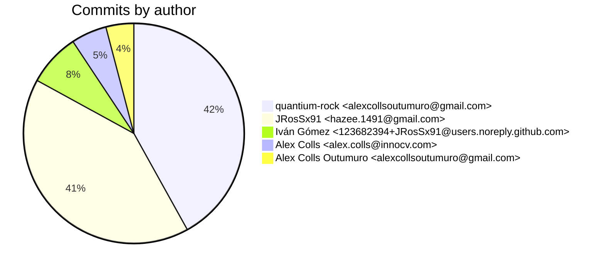
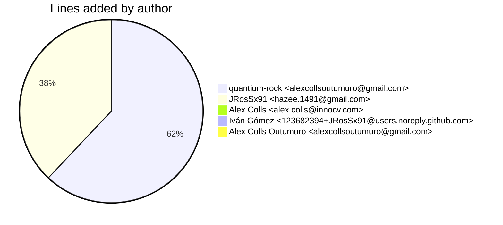
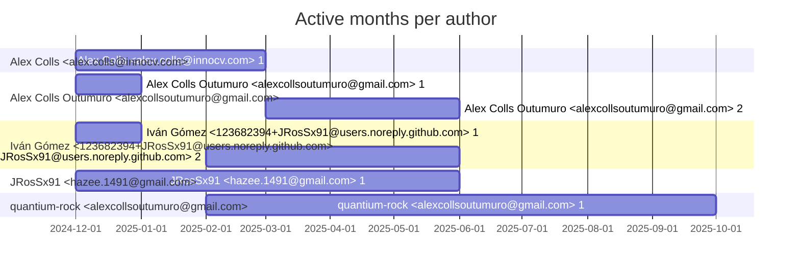

# Git Evaluation — orn-admin-api

Repo: `/home/quantium/labs/oriane/orn-admin-api`

## Summary

| Metric | Value |
|---|---:|
| Current tracked files | 141 |
| Current lines of code (tracked) | 31093 |
| Commits (total) | 441 |
| Commits (merges) | 75 |
| Commits (non-merges) | 366 |
| Unique authors | 4 |
| First commit | 2024-12-10T09:59:05+01:00 |
| Last commit | 2025-09-09T20:49:10+02:00 |
| Active days | 101 |
| Span days | 274 |
| Avg commits/day | 1.6095 |
| Lines added (sum) | 120376 |
| Lines deleted (sum) | 88133 |
| Files touched (sum of numstat rows) | 1668 |
| Estimated hours (session-based) | 343.36 |

## Schedule footprint

| Metric | Count |
|---|---:|
| Weekend days active (Sat/Sun) | 26 |
| Weekday days active | 75 |
| Night days active | 28 |
| Daytime days active | 86 |
| Days with both day & night activity | 18 |
| Day-only days | 68 |
| Night-only days | 10 |

## Developer leaderboard

| Developer | Commits | Hours | Wknd days | Night days | Day days | Both | Added | Deleted | Files | Active days | First | Last | Avg size | Median size | Stars |
|---|---:|---:|---:|---:|---:|---:|---:|---:|---:|---:|---|---|---:|---:|:--:
| JRosSx91 <hazee.1491@gmail.com> | 181 | 154.85 | 13 | 13 | 55 | 7 | 45383 | 58475 | 916 | 64 | 2024-12-10T10:10:29+01:00 | 2025-05-28T11:48:20+02:00 | 573.8 | 48.0 | ★★★★★ |
| quantium-rock <alexcollsoutumuro@gmail.com> | 185 | 142.31 | 12 | 13 | 42 | 9 | 74139 | 29473 | 675 | 52 | 2025-02-08T22:27:14+01:00 | 2025-09-09T20:49:10+02:00 | 560.06 | 58.0 | ★★★★★ |
| Iván Gómez <123682394+JRosSx91@users.noreply.github.com> | 34 | 20.4 | 4 | 2 | 18 | 0 | 1 | 0 | 1 | 22 | 2024-12-10T09:59:05+01:00 | 2025-05-23T11:22:44+02:00 | 0.03 | 0.0 | ★☆☆☆☆ |
| Alex Colls <alex.colls@innocv.com> | 23 | 14.84 | 4 | 2 | 7 | 1 | 853 | 185 | 76 | 9 | 2024-12-28T20:48:05+01:00 | 2025-02-14T08:16:36+01:00 | 45.13 | 8.0 | ☆☆☆☆☆ |
| Alex Colls Outumuro <alexcollsoutumuro@gmail.com> | 18 | 10.95 | 1 | 2 | 12 | 2 | 0 | 0 | 0 | 12 | 2024-12-28T18:53:45+01:00 | 2025-05-28T11:55:25+02:00 | 0.0 | 0.0 | ☆☆☆☆☆ |

## Commits by author

## Lines added by author

## Effort estimation model

This report estimates effort using a session + commit-weighted heuristic:
- Split commits per author into sessions where the gap > SESSION_GAP_MINUTES.
- Per session, sum per-commit minutes: base + sqrt(lines)/10 * MINUTES_PER_100_LINES + files * MINUTES_PER_FILE.
- Enforce MIN_SESSION_MINUTES minimum per session.
- Sum per day with MAX_HOURS_PER_DAY cap; multiply by CALIBRATION_FACTOR.

Parameters:

| Param | Value |
|---|---:|
| SESSION_GAP_MINUTES | 90 |
| MAX_HOURS_PER_DAY | 10.0 |
| MIN_SESSION_MINUTES | 30.0 |
| MINUTES_PER_COMMIT_BASE | 12.0 |
| MINUTES_PER_100_LINES | 8.0 |
| MINUTES_PER_FILE | 2.0 |
| CALIBRATION_FACTOR | 1.5 |

## Monthly activity

| Month | Commits | Added | Deleted | Files | Chart |
|---|---:|---:|---:|---:|:---|
| 2024-12 | 64 | 14545 | 11557 | 374 | ######################## |
| 2025-01 | 25 | 968 | 269 | 68 | ######### |
| 2025-02 | 58 | 15065 | 11536 | 150 | ##################### |
| 2025-03 | 108 | 15166 | 2337 | 236 | ######################################## |
| 2025-04 | 79 | 9005 | 18922 | 209 | ############################# |
| 2025-05 | 50 | 43587 | 25183 | 438 | ################### |
| 2025-06 | 11 | 3675 | 555 | 48 | #### |
| 2025-07 | 2 | 5 | 2 | 4 | # |
| 2025-08 | 10 | 1210 | 347 | 29 | #### |
| 2025-09 | 34 | 17150 | 17425 | 112 | ############# |

## Author activity timeline

## Highlights

- Longest active streak: 8 days (2025-03-28 to 2025-04-04)
- Best day by commits: 2025-03-28 — 17 commits
- Best day by lines added: 2025-05-28 — 14679 lines

