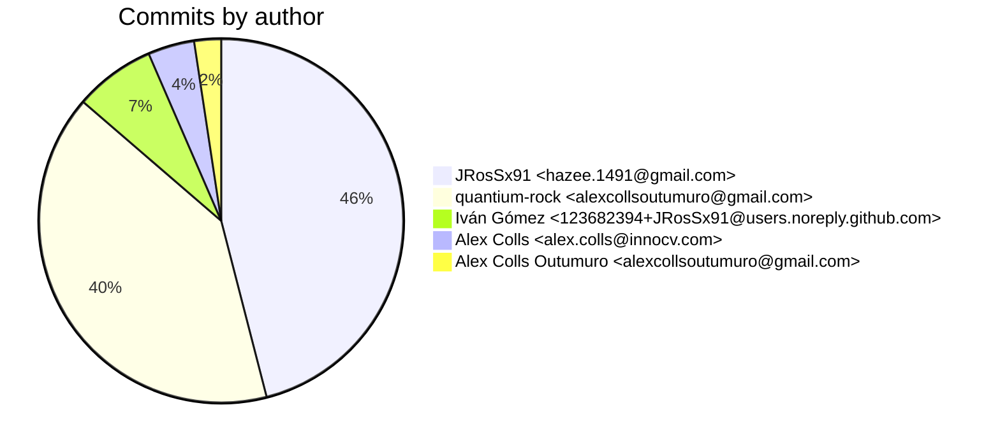
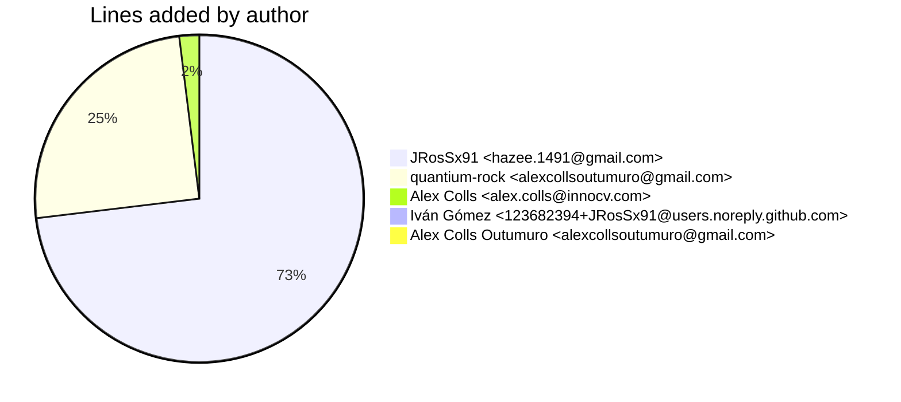
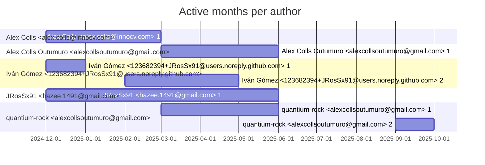

# Git Evaluation — orn-admin-web

Repo: `/home/quantium/labs/oriane/orn-admin-web`

## Summary

| Metric | Value |
|---|---:|
| Current tracked files | 243 |
| Current lines of code (tracked) | 23470 |
| Commits (total) | 461 |
| Commits (merges) | 74 |
| Commits (non-merges) | 387 |
| Unique authors | 4 |
| First commit | 2024-12-11T12:55:53+01:00 |
| Last commit | 2025-09-09T17:21:55+02:00 |
| Active days | 89 |
| Span days | 273 |
| Avg commits/day | 1.6886 |
| Lines added (sum) | 84119 |
| Lines deleted (sum) | 59776 |
| Files touched (sum of numstat rows) | 1552 |
| Estimated hours (session-based) | 320.67 |

## Schedule footprint

| Metric | Count |
|---|---:|
| Weekend days active (Sat/Sun) | 21 |
| Weekday days active | 68 |
| Night days active | 21 |
| Daytime days active | 80 |
| Days with both day & night activity | 16 |
| Day-only days | 64 |
| Night-only days | 5 |

## Developer leaderboard

| Developer | Commits | Hours | Wknd days | Night days | Day days | Both | Added | Deleted | Files | Active days | First | Last | Avg size | Median size | Stars |
|---|---:|---:|---:|---:|---:|---:|---:|---:|---:|---:|---|---|---:|---:|:--:
| JRosSx91 <hazee.1491@gmail.com> | 212 | 158.83 | 10 | 13 | 53 | 8 | 61486 | 49412 | 838 | 60 | 2024-12-11T13:00:08+01:00 | 2025-05-28T11:48:37+02:00 | 523.1 | 17.5 | ★★★★★ |
| quantium-rock <alexcollsoutumuro@gmail.com> | 186 | 122.65 | 6 | 9 | 36 | 6 | 20985 | 10213 | 672 | 40 | 2025-03-04T12:24:46+01:00 | 2025-09-09T17:21:55+02:00 | 167.73 | 21.0 | ★★★★☆ |
| Iván Gómez <123682394+JRosSx91@users.noreply.github.com> | 33 | 20.1 | 2 | 2 | 19 | 0 | 1 | 0 | 1 | 23 | 2024-12-11T12:55:53+01:00 | 2025-04-22T16:21:19+02:00 | 0.03 | 0.0 | ★☆☆☆☆ |
| Alex Colls <alex.colls@innocv.com> | 19 | 11.59 | 5 | 1 | 7 | 1 | 1647 | 151 | 41 | 8 | 2024-12-28T18:41:20+01:00 | 2025-02-16T14:17:03+01:00 | 94.63 | 8.0 | ☆☆☆☆☆ |
| Alex Colls Outumuro <alexcollsoutumuro@gmail.com> | 11 | 7.5 | 0 | 1 | 8 | 0 | 0 | 0 | 0 | 10 | 2025-03-26T17:23:47+01:00 | 2025-05-28T11:54:58+02:00 | 0.0 | 0.0 | ☆☆☆☆☆ |

## Commits by author

## Lines added by author

## Effort estimation model

This report estimates effort using a session + commit-weighted heuristic:
- Split commits per author into sessions where the gap > SESSION_GAP_MINUTES.
- Per session, sum per-commit minutes: base + sqrt(lines)/10 * MINUTES_PER_100_LINES + files * MINUTES_PER_FILE.
- Enforce MIN_SESSION_MINUTES minimum per session.
- Sum per day with MAX_HOURS_PER_DAY cap; multiply by CALIBRATION_FACTOR.

Parameters:

| Param | Value |
|---|---:|
| SESSION_GAP_MINUTES | 90 |
| MAX_HOURS_PER_DAY | 10.0 |
| MIN_SESSION_MINUTES | 30.0 |
| MINUTES_PER_COMMIT_BASE | 12.0 |
| MINUTES_PER_100_LINES | 8.0 |
| MINUTES_PER_FILE | 2.0 |
| CALIBRATION_FACTOR | 1.5 |

## Monthly activity

| Month | Commits | Added | Deleted | Files | Chart |
|---|---:|---:|---:|---:|:---|
| 2024-12 | 58 | 10121 | 5110 | 213 | ############### |
| 2025-01 | 56 | 4367 | 1202 | 128 | ############## |
| 2025-02 | 63 | 36569 | 32386 | 310 | ################ |
| 2025-03 | 70 | 12068 | 8325 | 205 | ################## |
| 2025-04 | 159 | 13970 | 11401 | 519 | ######################################## |
| 2025-05 | 36 | 6683 | 1237 | 148 | ######### |
| 2025-09 | 19 | 341 | 115 | 29 | ##### |

## Author activity timeline

## Highlights

- Longest active streak: 13 days (2025-03-30 to 2025-04-11)
- Best day by commits: 2025-04-07 — 24 commits
- Best day by lines added: 2025-02-10 — 20447 lines

