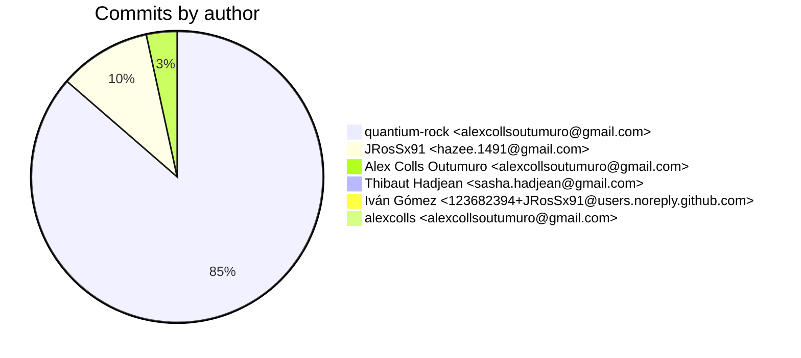
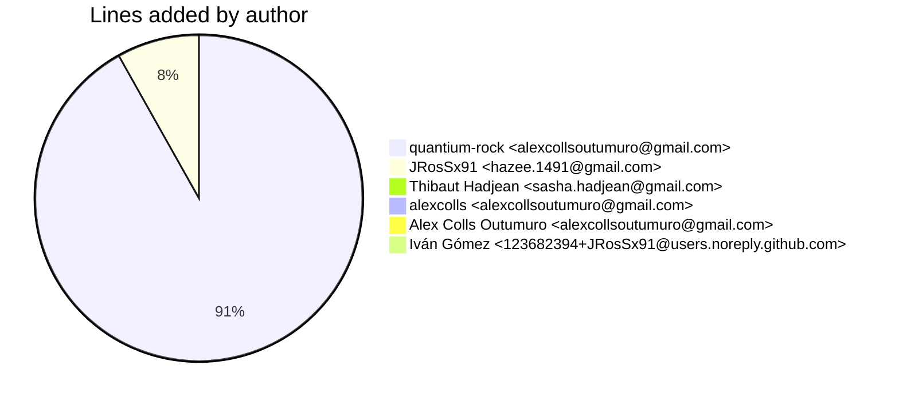
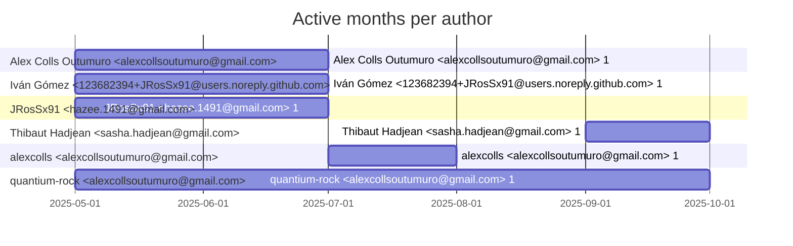

# Git Evaluation — orn-experience-app

Repo: `/home/quantium/labs/oriane/orn-experience-app`

## Summary

| Metric | Value |
|---|---:|
| Current tracked files | 189 |
| Current lines of code (tracked) | 25828 |
| Commits (total) | 240 |
| Commits (merges) | 12 |
| Commits (non-merges) | 228 |
| Unique authors | 4 |
| First commit | 2025-05-20T19:47:54+02:00 |
| Last commit | 2025-09-12T04:04:02+02:00 |
| Active days | 40 |
| Span days | 116 |
| Avg commits/day | 2.069 |
| Lines added (sum) | 89459 |
| Lines deleted (sum) | 63918 |
| Files touched (sum of numstat rows) | 1796 |
| Estimated hours (session-based) | 227.67 |

## Schedule footprint

| Metric | Count |
|---|---:|
| Weekend days active (Sat/Sun) | 7 |
| Weekday days active | 33 |
| Night days active | 15 |
| Daytime days active | 35 |
| Days with both day & night activity | 11 |
| Day-only days | 24 |
| Night-only days | 4 |

## Developer leaderboard

| Developer | Commits | Hours | Wknd days | Night days | Day days | Both | Added | Deleted | Files | Active days | First | Last | Avg size | Median size | Stars |
|---|---:|---:|---:|---:|---:|---:|---:|---:|---:|---:|---|---|---:|---:|:--:
| quantium-rock <alexcollsoutumuro@gmail.com> | 203 | 195.52 | 4 | 11 | 30 | 7 | 81439 | 44470 | 1662 | 36 | 2025-05-20T20:30:06+02:00 | 2025-09-12T04:04:02+02:00 | 620.24 | 84.0 | ★★★★★ |
| JRosSx91 <hazee.1491@gmail.com> | 24 | 19.33 | 3 | 5 | 6 | 3 | 7206 | 823 | 98 | 10 | 2025-05-30T12:05:02+02:00 | 2025-06-11T23:38:19+02:00 | 334.54 | 83.5 | ☆☆☆☆☆ |
| Alex Colls Outumuro <alexcollsoutumuro@gmail.com> | 8 | 5.54 | 0 | 0 | 3 | 0 | 18 | 2641 | 4 | 4 | 2025-05-20T19:47:54+02:00 | 2025-06-11T21:11:06+02:00 | 332.38 | 1.0 | ☆☆☆☆☆ |
| alexcolls <alexcollsoutumuro@gmail.com> | 1 | 3.01 | 1 | 0 | 1 | 0 | 52 | 15718 | 4 | 1 | 2025-07-05T19:58:57+02:00 | 2025-07-05T19:58:57+02:00 | 15770.0 | 15770.0 | ☆☆☆☆☆ |
| Thibaut Hadjean <sasha.hadjean@gmail.com> | 2 | 2.77 | 0 | 0 | 2 | 0 | 744 | 266 | 28 | 2 | 2025-09-04T18:04:29+02:00 | 2025-09-05T11:13:31+02:00 | 505.0 | 505.0 | ☆☆☆☆☆ |
| Iván Gómez <123682394+JRosSx91@users.noreply.github.com> | 2 | 1.5 | 0 | 1 | 1 | 0 | 0 | 0 | 0 | 2 | 2025-05-30T15:52:56+02:00 | 2025-06-06T23:06:34+02:00 | 0.0 | 0.0 | ☆☆☆☆☆ |

## Commits by author

## Lines added by author

## Effort estimation model

This report estimates effort using a session + commit-weighted heuristic:
- Split commits per author into sessions where the gap > SESSION_GAP_MINUTES.
- Per session, sum per-commit minutes: base + sqrt(lines)/10 * MINUTES_PER_100_LINES + files * MINUTES_PER_FILE.
- Enforce MIN_SESSION_MINUTES minimum per session.
- Sum per day with MAX_HOURS_PER_DAY cap; multiply by CALIBRATION_FACTOR.

Parameters:

| Param | Value |
|---|---:|
| SESSION_GAP_MINUTES | 90 |
| MAX_HOURS_PER_DAY | 10.0 |
| MIN_SESSION_MINUTES | 30.0 |
| MINUTES_PER_COMMIT_BASE | 12.0 |
| MINUTES_PER_100_LINES | 8.0 |
| MINUTES_PER_FILE | 2.0 |
| CALIBRATION_FACTOR | 1.5 |

## Monthly activity

| Month | Commits | Added | Deleted | Files | Chart |
|---|---:|---:|---:|---:|:---|
| 2025-05 | 24 | 15530 | 2543 | 353 | ######### |
| 2025-06 | 105 | 22338 | 23924 | 965 | ######################################## |
| 2025-07 | 39 | 43436 | 17272 | 249 | ############### |
| 2025-08 | 53 | 3423 | 18308 | 132 | #################### |
| 2025-09 | 19 | 4732 | 1871 | 97 | ####### |

## Author activity timeline

## Highlights

- Longest active streak: 15 days (2025-05-30 to 2025-06-13)
- Best day by commits: 2025-08-26 — 28 commits
- Best day by lines added: 2025-07-06 — 20976 lines

