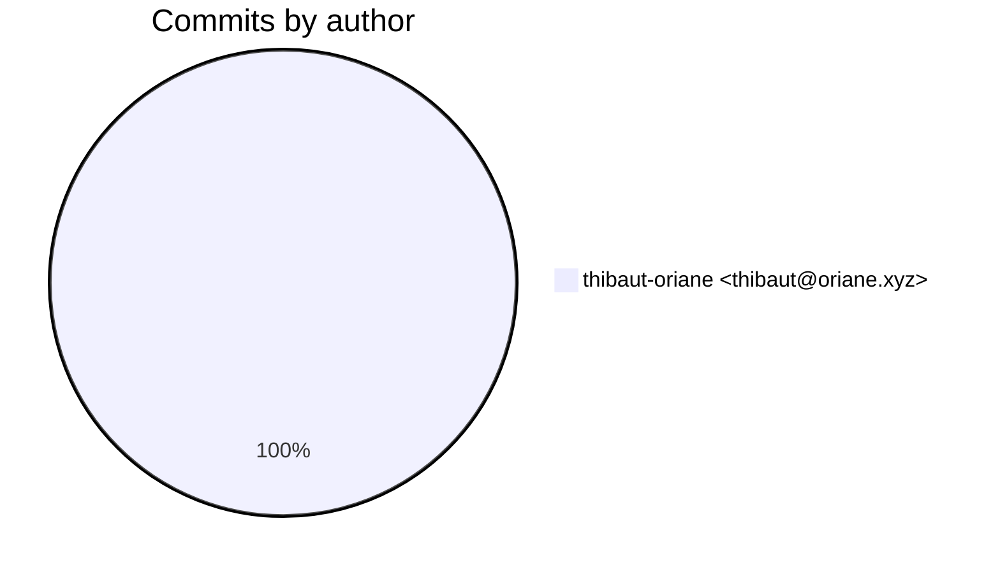
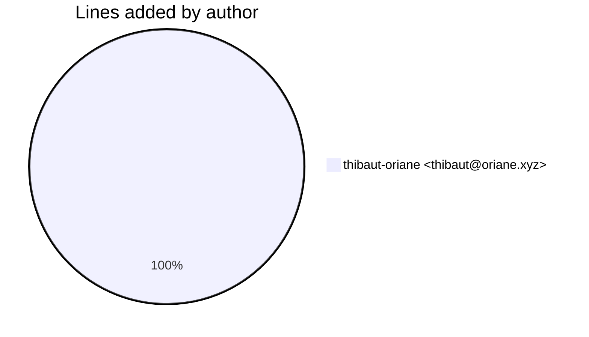
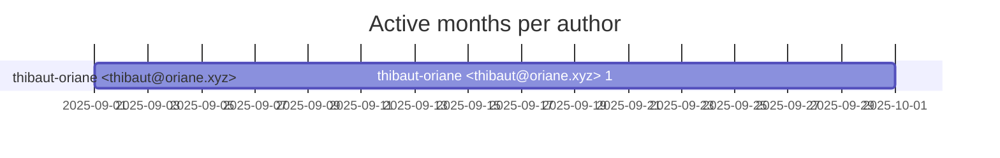

# Git Evaluation — orn-experience-applications

Repo: `/home/quantium/labs/oriane/orn-experience-applications`

## Summary

| Metric | Value |
|---|---:|
| Current tracked files | 1 |
| Current lines of code (tracked) | 1 |
| Commits (total) | 1 |
| Commits (merges) | 0 |
| Commits (non-merges) | 1 |
| Unique authors | 1 |
| First commit | 2025-09-11T10:09:35+02:00 |
| Last commit | 2025-09-11T10:09:35+02:00 |
| Active days | 1 |
| Span days | 1 |
| Avg commits/day | 1.0 |
| Lines added (sum) | 1 |
| Lines deleted (sum) | 0 |
| Files touched (sum of numstat rows) | 1 |
| Estimated hours (session-based) | 1.5 |

## Developer leaderboard

| Developer | Commits | Hours | Added | Deleted | Files | Active days | First | Last | Avg size | Median size | Stars |
|---|---:|---:|---:|---:|---:|---:|---|---|---:|---:|:--:
| thibaut-oriane <thibaut@oriane.xyz> | 1 | 1.5 | 1 | 0 | 1 | 1 | 2025-09-11T10:09:35+02:00 | 2025-09-11T10:09:35+02:00 | 1.0 | 1.0 | ★★★★★ |

## Commits by author

## Lines added by author

## Effort estimation model

This report estimates effort using a session + commit-weighted heuristic:
- Split commits per author into sessions where the gap > SESSION_GAP_MINUTES.
- Per session, sum per-commit minutes: base + sqrt(lines)/10 * MINUTES_PER_100_LINES + files * MINUTES_PER_FILE.
- Enforce MIN_SESSION_MINUTES minimum per session.
- Sum per day with MAX_HOURS_PER_DAY cap; multiply by CALIBRATION_FACTOR.

Parameters:

| Param | Value |
|---|---:|
| SESSION_GAP_MINUTES | 90 |
| MAX_HOURS_PER_DAY | 10.0 |
| MIN_SESSION_MINUTES | 45.0 |
| MINUTES_PER_COMMIT_BASE | 15.0 |
| MINUTES_PER_100_LINES | 12.0 |
| MINUTES_PER_FILE | 3.0 |
| CALIBRATION_FACTOR | 2.0 |

## Monthly activity

| Month | Commits | Added | Deleted | Files | Chart |
|---|---:|---:|---:|---:|:---|
| 2025-09 | 1 | 1 | 0 | 1 | ######################################## |

## Author activity timeline

## Highlights

- Longest active streak: 1 days (2025-09-11 to 2025-09-11)
- Best day by commits: 2025-09-11 — 1 commits
- Best day by lines added: 2025-09-11 — 1 lines

