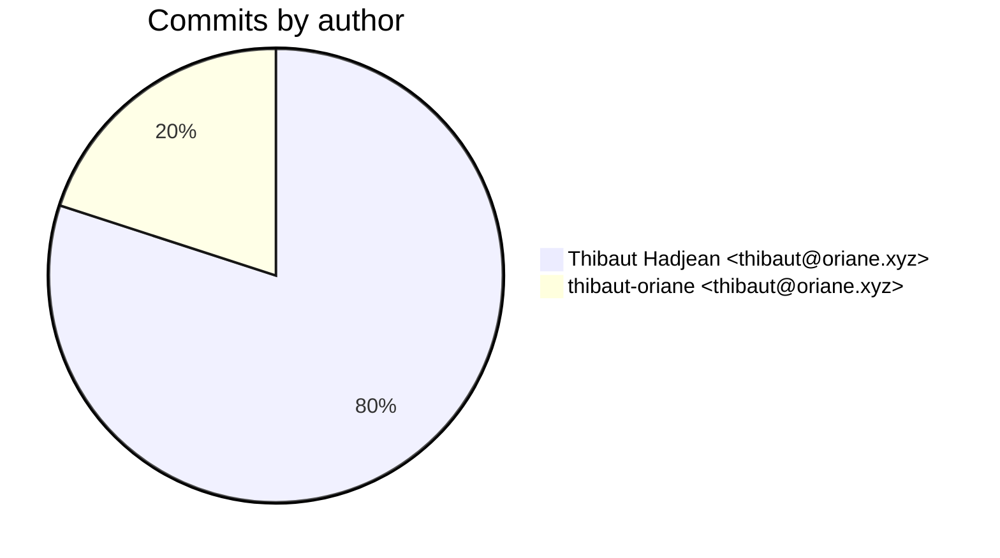
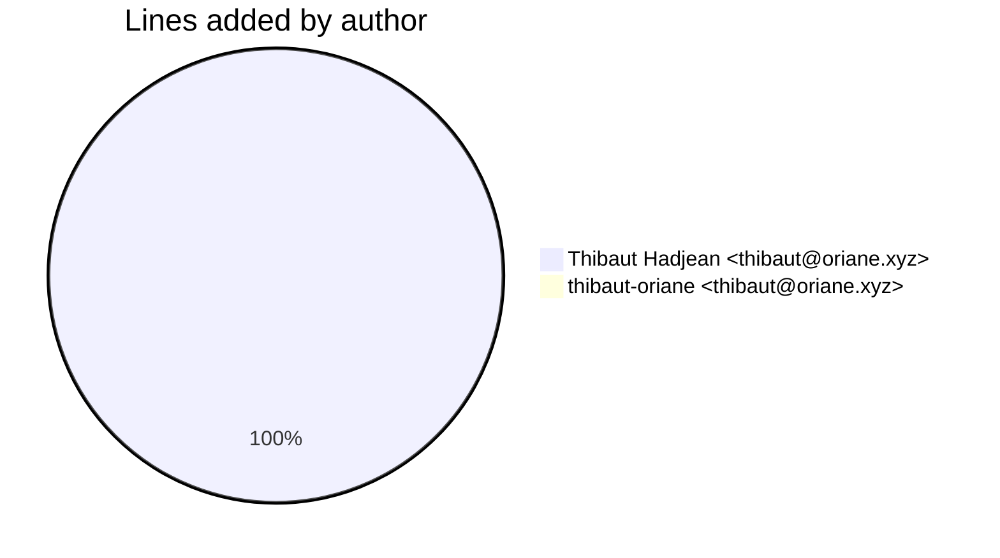
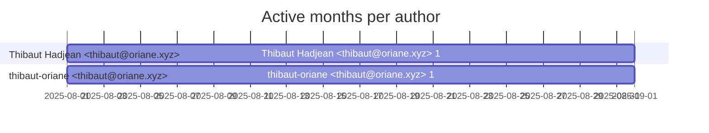

# Git Evaluation — orn-platform-applications

Repo: `/home/quantium/labs/oriane/orn-platform-applications`

## Summary

| Metric | Value |
|---|---:|
| Current tracked files | 36 |
| Current lines of code (tracked) | 845 |
| Commits (total) | 5 |
| Commits (merges) | 0 |
| Commits (non-merges) | 5 |
| Unique authors | 1 |
| First commit | 2025-08-08T18:45:37+02:00 |
| Last commit | 2025-08-15T19:23:22+02:00 |
| Active days | 3 |
| Span days | 8 |
| Avg commits/day | 0.625 |
| Lines added (sum) | 851 |
| Lines deleted (sum) | 6 |
| Files touched (sum of numstat rows) | 40 |
| Estimated hours (session-based) | 5.28 |

## Schedule footprint

| Metric | Count |
|---|---:|
| Weekend days active (Sat/Sun) | 0 |
| Weekday days active | 3 |
| Night days active | 1 |
| Daytime days active | 2 |
| Days with both day & night activity | 0 |
| Day-only days | 2 |
| Night-only days | 1 |

## Developer leaderboard

| Developer | Commits | Hours | Wknd days | Night days | Day days | Both | Added | Deleted | Files | Active days | First | Last | Avg size | Median size | Stars |
|---|---:|---:|---:|---:|---:|---:|---:|---:|---:|---:|---|---|---:|---:|:--:
| Thibaut Hadjean <thibaut@oriane.xyz> | 4 | 4.53 | 0 | 1 | 2 | 0 | 849 | 6 | 39 | 3 | 2025-08-08T18:59:25+02:00 | 2025-08-15T19:23:22+02:00 | 213.75 | 5.5 | ★★★★★ |
| thibaut-oriane <thibaut@oriane.xyz> | 1 | 0.75 | 0 | 0 | 1 | 0 | 2 | 0 | 1 | 1 | 2025-08-08T18:45:37+02:00 | 2025-08-08T18:45:37+02:00 | 2.0 | 2.0 | ★☆☆☆☆ |

## Commits by author

## Lines added by author

## Effort estimation model

This report estimates effort using a session + commit-weighted heuristic:
- Split commits per author into sessions where the gap > SESSION_GAP_MINUTES.
- Per session, sum per-commit minutes: base + sqrt(lines)/10 * MINUTES_PER_100_LINES + files * MINUTES_PER_FILE.
- Enforce MIN_SESSION_MINUTES minimum per session.
- Sum per day with MAX_HOURS_PER_DAY cap; multiply by CALIBRATION_FACTOR.

Parameters:

| Param | Value |
|---|---:|
| SESSION_GAP_MINUTES | 90 |
| MAX_HOURS_PER_DAY | 10.0 |
| MIN_SESSION_MINUTES | 30.0 |
| MINUTES_PER_COMMIT_BASE | 12.0 |
| MINUTES_PER_100_LINES | 8.0 |
| MINUTES_PER_FILE | 2.0 |
| CALIBRATION_FACTOR | 1.5 |

## Monthly activity

| Month | Commits | Added | Deleted | Files | Chart |
|---|---:|---:|---:|---:|:---|
| 2025-08 | 5 | 851 | 6 | 40 | ######################################## |

## Author activity timeline

## Highlights

- Longest active streak: 1 days (2025-08-08 to 2025-08-08)
- Best day by commits: 2025-08-08 — 3 commits
- Best day by lines added: 2025-08-08 — 847 lines

