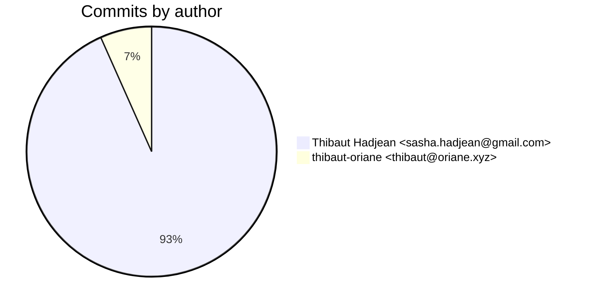
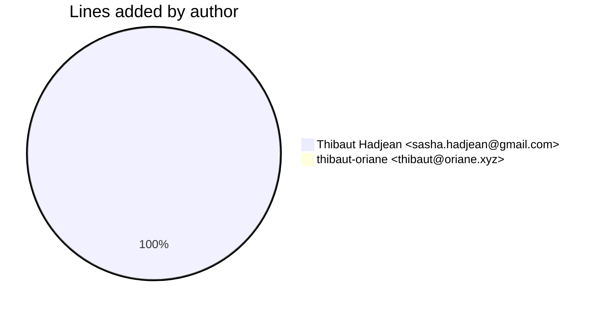
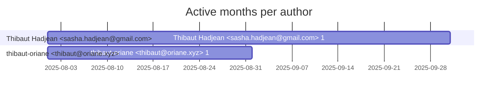

# Git Evaluation — orn-processor-applications

Repo: `/home/quantium/labs/oriane/orn-processor-applications`

## Summary

| Metric | Value |
|---|---:|
| Current tracked files | 18 |
| Current lines of code (tracked) | 580 |
| Commits (total) | 15 |
| Commits (merges) | 0 |
| Commits (non-merges) | 15 |
| Unique authors | 2 |
| First commit | 2025-08-08T20:11:09+02:00 |
| Last commit | 2025-09-02T20:50:08+02:00 |
| Active days | 8 |
| Span days | 26 |
| Avg commits/day | 0.5769 |
| Lines added (sum) | 718 |
| Lines deleted (sum) | 138 |
| Files touched (sum of numstat rows) | 59 |
| Estimated hours (session-based) | 19.95 |

## Developer leaderboard

| Developer | Commits | Hours | Added | Deleted | Files | Active days | First | Last | Avg size | Median size | Stars |
|---|---:|---:|---:|---:|---:|---:|---|---|---:|---:|:--:
| Thibaut Hadjean <sasha.hadjean@gmail.com> | 14 | 18.45 | 716 | 138 | 58 | 8 | 2025-08-08T21:12:46+02:00 | 2025-09-02T20:50:08+02:00 | 61.0 | 17.0 | ★★★★★ |
| thibaut-oriane <thibaut@oriane.xyz> | 1 | 1.5 | 2 | 0 | 1 | 1 | 2025-08-08T20:11:09+02:00 | 2025-08-08T20:11:09+02:00 | 2.0 | 2.0 | ☆☆☆☆☆ |

## Commits by author

## Lines added by author

## Effort estimation model

This report estimates effort using a session + commit-weighted heuristic:
- Split commits per author into sessions where the gap > SESSION_GAP_MINUTES.
- Per session, sum per-commit minutes: base + sqrt(lines)/10 * MINUTES_PER_100_LINES + files * MINUTES_PER_FILE.
- Enforce MIN_SESSION_MINUTES minimum per session.
- Sum per day with MAX_HOURS_PER_DAY cap; multiply by CALIBRATION_FACTOR.

Parameters:

| Param | Value |
|---|---:|
| SESSION_GAP_MINUTES | 90 |
| MAX_HOURS_PER_DAY | 10.0 |
| MIN_SESSION_MINUTES | 45.0 |
| MINUTES_PER_COMMIT_BASE | 15.0 |
| MINUTES_PER_100_LINES | 12.0 |
| MINUTES_PER_FILE | 3.0 |
| CALIBRATION_FACTOR | 2.0 |

## Monthly activity

| Month | Commits | Added | Deleted | Files | Chart |
|---|---:|---:|---:|---:|:---|
| 2025-08 | 13 | 703 | 123 | 54 | ######################################## |
| 2025-09 | 2 | 15 | 15 | 5 | ###### |

## Author activity timeline

## Highlights

- Longest active streak: 2 days (2025-08-27 to 2025-08-28)
- Best day by commits: 2025-08-15 — 4 commits
- Best day by lines added: 2025-08-13 — 316 lines

