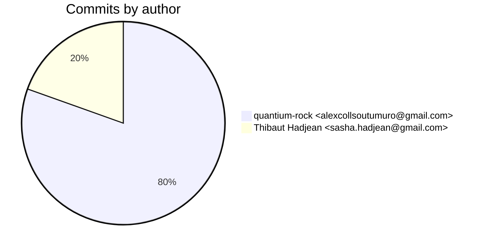
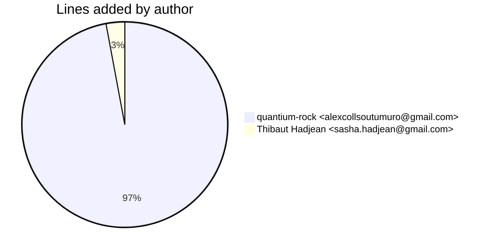
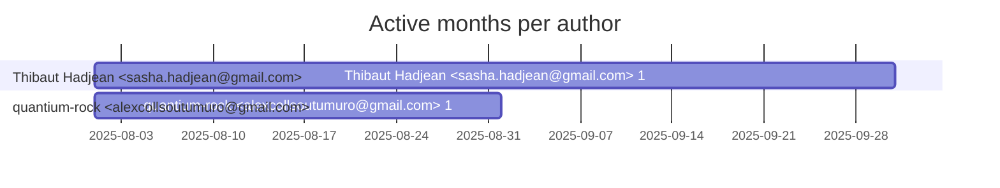

# Git Evaluation — orn-processor-etls

Repo: `/home/quantium/labs/oriane/orn-processor-etls`

## Summary

| Metric | Value |
|---|---:|
| Current tracked files | 141 |
| Current lines of code (tracked) | 27137 |
| Commits (total) | 87 |
| Commits (merges) | 0 |
| Commits (non-merges) | 87 |
| Unique authors | 2 |
| First commit | 2025-08-06T09:35:48+02:00 |
| Last commit | 2025-09-08T12:52:42+02:00 |
| Active days | 20 |
| Span days | 34 |
| Avg commits/day | 2.5588 |
| Lines added (sum) | 72067 |
| Lines deleted (sum) | 36305 |
| Files touched (sum of numstat rows) | 1865 |
| Estimated hours (session-based) | 240.43 |

## Developer leaderboard

| Developer | Commits | Hours | Added | Deleted | Files | Active days | First | Last | Avg size | Median size | Stars |
|---|---:|---:|---:|---:|---:|---:|---|---|---:|---:|:--:
| quantium-rock <alexcollsoutumuro@gmail.com> | 70 | 213.56 | 69955 | 33709 | 1785 | 12 | 2025-08-06T09:35:48+02:00 | 2025-08-25T22:15:26+02:00 | 1480.91 | 191.0 | ★★★★★ |
| Thibaut Hadjean <sasha.hadjean@gmail.com> | 17 | 26.87 | 2112 | 2596 | 80 | 12 | 2025-08-12T18:42:26+02:00 | 2025-09-08T12:52:42+02:00 | 276.94 | 48.0 | ★☆☆☆☆ |

## Commits by author

## Lines added by author

## Effort estimation model

This report estimates effort using a session + commit-weighted heuristic:
- Split commits per author into sessions where the gap > SESSION_GAP_MINUTES.
- Per session, sum per-commit minutes: base + sqrt(lines)/10 * MINUTES_PER_100_LINES + files * MINUTES_PER_FILE.
- Enforce MIN_SESSION_MINUTES minimum per session.
- Sum per day with MAX_HOURS_PER_DAY cap; multiply by CALIBRATION_FACTOR.

Parameters:

| Param | Value |
|---|---:|
| SESSION_GAP_MINUTES | 90 |
| MAX_HOURS_PER_DAY | 10.0 |
| MIN_SESSION_MINUTES | 45.0 |
| MINUTES_PER_COMMIT_BASE | 15.0 |
| MINUTES_PER_100_LINES | 12.0 |
| MINUTES_PER_FILE | 3.0 |
| CALIBRATION_FACTOR | 2.0 |

## Monthly activity

| Month | Commits | Added | Deleted | Files | Chart |
|---|---:|---:|---:|---:|:---|
| 2025-08 | 85 | 72033 | 36160 | 1849 | ######################################## |
| 2025-09 | 2 | 34 | 145 | 16 | # |

## Author activity timeline

## Highlights

- Longest active streak: 7 days (2025-08-11 to 2025-08-17)
- Best day by commits: 2025-08-14 — 25 commits
- Best day by lines added: 2025-08-07 — 22943 lines

