# Git Evaluation — qdrant

Repo: `/home/quantium/labs/oriane/_deprecated/qdrant`

## Summary

| Metric | Value |
|---|---:|
| Current tracked files | 1266 |
| Current lines of code (tracked) | 685510 |
| Commits (total) | 4534 |
| Commits (merges) | 18 |
| Commits (non-merges) | 4516 |
| Unique authors | 146 |
| First commit | 2020-05-30T23:35:38+02:00 |
| Last commit | 2025-07-17T16:11:44+02:00 |
| Active days | 1049 |
| Span days | 1875 |
| Avg commits/day | 2.4181 |
| Lines added (sum) | 952210 |
| Lines deleted (sum) | 255053 |
| Files touched (sum of numstat rows) | 26742 |
| Estimated hours (session-based) | 7682.16 |

## Developer leaderboard

| Developer | Commits | Hours | Added | Deleted | Files | Active days | First | Last | Avg size | Median size | Stars |
|---|---:|---:|---:|---:|---:|---:|---|---|---:|---:|:--:
| Andrey Vasnetsov <andrey@vasnetsov.com> | 741 | 1483.61 | 383891 | 54094 | 5088 | 451 | 2020-10-26T17:44:31+01:00 | 2025-07-17T14:32:18+02:00 | 591.07 | 56.0 | ★★★★★ |
| Arnaud Gourlay <arnaud.gourlay@gmail.com> | 661 | 1108.56 | 88965 | 35298 | 3436 | 409 | 2021-12-13T17:15:56+01:00 | 2025-07-16T17:14:06+02:00 | 187.99 | 33.0 | ★★★★☆ |
| dependabot[bot] <49699333+dependabot[bot]@users.noreply.github.com> | 1143 | 1101.7 | 12718 | 9918 | 2397 | 352 | 2020-12-31T07:35:32+00:00 | 2025-07-15T07:25:36+00:00 | 19.8 | 8.0 | ★★★★☆ |
| Tim Visée <tim+github@visee.me> | 552 | 912.01 | 121168 | 22831 | 3200 | 319 | 2023-03-07T17:03:20+01:00 | 2025-07-17T16:11:44+02:00 | 260.87 | 46.5 | ★★★☆☆ |
| Luis Cossío <luis.cossio@qdrant.com> | 272 | 564.05 | 66109 | 23481 | 2317 | 183 | 2023-04-21T15:37:09-04:00 | 2025-07-17T04:41:24-04:00 | 329.38 | 159.0 | ★★☆☆☆ |
| Ivan Pleshkov <pleshkov.ivan@gmail.com> | 234 | 481.95 | 71344 | 18519 | 1867 | 171 | 2021-12-31T11:38:33+03:00 | 2025-07-14T19:28:07+02:00 | 384.03 | 135.0 | ★★☆☆☆ |
| xzfc <5121426+xzfc@users.noreply.github.com> | 165 | 416.35 | 36715 | 24395 | 2032 | 116 | 2024-01-22T14:39:57+00:00 | 2025-07-02T23:06:44+00:00 | 370.36 | 262.0 | ★☆☆☆☆ |
| Roman Titov <ffuugoo@users.noreply.github.com> | 176 | 348.21 | 40547 | 24707 | 1189 | 143 | 2023-01-06T12:02:57+01:00 | 2025-07-14T15:03:16+02:00 | 370.76 | 137.5 | ★☆☆☆☆ |
| Jojii <15957865+JojiiOfficial@users.noreply.github.com> | 92 | 271.29 | 27847 | 9295 | 1532 | 69 | 2024-02-08T12:50:58+01:00 | 2025-07-17T11:04:43+02:00 | 403.72 | 230.5 | ★☆☆☆☆ |
| Egor Ivkov <e.o.ivkov@gmail.com> | 84 | 169.71 | 12706 | 6213 | 701 | 69 | 2021-12-23T15:00:07+03:00 | 2022-10-23T00:23:37+03:00 | 225.23 | 143.5 | ★☆☆☆☆ |
| Andrey Vasnetsov <vasnetsov93@gmail.com> | 69 | 147.86 | 13534 | 3853 | 684 | 37 | 2020-05-30T23:35:38+02:00 | 2021-04-08T00:37:38+02:00 | 251.99 | 176.0 | ☆☆☆☆☆ |
| Kumar Shivendu <kshivendu1@gmail.com> | 53 | 89.68 | 2220 | 640 | 236 | 49 | 2023-12-27T18:19:16+05:30 | 2025-07-16T17:51:30+05:30 | 53.96 | 17.0 | ☆☆☆☆☆ |
| Konstantin <kgrech@users.noreply.github.com> | 11 | 51.67 | 11733 | 4005 | 323 | 9 | 2021-06-27T23:55:59+01:00 | 2021-12-11T20:55:01+00:00 | 1430.73 | 392.0 | ☆☆☆☆☆ |
| allcontributors[bot] <46447321+allcontributors[bot]@users.noreply.github.com> | 35 | 41.4 | 449 | 57 | 70 | 23 | 2021-05-27T00:21:50+02:00 | 2023-04-12T17:40:34+02:00 | 14.46 | 10.0 | ☆☆☆☆☆ |
| Gabriel Velo <gabriel.velo@gmail.com> | 10 | 33.41 | 5408 | 5315 | 173 | 10 | 2022-02-03T06:12:57-03:00 | 2022-06-06T12:14:20-03:00 | 1072.3 | 235.0 | ☆☆☆☆☆ |
| generall <andrey@vasnetsov.com> | 17 | 25.5 | 9666 | 75 | 18 | 12 | 2023-10-09T14:46:46+02:00 | 2025-07-12T14:01:14+02:00 | 573.0 | 3.0 | ☆☆☆☆☆ |
| n0x29a <15330763+n0x29a@users.noreply.github.com> | 9 | 19.88 | 3596 | 1147 | 72 | 9 | 2024-10-16T19:37:38+02:00 | 2025-01-23T17:34:38+00:00 | 527.0 | 431.0 | ☆☆☆☆☆ |
| n0x29a <vladi@qdrant.com> | 4 | 18.88 | 12847 | 528 | 99 | 4 | 2025-05-14T21:01:49+02:00 | 2025-06-16T12:48:21+02:00 | 3343.75 | 602.5 | ☆☆☆☆☆ |
| Andrei Vasnetsov <andrei.vasnetsov@moberries.com> | 9 | 17.31 | 1046 | 884 | 83 | 4 | 2020-10-18T16:16:24+02:00 | 2020-10-21T00:35:54+02:00 | 214.44 | 189.0 | ☆☆☆☆☆ |
| tellet-q <166374656+tellet-q@users.noreply.github.com> | 7 | 13.68 | 3127 | 1330 | 31 | 7 | 2024-06-29T22:40:18+02:00 | 2025-07-14T12:42:06+02:00 | 636.71 | 178.0 | ☆☆☆☆☆ |
| Predrag Knezevic <predrag.knezevic@qdrant.com> | 3 | 12.23 | 1656 | 1290 | 68 | 3 | 2024-11-01T18:12:59+01:00 | 2024-11-06T20:09:31+01:00 | 982.0 | 1046.0 | ☆☆☆☆☆ |
| Luis Cossío <luis.cossio@outlook.com> | 6 | 10.54 | 579 | 51 | 36 | 5 | 2023-02-02T10:52:17-03:00 | 2023-04-14T18:03:13-04:00 | 105.0 | 82.0 | ☆☆☆☆☆ |
| Zein Wen <85084498+zzzz-vincent@users.noreply.github.com> | 4 | 10.19 | 2589 | 549 | 36 | 4 | 2023-06-27T01:58:32-07:00 | 2023-10-04T02:57:51-07:00 | 784.5 | 399.0 | ☆☆☆☆☆ |
| George <george.panchuk@qdrant.tech> | 6 | 9.27 | 150 | 344 | 24 | 6 | 2023-01-31T15:43:40+04:00 | 2025-01-30T13:35:45+01:00 | 82.33 | 41.5 | ☆☆☆☆☆ |
| Russ Cam <russ.cam@forloop.co.uk> | 3 | 9.15 | 201 | 220 | 60 | 3 | 2022-08-10T17:39:21+10:00 | 2023-11-08T21:47:14+10:00 | 140.33 | 14.0 | ☆☆☆☆☆ |
| Marcin Puc <5671049+tranzystorek-io@users.noreply.github.com> | 3 | 8.37 | 214 | 202 | 46 | 3 | 2021-11-10T21:32:25+01:00 | 2021-11-12T19:16:00+01:00 | 138.67 | 40.0 | ☆☆☆☆☆ |
| paulotten <paulotten@users.noreply.github.com> | 5 | 7.86 | 321 | 15 | 17 | 5 | 2023-04-17T05:42:34-04:00 | 2023-05-01T04:29:06-04:00 | 67.2 | 49.0 | ☆☆☆☆☆ |
| Jesse <github@jessebakker.com> | 3 | 7.68 | 2094 | 171 | 35 | 2 | 2023-05-08T17:02:29+02:00 | 2023-08-07T16:16:41+02:00 | 755.0 | 62.0 | ☆☆☆☆☆ |
| Ibrahim M. Akrab <ibrahim.m.akrab@gmail.com> | 3 | 7.53 | 1221 | 112 | 35 | 3 | 2023-03-21T18:17:25+02:00 | 2023-04-18T18:46:06+02:00 | 444.33 | 464.0 | ☆☆☆☆☆ |
| Anton Kaliaev <anton.kalyaev@gmail.com> | 4 | 7.05 | 139 | 161 | 37 | 1 | 2022-01-03T20:28:21+04:00 | 2022-01-03T20:28:56+04:00 | 75.0 | 63.0 | ☆☆☆☆☆ |
| kwkr <kawka.maciej.93@gmail.com> | 3 | 6.55 | 708 | 48 | 29 | 3 | 2023-10-06T12:13:01+02:00 | 2024-03-13T10:59:07+01:00 | 252.0 | 217.0 | ☆☆☆☆☆ |
| Anton V <94402218+anveq@users.noreply.github.com> | 4 | 6.48 | 74 | 30 | 18 | 3 | 2021-11-24T11:26:19+03:00 | 2021-12-09T20:18:20+03:00 | 26.0 | 6.0 | ☆☆☆☆☆ |
| Di Zhao <di.zhao@gmail.com> | 3 | 6.33 | 401 | 132 | 28 | 3 | 2023-08-16T01:56:44-07:00 | 2023-12-04T14:18:25-08:00 | 177.67 | 119.0 | ☆☆☆☆☆ |
| Kenshin Tanaka <70839560+kemkemG0@users.noreply.github.com> | 2 | 6.33 | 1267 | 151 | 33 | 2 | 2024-05-10T23:54:23+09:00 | 2024-05-13T18:36:56+09:00 | 709.0 | 709.0 | ☆☆☆☆☆ |
| Kartik Gupta <84975264+kartik-gupta-ij@users.noreply.github.com> | 3 | 6.19 | 648 | 1030 | 19 | 3 | 2024-07-12T16:25:35+05:30 | 2024-10-25T00:05:18+05:30 | 559.33 | 479.0 | ☆☆☆☆☆ |
| Alexander Galibey <48586936+galibey@users.noreply.github.com> | 2 | 6.03 | 834 | 671 | 31 | 2 | 2021-08-03T11:35:55+03:00 | 2021-08-22T23:11:00+03:00 | 752.5 | 752.5 | ☆☆☆☆☆ |
| Andre Zayarni <926368+azayarni@users.noreply.github.com> | 4 | 6.0 | 6 | 4 | 4 | 4 | 2022-08-22T16:37:43+02:00 | 2025-03-27T13:01:49+01:00 | 2.5 | 2.0 | ☆☆☆☆☆ |
| shylock <tcath2s@gmail.com> | 1 | 5.52 | 877 | 51 | 38 | 1 | 2024-02-15T22:15:05+08:00 | 2024-02-15T22:15:05+08:00 | 928.0 | 928.0 | ☆☆☆☆☆ |
| timvisee <tim@visee.me> | 4 | 5.46 | 188 | 224 | 15 | 3 | 2023-11-21T10:39:58+01:00 | 2025-01-27T18:21:15+01:00 | 103.0 | 116.0 | ☆☆☆☆☆ |
| trean <trean.mi@gmail.com> | 2 | 5.17 | 657 | 68 | 22 | 2 | 2021-06-20T15:30:12+02:00 | 2022-05-05T14:31:50+02:00 | 362.5 | 362.5 | ☆☆☆☆☆ |
| Kamyar Salahi <kam.salahi@gmail.com> | 1 | 4.89 | 1585 | 5 | 28 | 1 | 2024-05-13T14:19:21-07:00 | 2024-05-13T14:19:21-07:00 | 1590.0 | 1590.0 | ☆☆☆☆☆ |
| Nirant <NirantK@users.noreply.github.com> | 3 | 4.5 | 143 | 113 | 4 | 2 | 2023-04-27T18:42:39+05:30 | 2023-05-04T14:21:56+05:30 | 85.33 | 2.0 | ☆☆☆☆☆ |
| Prokudin Alexander <prok20@inbox.ru> | 1 | 4.18 | 185 | 199 | 29 | 1 | 2022-01-18T01:33:26+03:00 | 2022-01-18T01:33:26+03:00 | 384.0 | 384.0 | ☆☆☆☆☆ |
| ding-young <lsyhime@snu.ac.kr> | 1 | 3.82 | 821 | 106 | 21 | 1 | 2024-02-12T00:43:43+09:00 | 2024-02-12T00:43:43+09:00 | 927.0 | 927.0 | ☆☆☆☆☆ |
| Damien Castelltort <dcastelltort@gmail.com> | 1 | 3.52 | 159 | 82 | 24 | 1 | 2023-06-21T22:53:19+02:00 | 2023-06-21T22:53:19+02:00 | 241.0 | 241.0 | ☆☆☆☆☆ |
| Wesley <100464352+ologbonowiwi@users.noreply.github.com> | 1 | 3.5 | 573 | 52 | 20 | 1 | 2023-11-23T17:58:35-03:00 | 2023-11-23T17:58:35-03:00 | 625.0 | 625.0 | ☆☆☆☆☆ |
| stencillogic <59373360+stencillogic@users.noreply.github.com> | 1 | 3.42 | 613 | 41 | 19 | 1 | 2023-03-20T22:59:49+03:00 | 2023-03-20T22:59:49+03:00 | 654.0 | 654.0 | ☆☆☆☆☆ |
| Anush <anushshetty90@gmail.com> | 2 | 3.4 | 27 | 31 | 12 | 2 | 2024-01-11T17:30:52+05:30 | 2024-03-18T18:14:41+05:30 | 29.0 | 29.0 | ☆☆☆☆☆ |
| Kaan C. Fidan <kaancfidan@gmail.com> | 1 | 3.18 | 370 | 8 | 19 | 1 | 2023-12-02T23:28:38+03:00 | 2023-12-02T23:28:38+03:00 | 378.0 | 378.0 | ☆☆☆☆☆ |
| Josh Soref <2119212+jsoref@users.noreply.github.com> | 1 | 3.15 | 39 | 39 | 23 | 1 | 2023-09-14T05:38:23-04:00 | 2023-09-14T05:38:23-04:00 | 78.0 | 78.0 | ☆☆☆☆☆ |
| Jayant Pranjal <96689162+jayantpranjal0@users.noreply.github.com> | 2 | 3.0 | 36 | 10 | 2 | 2 | 2025-06-04T21:26:55+05:30 | 2025-06-05T13:50:12+05:30 | 23.0 | 23.0 | ☆☆☆☆☆ |
| Gulshan <kumar.gulshan2192@gmail.com> | 2 | 3.0 | 130 | 33 | 9 | 2 | 2024-12-19T15:50:32+05:30 | 2024-12-20T17:57:49+05:30 | 81.5 | 81.5 | ☆☆☆☆☆ |
| Srubin Sethu Madhavan <shrubin93.skn@gmail.com> | 2 | 3.0 | 35 | 11 | 2 | 2 | 2024-08-19T12:30:36+01:00 | 2024-08-20T13:47:44+01:00 | 23.0 | 23.0 | ☆☆☆☆☆ |
| Luis Merino <mail@luismerino.name> | 2 | 3.0 | 140 | 47 | 4 | 2 | 2024-06-25T13:44:25+02:00 | 2024-06-29T22:39:09+02:00 | 93.5 | 93.5 | ☆☆☆☆☆ |
| Lokesh Kumar <lkumar94@gmail.com> | 2 | 3.0 | 4 | 4 | 2 | 2 | 2024-06-04T17:05:44+02:00 | 2024-06-06T09:55:03+02:00 | 4.0 | 4.0 | ☆☆☆☆☆ |
| Arnaud Gourlay <arnaud.gourlay@qdrant.com> | 2 | 3.0 | 123 | 70 | 3 | 2 | 2024-03-12T17:29:04+01:00 | 2024-03-13T15:18:13+01:00 | 96.5 | 96.5 | ☆☆☆☆☆ |
| Dhanus <dhanus3133@gmail.com> | 2 | 3.0 | 109 | 12 | 4 | 2 | 2024-01-07T03:30:31+05:30 | 2024-01-16T17:56:20+05:30 | 60.5 | 60.5 | ☆☆☆☆☆ |
| Yiping Deng <yiping.deng.98@gmail.com> | 2 | 3.0 | 222 | 29 | 6 | 2 | 2023-05-02T12:29:32+01:00 | 2023-08-16T07:57:58+01:00 | 125.5 | 125.5 | ☆☆☆☆☆ |
| Ikko Eltociear Ashimine <eltociear@gmail.com> | 2 | 3.0 | 2 | 2 | 2 | 2 | 2023-04-09T21:31:34+09:00 | 2023-05-08T05:05:52+09:00 | 2.0 | 2.0 | ☆☆☆☆☆ |
| Yiping Deng <y.deng@jacobs-university.de> | 2 | 3.0 | 61 | 19 | 9 | 2 | 2023-04-03T16:27:38+01:00 | 2023-04-10T15:03:30+01:00 | 40.0 | 40.0 | ☆☆☆☆☆ |
| Tim Eggert <tim@elbart.com> | 1 | 2.94 | 372 | 73 | 16 | 1 | 2022-01-25T16:22:18+01:00 | 2022-01-25T16:22:18+01:00 | 445.0 | 445.0 | ☆☆☆☆☆ |
| HaiCheViet <cheviethai123@gmail.com> | 1 | 2.86 | 396 | 68 | 15 | 1 | 2021-10-12T16:07:36+07:00 | 2021-10-12T16:07:36+07:00 | 464.0 | 464.0 | ☆☆☆☆☆ |
| Yaroslav Halchenko <debian@onerussian.com> | 1 | 2.84 | 51 | 23 | 20 | 1 | 2023-07-12T10:30:42-04:00 | 2023-07-12T10:30:42-04:00 | 74.0 | 74.0 | ☆☆☆☆☆ |
| Gabriel <gabrielgcr45@gmail.com> | 1 | 2.78 | 374 | 10 | 15 | 1 | 2024-01-29T09:39:42-03:00 | 2024-01-29T09:39:42-03:00 | 384.0 | 384.0 | ☆☆☆☆☆ |
| Alex Huang <huangweijun1001@gmail.com> | 1 | 2.78 | 531 | 71 | 13 | 1 | 2023-04-04T12:08:13+02:00 | 2023-04-04T12:08:13+02:00 | 602.0 | 602.0 | ☆☆☆☆☆ |
| Predrag Knezevic <pedjak@gmail.com> | 1 | 2.67 | 167 | 117 | 15 | 1 | 2024-10-31T18:30:41+01:00 | 2024-10-31T18:30:41+01:00 | 284.0 | 284.0 | ☆☆☆☆☆ |
| Alexandru Cihodaru <40807189+AlexandruCihodaru@users.noreply.github.com> | 1 | 2.6 | 335 | 168 | 12 | 1 | 2024-02-28T21:04:12+02:00 | 2024-02-28T21:04:12+02:00 | 503.0 | 503.0 | ☆☆☆☆☆ |
| Joan Fontanals <jfontanalsmartinez@gmail.com> | 1 | 2.58 | 670 | 57 | 10 | 1 | 2021-05-26T23:59:57+02:00 | 2021-05-26T23:59:57+02:00 | 727.0 | 727.0 | ☆☆☆☆☆ |
| Andrey Perelygin <38869290+nilhex@users.noreply.github.com> | 1 | 2.4 | 748 | 12 | 8 | 1 | 2023-05-01T15:28:11+07:00 | 2023-05-01T15:28:11+07:00 | 760.0 | 760.0 | ☆☆☆☆☆ |
| Daniil <daniil@moteefe.com> | 1 | 2.25 | 107 | 22 | 13 | 1 | 2022-01-03T19:12:01+03:00 | 2022-01-03T19:12:01+03:00 | 129.0 | 129.0 | ☆☆☆☆☆ |
| llogiq <bogusandre@gmail.com> | 1 | 2.21 | 189 | 330 | 8 | 1 | 2023-05-30T10:24:52+02:00 | 2023-05-30T10:24:52+02:00 | 519.0 | 519.0 | ☆☆☆☆☆ |
| Eugene Tolbakov <ev.tolbakov@gmail.com> | 1 | 2.1 | 248 | 153 | 8 | 1 | 2023-09-25T14:10:45+01:00 | 2023-09-25T14:10:45+01:00 | 401.0 | 401.0 | ☆☆☆☆☆ |
| Tushar Dahiya <tusharxoxoxo@gmail.com> | 1 | 1.91 | 53 | 53 | 10 | 1 | 2023-03-22T20:35:37+05:30 | 2023-03-22T20:35:37+05:30 | 106.0 | 106.0 | ☆☆☆☆☆ |
| Ricardo Pallas <rpallas92@gmail.com> | 1 | 1.85 | 110 | 16 | 9 | 1 | 2024-03-26T14:27:33+01:00 | 2024-03-26T14:27:33+01:00 | 126.0 | 126.0 | ☆☆☆☆☆ |
| AMIR <31338382+amiremohamadi@users.noreply.github.com> | 1 | 1.79 | 283 | 17 | 6 | 1 | 2024-05-13T23:46:35+03:30 | 2024-05-13T23:46:35+03:30 | 300.0 | 300.0 | ☆☆☆☆☆ |
| Tim <dev@timsueberkrueb.io> | 1 | 1.77 | 23 | 23 | 10 | 1 | 2023-06-05T10:20:21+02:00 | 2023-06-05T10:20:21+02:00 | 46.0 | 46.0 | ☆☆☆☆☆ |
| Konstantin G <kgrech@mail.ru> | 1 | 1.59 | 79 | 70 | 6 | 1 | 2021-07-05T22:32:23+01:00 | 2021-07-05T22:32:23+01:00 | 149.0 | 149.0 | ☆☆☆☆☆ |
| Jason Mobarak <git@jason.mobarak.name> | 1 | 1.5 | 1 | 1 | 1 | 1 | 2025-06-26T01:05:39-07:00 | 2025-06-26T01:05:39-07:00 | 2.0 | 2.0 | ☆☆☆☆☆ |
| Andre Zayarni <andre@qdrant.com> | 1 | 1.5 | 41 | 136 | 1 | 1 | 2025-07-12T06:46:14+02:00 | 2025-07-12T06:46:14+02:00 | 177.0 | 177.0 | ☆☆☆☆☆ |
| ip75 <igor.polovykh@gmail.com> | 1 | 1.5 | 12 | 20 | 3 | 1 | 2025-05-05T12:13:13+03:00 | 2025-05-05T12:13:13+03:00 | 32.0 | 32.0 | ☆☆☆☆☆ |
| LesserPanda <60764506+kzsc5464@users.noreply.github.com> | 1 | 1.5 | 4 | 4 | 2 | 1 | 2025-04-30T05:12:31+09:00 | 2025-04-30T05:12:31+09:00 | 8.0 | 8.0 | ☆☆☆☆☆ |
| Huge <mr.huge@seznam.cz> | 1 | 1.5 | 1 | 1 | 1 | 1 | 2025-03-28T13:50:39+01:00 | 2025-03-28T13:50:39+01:00 | 2.0 | 2.0 | ☆☆☆☆☆ |
| Damian <damiakpan@gmail.com> | 1 | 1.5 | 22 | 1 | 2 | 1 | 2025-02-06T09:43:43+01:00 | 2025-02-06T09:43:43+01:00 | 23.0 | 23.0 | ☆☆☆☆☆ |
| Joey Krejci <josephkrejci@gmail.com> | 1 | 1.5 | 1 | 1 | 1 | 1 | 2025-02-03T11:10:54-07:00 | 2025-02-03T11:10:54-07:00 | 2.0 | 2.0 | ☆☆☆☆☆ |
| Ashwant Manikoth <ashwanta75@gmail.com> | 1 | 1.5 | 1 | 1 | 1 | 1 | 2025-01-06T07:04:13-04:00 | 2025-01-06T07:04:13-04:00 | 2.0 | 2.0 | ☆☆☆☆☆ |
| Wen-Ching Wei <115555327+weiwch@users.noreply.github.com> | 1 | 1.5 | 1 | 1 | 1 | 1 | 2024-12-09T19:28:56+08:00 | 2024-12-09T19:28:56+08:00 | 2.0 | 2.0 | ☆☆☆☆☆ |
| Redouan El Rhazouani <81578195+redouan-rhazouani@users.noreply.github.com> | 1 | 1.5 | 196 | 65 | 1 | 1 | 2024-12-06T10:43:58+01:00 | 2024-12-06T10:43:58+01:00 | 261.0 | 261.0 | ☆☆☆☆☆ |
| gulshan-rs <kumar.gulshan2192@gmail.com> | 1 | 1.5 | 14 | 6 | 1 | 1 | 2024-11-18T15:26:31+05:30 | 2024-11-18T15:26:31+05:30 | 20.0 | 20.0 | ☆☆☆☆☆ |
| Palash Dhabale <100768184+PalashDhabale@users.noreply.github.com> | 1 | 1.5 | 1 | 1 | 1 | 1 | 2024-10-23T12:26:22+05:30 | 2024-10-23T12:26:22+05:30 | 2.0 | 2.0 | ☆☆☆☆☆ |
| Serhii Tatarintsev <sergey@tatarintsev.me> | 1 | 1.5 | 17 | 3 | 1 | 1 | 2024-09-22T21:28:47+02:00 | 2024-09-22T21:28:47+02:00 | 20.0 | 20.0 | ☆☆☆☆☆ |
| misssonder <819643718@qq.com> | 1 | 1.5 | 21 | 138 | 1 | 1 | 2024-09-17T23:06:30+08:00 | 2024-09-17T23:06:30+08:00 | 159.0 | 159.0 | ☆☆☆☆☆ |
| Dominik Kellner <dkellner@dkellner.de> | 1 | 1.5 | 32 | 18 | 1 | 1 | 2024-09-16T20:47:31+02:00 | 2024-09-16T20:47:31+02:00 | 50.0 | 50.0 | ☆☆☆☆☆ |
| Vamshi Maskuri <117595548+varshith257@users.noreply.github.com> | 1 | 1.5 | 31 | 4 | 3 | 1 | 2024-09-15T03:36:00+05:30 | 2024-09-15T03:36:00+05:30 | 35.0 | 35.0 | ☆☆☆☆☆ |
| Justin Miller <justinrmiller@users.noreply.github.com> | 1 | 1.5 | 9 | 0 | 1 | 1 | 2024-09-11T00:33:38-07:00 | 2024-09-11T00:33:38-07:00 | 9.0 | 9.0 | ☆☆☆☆☆ |
| Sebastiaan van Steenis <superseb@users.noreply.github.com> | 1 | 1.5 | 21 | 0 | 1 | 1 | 2024-09-02T17:34:04+02:00 | 2024-09-02T17:34:04+02:00 | 21.0 | 21.0 | ☆☆☆☆☆ |
| qdegraaf <34540841+qdegraaf@users.noreply.github.com> | 1 | 1.5 | 4 | 2 | 1 | 1 | 2024-08-05T10:12:03+02:00 | 2024-08-05T10:12:03+02:00 | 6.0 | 6.0 | ☆☆☆☆☆ |
| Natanael Mojica <neithanmo@gmail.com> | 1 | 1.5 | 9 | 9 | 4 | 1 | 2024-07-24T00:39:24-06:00 | 2024-07-24T00:39:24-06:00 | 18.0 | 18.0 | ☆☆☆☆☆ |
| David Myriel <davidmyriel@gmail.com> | 1 | 1.5 | 5 | 0 | 1 | 1 | 2024-07-22T11:33:57-07:00 | 2024-07-22T11:33:57-07:00 | 5.0 | 5.0 | ☆☆☆☆☆ |
| xhjkl <xhjkl@users.noreply.github.com> | 1 | 1.5 | 22 | 6 | 2 | 1 | 2024-05-27T11:34:48+04:00 | 2024-05-27T11:34:48+04:00 | 28.0 | 28.0 | ☆☆☆☆☆ |
| Drew <andrew@almostimplemented.com> | 1 | 1.5 | 161 | 4 | 3 | 1 | 2024-04-29T11:26:18+01:00 | 2024-04-29T11:26:18+01:00 | 165.0 | 165.0 | ☆☆☆☆☆ |
| Mac Chaffee <me@macchaffee.com> | 1 | 1.5 | 14 | 7 | 3 | 1 | 2024-04-17T11:20:55-04:00 | 2024-04-17T11:20:55-04:00 | 21.0 | 21.0 | ☆☆☆☆☆ |
| Hyeongchan Kim <kozistr@gmail.com> | 1 | 1.5 | 1 | 0 | 1 | 1 | 2024-04-14T05:59:23+09:00 | 2024-04-14T05:59:23+09:00 | 1.0 | 1.0 | ☆☆☆☆☆ |
| Abhishek Kumar Gupta <abhishekguptaatweb17@gmail.com> | 1 | 1.5 | 9 | 3 | 2 | 1 | 2024-04-03T15:04:52+05:30 | 2024-04-03T15:04:52+05:30 | 12.0 | 12.0 | ☆☆☆☆☆ |
| Sai Vinay G <gsaivinay@users.noreply.github.com> | 1 | 1.5 | 31 | 2 | 2 | 1 | 2024-03-18T15:38:24+00:00 | 2024-03-18T15:38:24+00:00 | 33.0 | 33.0 | ☆☆☆☆☆ |
| InventiveCoder <163831412+InventiveCoder@users.noreply.github.com> | 1 | 1.5 | 1 | 1 | 1 | 1 | 2024-03-18T20:33:25+08:00 | 2024-03-18T20:33:25+08:00 | 2.0 | 2.0 | ☆☆☆☆☆ |
| jn <nxqd.inbox+rhacker@gmail.com> | 1 | 1.5 | 0 | 8 | 1 | 1 | 2024-03-15T19:58:47+07:00 | 2024-03-15T19:58:47+07:00 | 8.0 | 8.0 | ☆☆☆☆☆ |
| Florents Tselai <florents.tselai@gmail.com> | 1 | 1.5 | 5 | 4 | 1 | 1 | 2024-02-16T14:32:19+02:00 | 2024-02-16T14:32:19+02:00 | 9.0 | 9.0 | ☆☆☆☆☆ |
| amietn <amietn@users.noreply.github.com> | 1 | 1.5 | 30 | 0 | 1 | 1 | 2024-02-13T18:25:14+01:00 | 2024-02-13T18:25:14+01:00 | 30.0 | 30.0 | ☆☆☆☆☆ |
| Zihong Lin <58595459+Okabe-Rintarou-0@users.noreply.github.com> | 1 | 1.5 | 133 | 23 | 4 | 1 | 2024-02-08T20:43:16+08:00 | 2024-02-08T20:43:16+08:00 | 156.0 | 156.0 | ☆☆☆☆☆ |
| Matt Busche <mrbusche@gmail.com> | 1 | 1.5 | 2 | 2 | 1 | 1 | 2024-01-30T02:37:30-06:00 | 2024-01-30T02:37:30-06:00 | 4.0 | 4.0 | ☆☆☆☆☆ |
| Shrinibas Mahanta <101013814+2k4sm@users.noreply.github.com> | 1 | 1.5 | 20 | 6 | 5 | 1 | 2024-01-23T19:49:13+05:30 | 2024-01-23T19:49:13+05:30 | 26.0 | 26.0 | ☆☆☆☆☆ |
| Tuana Çelik <tuana.celik@deepset.ai> | 1 | 1.5 | 1 | 0 | 1 | 1 | 2024-01-11T12:52:43+03:00 | 2024-01-11T12:52:43+03:00 | 1.0 | 1.0 | ☆☆☆☆☆ |
| neo773 <62795688+neo773@users.noreply.github.com> | 1 | 1.5 | 14 | 0 | 1 | 1 | 2024-01-08T16:49:14+05:30 | 2024-01-08T16:49:14+05:30 | 14.0 | 14.0 | ☆☆☆☆☆ |
| Pegasis404 <156421584+Pegasis404@users.noreply.github.com> | 1 | 1.5 | 19 | 10 | 1 | 1 | 2024-01-18T14:51:01+05:30 | 2024-01-18T14:51:01+05:30 | 29.0 | 29.0 | ☆☆☆☆☆ |
| golangboy <golangboy@qq.com> | 1 | 1.5 | 2 | 1 | 1 | 1 | 2023-12-06T20:11:06+08:00 | 2023-12-06T20:11:06+08:00 | 3.0 | 3.0 | ☆☆☆☆☆ |
| Julian Braha <julianbraha@gmail.com> | 1 | 1.5 | 3 | 3 | 1 | 1 | 2023-12-02T03:11:36-05:00 | 2023-12-02T03:11:36-05:00 | 6.0 | 6.0 | ☆☆☆☆☆ |
| Kerem Celik <me@keremc.com> | 1 | 1.5 | 14 | 7 | 3 | 1 | 2023-11-20T07:10:59-08:00 | 2023-11-20T07:10:59-08:00 | 21.0 | 21.0 | ☆☆☆☆☆ |
| ilkecan <40234257+ilkecan@users.noreply.github.com> | 1 | 1.5 | 1 | 0 | 1 | 1 | 2023-11-03T21:29:45+03:00 | 2023-11-03T21:29:45+03:00 | 1.0 | 1.0 | ☆☆☆☆☆ |
| Alexander A <andreevlex.as@gmail.com> | 1 | 1.5 | 6 | 0 | 1 | 1 | 2023-10-26T17:26:27+03:00 | 2023-10-26T17:26:27+03:00 | 6.0 | 6.0 | ☆☆☆☆☆ |
| Apostolos Matsagkas <Apmats@users.noreply.github.com> | 1 | 1.5 | 5 | 5 | 1 | 1 | 2023-10-25T12:56:18+03:00 | 2023-10-25T12:56:18+03:00 | 10.0 | 10.0 | ☆☆☆☆☆ |
| Smark <ynlbq@outlook.com> | 1 | 1.5 | 1 | 1 | 1 | 1 | 2023-09-19T16:57:12+08:00 | 2023-09-19T16:57:12+08:00 | 2.0 | 2.0 | ☆☆☆☆☆ |
| Bastian Hofmann <mail@bastianhofmann.de> | 1 | 1.5 | 18 | 0 | 2 | 1 | 2023-09-11T12:27:46+02:00 | 2023-09-11T12:27:46+02:00 | 18.0 | 18.0 | ☆☆☆☆☆ |
| zpp12354321 <108643759+zpp12354321@users.noreply.github.com> | 1 | 1.5 | 1 | 1 | 1 | 1 | 2023-09-03T20:00:34+08:00 | 2023-09-03T20:00:34+08:00 | 2.0 | 2.0 | ☆☆☆☆☆ |
| Camden Cheek <camden@ccheek.com> | 1 | 1.5 | 48 | 0 | 6 | 1 | 2023-08-25T09:18:17-06:00 | 2023-08-25T09:18:17-06:00 | 48.0 | 48.0 | ☆☆☆☆☆ |
| 二手掉包工程师 <rustin.liu@gmail.com> | 1 | 1.5 | 7 | 7 | 4 | 1 | 2023-07-13T16:52:01+08:00 | 2023-07-13T16:52:01+08:00 | 14.0 | 14.0 | ☆☆☆☆☆ |
| Taras Tsugrii <taras.tsugriy@gmail.com> | 1 | 1.5 | 3 | 3 | 1 | 1 | 2023-07-11T02:18:38-05:00 | 2023-07-11T02:18:38-05:00 | 6.0 | 6.0 | ☆☆☆☆☆ |
| Denis Bazhenov <dotsid@gmail.com> | 1 | 1.5 | 89 | 41 | 5 | 1 | 2023-07-02T20:28:47+07:00 | 2023-07-02T20:28:47+07:00 | 130.0 | 130.0 | ☆☆☆☆☆ |
| Yusuf Anı <yusufani8@gmail.com> | 1 | 1.5 | 1 | 2 | 1 | 1 | 2023-06-12T16:01:34+02:00 | 2023-06-12T16:01:34+02:00 | 3.0 | 3.0 | ☆☆☆☆☆ |
| SunisDown <isdown.sun@gmail.com> | 1 | 1.5 | 88 | 4 | 6 | 1 | 2023-06-05T22:21:19+08:00 | 2023-06-05T22:21:19+08:00 | 92.0 | 92.0 | ☆☆☆☆☆ |
| Kaya Gökalp <kayagokalp123@gmail.com> | 1 | 1.5 | 9 | 34 | 5 | 1 | 2023-05-31T01:00:32-07:00 | 2023-05-31T01:00:32-07:00 | 43.0 | 43.0 | ☆☆☆☆☆ |
| Santiago Fraire Willemoes <santiwilly@gmail.com> | 1 | 1.5 | 2 | 2 | 1 | 1 | 2023-06-01T21:00:21+02:00 | 2023-06-01T21:00:21+02:00 | 4.0 | 4.0 | ☆☆☆☆☆ |
| Shubham Mishra <shivam828787@gmail.com> | 1 | 1.5 | 77 | 0 | 1 | 1 | 2023-04-25T15:43:48+05:30 | 2023-04-25T15:43:48+05:30 | 77.0 | 77.0 | ☆☆☆☆☆ |
| Joshua Price <jwpjr567@gmail.com> | 1 | 1.5 | 1 | 1 | 1 | 1 | 2023-05-16T08:07:06-04:00 | 2023-05-16T08:07:06-04:00 | 2.0 | 2.0 | ☆☆☆☆☆ |
| C B Dev Narayan <devcb@pg.cusat.ac.in> | 1 | 1.5 | 1 | 1 | 1 | 1 | 2023-05-05T13:46:33+05:30 | 2023-05-05T13:46:33+05:30 | 2.0 | 2.0 | ☆☆☆☆☆ |
| Timon Vonk <mail@timonv.nl> | 1 | 1.5 | 15 | 0 | 1 | 1 | 2023-03-30T13:51:28+02:00 | 2023-03-30T13:51:28+02:00 | 15.0 | 15.0 | ☆☆☆☆☆ |
| Stephen Ni <nisiyong@users.noreply.github.com> | 1 | 1.5 | 1 | 1 | 1 | 1 | 2023-03-27T18:45:26+08:00 | 2023-03-27T18:45:26+08:00 | 2.0 | 2.0 | ☆☆☆☆☆ |
| Moaz bin Mokhtar <moaz.mokhtar@gmail.com> | 1 | 1.5 | 81 | 1 | 2 | 1 | 2023-03-22T01:30:19+02:00 | 2023-03-22T01:30:19+02:00 | 82.0 | 82.0 | ☆☆☆☆☆ |
| Kornél Csernai <749306+csko@users.noreply.github.com> | 1 | 1.5 | 3 | 0 | 1 | 1 | 2023-02-06T02:40:36-08:00 | 2023-02-06T02:40:36-08:00 | 3.0 | 3.0 | ☆☆☆☆☆ |
| Hozan <119854621+hozan23@users.noreply.github.com> | 1 | 1.5 | 14 | 6 | 3 | 1 | 2023-01-10T19:34:57+03:00 | 2023-01-10T19:34:57+03:00 | 20.0 | 20.0 | ☆☆☆☆☆ |
| Aaron Peddle <peddle.aaron@gmail.com> | 1 | 1.5 | 1 | 1 | 1 | 1 | 2022-08-03T01:19:28-07:00 | 2022-08-03T01:19:28-07:00 | 2.0 | 2.0 | ☆☆☆☆☆ |
| M. Yusuf Sarıgöz <yusufsarigoz@gmail.com> | 1 | 1.5 | 8 | 0 | 1 | 1 | 2022-06-27T11:47:54+03:00 | 2022-06-27T11:47:54+03:00 | 8.0 | 8.0 | ☆☆☆☆☆ |
| Snyk bot <snyk-bot@snyk.io> | 1 | 1.5 | 138 | 78 | 2 | 1 | 2022-06-07T12:25:58+01:00 | 2022-06-07T12:25:58+01:00 | 216.0 | 216.0 | ☆☆☆☆☆ |
| Fabrizio Schmidt <fabrizioschmidt@gmail.com> | 1 | 1.5 | 30 | 30 | 1 | 1 | 2022-05-31T11:32:02+02:00 | 2022-05-31T11:32:02+02:00 | 60.0 | 60.0 | ☆☆☆☆☆ |
| Kacper Łukawski <kacperlukawski@users.noreply.github.com> | 1 | 1.5 | 12 | 12 | 1 | 1 | 2022-05-05T09:46:26+02:00 | 2022-05-05T09:46:26+02:00 | 24.0 | 24.0 | ☆☆☆☆☆ |
| Snyk bot <github+bot@snyk.io> | 1 | 1.5 | 1 | 1 | 1 | 1 | 2022-03-18T12:35:07+00:00 | 2022-03-18T12:35:07+00:00 | 2.0 | 2.0 | ☆☆☆☆☆ |
| Andre Julius <noromoron@gmail.com> | 1 | 1.5 | 22 | 2 | 3 | 1 | 2022-01-09T13:21:13+01:00 | 2022-01-09T13:21:13+01:00 | 24.0 | 24.0 | ☆☆☆☆☆ |
| Viacheslav Poturaev <vearutop@users.noreply.github.com> | 1 | 1.5 | 2 | 2 | 1 | 1 | 2021-07-25T12:47:14+02:00 | 2021-07-25T12:47:14+02:00 | 4.0 | 4.0 | ☆☆☆☆☆ |
| Daniil Naumetc <11177808+kekonen@users.noreply.github.com> | 1 | 1.5 | 20 | 8 | 3 | 1 | 2021-07-15T15:25:44+02:00 | 2021-07-15T15:25:44+02:00 | 28.0 | 28.0 | ☆☆☆☆☆ |
| azayarni <926368+azayarni@users.noreply.github.com> | 1 | 1.5 | 5 | 5 | 1 | 1 | 2021-05-14T10:45:17+02:00 | 2021-05-14T10:45:17+02:00 | 10.0 | 10.0 | ☆☆☆☆☆ |

## Commits by author

```mermaid
pie title Commits by author
    "dependabot[bot] <49699333+dependabot[bot]@users.noreply.github.com>" : 1143
    "Andrey Vasnetsov <andrey@vasnetsov.com>" : 741
    "Arnaud Gourlay <arnaud.gourlay@gmail.com>" : 661
    "Tim Visée <tim+github@visee.me>" : 552
    "Luis Cossío <luis.cossio@qdrant.com>" : 272
    "Ivan Pleshkov <pleshkov.ivan@gmail.com>" : 234
    "Roman Titov <ffuugoo@users.noreply.github.com>" : 176
    "xzfc <5121426+xzfc@users.noreply.github.com>" : 165
    "Jojii <15957865+JojiiOfficial@users.noreply.github.com>" : 92
    "Egor Ivkov <e.o.ivkov@gmail.com>" : 84
    "Andrey Vasnetsov <vasnetsov93@gmail.com>" : 69
    "Kumar Shivendu <kshivendu1@gmail.com>" : 53
    "allcontributors[bot] <46447321+allcontributors[bot]@users.noreply.github.com>" : 35
    "generall <andrey@vasnetsov.com>" : 17
    "Konstantin <kgrech@users.noreply.github.com>" : 11
    "Gabriel Velo <gabriel.velo@gmail.com>" : 10
    "n0x29a <15330763+n0x29a@users.noreply.github.com>" : 9
    "Andrei Vasnetsov <andrei.vasnetsov@moberries.com>" : 9
    "tellet-q <166374656+tellet-q@users.noreply.github.com>" : 7
    "George <george.panchuk@qdrant.tech>" : 6
    "Luis Cossío <luis.cossio@outlook.com>" : 6
    "paulotten <paulotten@users.noreply.github.com>" : 5
    "n0x29a <vladi@qdrant.com>" : 4
    "Andre Zayarni <926368+azayarni@users.noreply.github.com>" : 4
    "timvisee <tim@visee.me>" : 4
    "Zein Wen <85084498+zzzz-vincent@users.noreply.github.com>" : 4
    "Anton Kaliaev <anton.kalyaev@gmail.com>" : 4
    "Anton V <94402218+anveq@users.noreply.github.com>" : 4
    "Predrag Knezevic <predrag.knezevic@qdrant.com>" : 3
    "Kartik Gupta <84975264+kartik-gupta-ij@users.noreply.github.com>" : 3
    "kwkr <kawka.maciej.93@gmail.com>" : 3
    "Di Zhao <di.zhao@gmail.com>" : 3
    "Russ Cam <russ.cam@forloop.co.uk>" : 3
    "Jesse <github@jessebakker.com>" : 3
    "Ibrahim M. Akrab <ibrahim.m.akrab@gmail.com>" : 3
    "Nirant <NirantK@users.noreply.github.com>" : 3
    "Marcin Puc <5671049+tranzystorek-io@users.noreply.github.com>" : 3
    "Jayant Pranjal <96689162+jayantpranjal0@users.noreply.github.com>" : 2
    "Gulshan <kumar.gulshan2192@gmail.com>" : 2
    "Srubin Sethu Madhavan <shrubin93.skn@gmail.com>" : 2
    "Luis Merino <mail@luismerino.name>" : 2
    "Lokesh Kumar <lkumar94@gmail.com>" : 2
    "Kenshin Tanaka <70839560+kemkemG0@users.noreply.github.com>" : 2
    "Anush <anushshetty90@gmail.com>" : 2
    "Arnaud Gourlay <arnaud.gourlay@qdrant.com>" : 2
    "Dhanus <dhanus3133@gmail.com>" : 2
    "Yiping Deng <yiping.deng.98@gmail.com>" : 2
    "Ikko Eltociear Ashimine <eltociear@gmail.com>" : 2
    "Yiping Deng <y.deng@jacobs-university.de>" : 2
    "trean <trean.mi@gmail.com>" : 2
    "Alexander Galibey <48586936+galibey@users.noreply.github.com>" : 2
    "Jason Mobarak <git@jason.mobarak.name>" : 1
    "Andre Zayarni <andre@qdrant.com>" : 1
    "ip75 <igor.polovykh@gmail.com>" : 1
    "LesserPanda <60764506+kzsc5464@users.noreply.github.com>" : 1
    "Huge <mr.huge@seznam.cz>" : 1
    "Damian <damiakpan@gmail.com>" : 1
    "Joey Krejci <josephkrejci@gmail.com>" : 1
    "Ashwant Manikoth <ashwanta75@gmail.com>" : 1
    "Wen-Ching Wei <115555327+weiwch@users.noreply.github.com>" : 1
    "Redouan El Rhazouani <81578195+redouan-rhazouani@users.noreply.github.com>" : 1
    "gulshan-rs <kumar.gulshan2192@gmail.com>" : 1
    "Predrag Knezevic <pedjak@gmail.com>" : 1
    "Palash Dhabale <100768184+PalashDhabale@users.noreply.github.com>" : 1
    "Serhii Tatarintsev <sergey@tatarintsev.me>" : 1
    "misssonder <819643718@qq.com>" : 1
    "Dominik Kellner <dkellner@dkellner.de>" : 1
    "Vamshi Maskuri <117595548+varshith257@users.noreply.github.com>" : 1
    "Justin Miller <justinrmiller@users.noreply.github.com>" : 1
    "Sebastiaan van Steenis <superseb@users.noreply.github.com>" : 1
    "qdegraaf <34540841+qdegraaf@users.noreply.github.com>" : 1
    "Natanael Mojica <neithanmo@gmail.com>" : 1
    "David Myriel <davidmyriel@gmail.com>" : 1
    "xhjkl <xhjkl@users.noreply.github.com>" : 1
    "Kamyar Salahi <kam.salahi@gmail.com>" : 1
    "AMIR <31338382+amiremohamadi@users.noreply.github.com>" : 1
    "Drew <andrew@almostimplemented.com>" : 1
    "Mac Chaffee <me@macchaffee.com>" : 1
    "Hyeongchan Kim <kozistr@gmail.com>" : 1
    "Abhishek Kumar Gupta <abhishekguptaatweb17@gmail.com>" : 1
    "Ricardo Pallas <rpallas92@gmail.com>" : 1
    "Sai Vinay G <gsaivinay@users.noreply.github.com>" : 1
    "InventiveCoder <163831412+InventiveCoder@users.noreply.github.com>" : 1
    "jn <nxqd.inbox+rhacker@gmail.com>" : 1
    "Alexandru Cihodaru <40807189+AlexandruCihodaru@users.noreply.github.com>" : 1
    "Florents Tselai <florents.tselai@gmail.com>" : 1
    "shylock <tcath2s@gmail.com>" : 1
    "amietn <amietn@users.noreply.github.com>" : 1
    "ding-young <lsyhime@snu.ac.kr>" : 1
    "Zihong Lin <58595459+Okabe-Rintarou-0@users.noreply.github.com>" : 1
    "Matt Busche <mrbusche@gmail.com>" : 1
    "Gabriel <gabrielgcr45@gmail.com>" : 1
    "Shrinibas Mahanta <101013814+2k4sm@users.noreply.github.com>" : 1
    "Tuana Çelik <tuana.celik@deepset.ai>" : 1
    "neo773 <62795688+neo773@users.noreply.github.com>" : 1
    "Pegasis404 <156421584+Pegasis404@users.noreply.github.com>" : 1
    "golangboy <golangboy@qq.com>" : 1
    "Kaan C. Fidan <kaancfidan@gmail.com>" : 1
    "Julian Braha <julianbraha@gmail.com>" : 1
    "Wesley <100464352+ologbonowiwi@users.noreply.github.com>" : 1
    "Kerem Celik <me@keremc.com>" : 1
    "ilkecan <40234257+ilkecan@users.noreply.github.com>" : 1
    "Alexander A <andreevlex.as@gmail.com>" : 1
    "Apostolos Matsagkas <Apmats@users.noreply.github.com>" : 1
    "Eugene Tolbakov <ev.tolbakov@gmail.com>" : 1
    "Smark <ynlbq@outlook.com>" : 1
    "Josh Soref <2119212+jsoref@users.noreply.github.com>" : 1
    "Bastian Hofmann <mail@bastianhofmann.de>" : 1
    "zpp12354321 <108643759+zpp12354321@users.noreply.github.com>" : 1
    "Camden Cheek <camden@ccheek.com>" : 1
    "二手掉包工程师 <rustin.liu@gmail.com>" : 1
    "Yaroslav Halchenko <debian@onerussian.com>" : 1
    "Taras Tsugrii <taras.tsugriy@gmail.com>" : 1
    "Denis Bazhenov <dotsid@gmail.com>" : 1
    "Damien Castelltort <dcastelltort@gmail.com>" : 1
    "Yusuf Anı <yusufani8@gmail.com>" : 1
    "SunisDown <isdown.sun@gmail.com>" : 1
    "Tim <dev@timsueberkrueb.io>" : 1
    "Kaya Gökalp <kayagokalp123@gmail.com>" : 1
    "llogiq <bogusandre@gmail.com>" : 1
    "Santiago Fraire Willemoes <santiwilly@gmail.com>" : 1
    "Andrey Perelygin <38869290+nilhex@users.noreply.github.com>" : 1
    "Shubham Mishra <shivam828787@gmail.com>" : 1
    "Joshua Price <jwpjr567@gmail.com>" : 1
    "C B Dev Narayan <devcb@pg.cusat.ac.in>" : 1
    "Alex Huang <huangweijun1001@gmail.com>" : 1
    "Timon Vonk <mail@timonv.nl>" : 1
    "Tushar Dahiya <tusharxoxoxo@gmail.com>" : 1
    "stencillogic <59373360+stencillogic@users.noreply.github.com>" : 1
    "Stephen Ni <nisiyong@users.noreply.github.com>" : 1
    "Moaz bin Mokhtar <moaz.mokhtar@gmail.com>" : 1
    "Kornél Csernai <749306+csko@users.noreply.github.com>" : 1
    "Hozan <119854621+hozan23@users.noreply.github.com>" : 1
    "Aaron Peddle <peddle.aaron@gmail.com>" : 1
    "M. Yusuf Sarıgöz <yusufsarigoz@gmail.com>" : 1
    "Snyk bot <snyk-bot@snyk.io>" : 1
    "Fabrizio Schmidt <fabrizioschmidt@gmail.com>" : 1
    "Kacper Łukawski <kacperlukawski@users.noreply.github.com>" : 1
    "Snyk bot <github+bot@snyk.io>" : 1
    "Tim Eggert <tim@elbart.com>" : 1
    "Prokudin Alexander <prok20@inbox.ru>" : 1
    "Andre Julius <noromoron@gmail.com>" : 1
    "Daniil <daniil@moteefe.com>" : 1
    "HaiCheViet <cheviethai123@gmail.com>" : 1
    "Viacheslav Poturaev <vearutop@users.noreply.github.com>" : 1
    "Daniil Naumetc <11177808+kekonen@users.noreply.github.com>" : 1
    "Konstantin G <kgrech@mail.ru>" : 1
    "Joan Fontanals <jfontanalsmartinez@gmail.com>" : 1
    "azayarni <926368+azayarni@users.noreply.github.com>" : 1
```



## Lines added by author

```mermaid
pie title Lines added by author
    "Andrey Vasnetsov <andrey@vasnetsov.com>" : 383891
    "Tim Visée <tim+github@visee.me>" : 121168
    "Arnaud Gourlay <arnaud.gourlay@gmail.com>" : 88965
    "Ivan Pleshkov <pleshkov.ivan@gmail.com>" : 71344
    "Luis Cossío <luis.cossio@qdrant.com>" : 66109
    "Roman Titov <ffuugoo@users.noreply.github.com>" : 40547
    "xzfc <5121426+xzfc@users.noreply.github.com>" : 36715
    "Jojii <15957865+JojiiOfficial@users.noreply.github.com>" : 27847
    "Andrey Vasnetsov <vasnetsov93@gmail.com>" : 13534
    "n0x29a <vladi@qdrant.com>" : 12847
    "dependabot[bot] <49699333+dependabot[bot]@users.noreply.github.com>" : 12718
    "Egor Ivkov <e.o.ivkov@gmail.com>" : 12706
    "Konstantin <kgrech@users.noreply.github.com>" : 11733
    "generall <andrey@vasnetsov.com>" : 9666
    "Gabriel Velo <gabriel.velo@gmail.com>" : 5408
    "n0x29a <15330763+n0x29a@users.noreply.github.com>" : 3596
    "tellet-q <166374656+tellet-q@users.noreply.github.com>" : 3127
    "Zein Wen <85084498+zzzz-vincent@users.noreply.github.com>" : 2589
    "Kumar Shivendu <kshivendu1@gmail.com>" : 2220
    "Jesse <github@jessebakker.com>" : 2094
    "Predrag Knezevic <predrag.knezevic@qdrant.com>" : 1656
    "Kamyar Salahi <kam.salahi@gmail.com>" : 1585
    "Kenshin Tanaka <70839560+kemkemG0@users.noreply.github.com>" : 1267
    "Ibrahim M. Akrab <ibrahim.m.akrab@gmail.com>" : 1221
    "Andrei Vasnetsov <andrei.vasnetsov@moberries.com>" : 1046
    "shylock <tcath2s@gmail.com>" : 877
    "Alexander Galibey <48586936+galibey@users.noreply.github.com>" : 834
    "ding-young <lsyhime@snu.ac.kr>" : 821
    "Andrey Perelygin <38869290+nilhex@users.noreply.github.com>" : 748
    "kwkr <kawka.maciej.93@gmail.com>" : 708
    "Joan Fontanals <jfontanalsmartinez@gmail.com>" : 670
    "trean <trean.mi@gmail.com>" : 657
    "Kartik Gupta <84975264+kartik-gupta-ij@users.noreply.github.com>" : 648
    "stencillogic <59373360+stencillogic@users.noreply.github.com>" : 613
    "Luis Cossío <luis.cossio@outlook.com>" : 579
    "Wesley <100464352+ologbonowiwi@users.noreply.github.com>" : 573
    "Alex Huang <huangweijun1001@gmail.com>" : 531
    "allcontributors[bot] <46447321+allcontributors[bot]@users.noreply.github.com>" : 449
    "Di Zhao <di.zhao@gmail.com>" : 401
    "HaiCheViet <cheviethai123@gmail.com>" : 396
    "Gabriel <gabrielgcr45@gmail.com>" : 374
    "Tim Eggert <tim@elbart.com>" : 372
    "Kaan C. Fidan <kaancfidan@gmail.com>" : 370
    "Alexandru Cihodaru <40807189+AlexandruCihodaru@users.noreply.github.com>" : 335
    "paulotten <paulotten@users.noreply.github.com>" : 321
    "AMIR <31338382+amiremohamadi@users.noreply.github.com>" : 283
    "Eugene Tolbakov <ev.tolbakov@gmail.com>" : 248
    "Yiping Deng <yiping.deng.98@gmail.com>" : 222
    "Marcin Puc <5671049+tranzystorek-io@users.noreply.github.com>" : 214
    "Russ Cam <russ.cam@forloop.co.uk>" : 201
    "Redouan El Rhazouani <81578195+redouan-rhazouani@users.noreply.github.com>" : 196
    "llogiq <bogusandre@gmail.com>" : 189
    "timvisee <tim@visee.me>" : 188
    "Prokudin Alexander <prok20@inbox.ru>" : 185
    "Predrag Knezevic <pedjak@gmail.com>" : 167
    "Drew <andrew@almostimplemented.com>" : 161
    "Damien Castelltort <dcastelltort@gmail.com>" : 159
    "George <george.panchuk@qdrant.tech>" : 150
    "Nirant <NirantK@users.noreply.github.com>" : 143
    "Luis Merino <mail@luismerino.name>" : 140
    "Anton Kaliaev <anton.kalyaev@gmail.com>" : 139
    "Snyk bot <snyk-bot@snyk.io>" : 138
    "Zihong Lin <58595459+Okabe-Rintarou-0@users.noreply.github.com>" : 133
    "Gulshan <kumar.gulshan2192@gmail.com>" : 130
    "Arnaud Gourlay <arnaud.gourlay@qdrant.com>" : 123
    "Ricardo Pallas <rpallas92@gmail.com>" : 110
    "Dhanus <dhanus3133@gmail.com>" : 109
    "Daniil <daniil@moteefe.com>" : 107
    "Denis Bazhenov <dotsid@gmail.com>" : 89
    "SunisDown <isdown.sun@gmail.com>" : 88
    "Moaz bin Mokhtar <moaz.mokhtar@gmail.com>" : 81
    "Konstantin G <kgrech@mail.ru>" : 79
    "Shubham Mishra <shivam828787@gmail.com>" : 77
    "Anton V <94402218+anveq@users.noreply.github.com>" : 74
    "Yiping Deng <y.deng@jacobs-university.de>" : 61
    "Tushar Dahiya <tusharxoxoxo@gmail.com>" : 53
    "Yaroslav Halchenko <debian@onerussian.com>" : 51
    "Camden Cheek <camden@ccheek.com>" : 48
    "Andre Zayarni <andre@qdrant.com>" : 41
    "Josh Soref <2119212+jsoref@users.noreply.github.com>" : 39
    "Jayant Pranjal <96689162+jayantpranjal0@users.noreply.github.com>" : 36
    "Srubin Sethu Madhavan <shrubin93.skn@gmail.com>" : 35
    "Dominik Kellner <dkellner@dkellner.de>" : 32
    "Vamshi Maskuri <117595548+varshith257@users.noreply.github.com>" : 31
    "Sai Vinay G <gsaivinay@users.noreply.github.com>" : 31
    "amietn <amietn@users.noreply.github.com>" : 30
    "Fabrizio Schmidt <fabrizioschmidt@gmail.com>" : 30
    "Anush <anushshetty90@gmail.com>" : 27
    "Tim <dev@timsueberkrueb.io>" : 23
    "Damian <damiakpan@gmail.com>" : 22
    "xhjkl <xhjkl@users.noreply.github.com>" : 22
    "Andre Julius <noromoron@gmail.com>" : 22
    "misssonder <819643718@qq.com>" : 21
    "Sebastiaan van Steenis <superseb@users.noreply.github.com>" : 21
    "Shrinibas Mahanta <101013814+2k4sm@users.noreply.github.com>" : 20
    "Daniil Naumetc <11177808+kekonen@users.noreply.github.com>" : 20
    "Pegasis404 <156421584+Pegasis404@users.noreply.github.com>" : 19
    "Bastian Hofmann <mail@bastianhofmann.de>" : 18
    "Serhii Tatarintsev <sergey@tatarintsev.me>" : 17
    "Timon Vonk <mail@timonv.nl>" : 15
    "gulshan-rs <kumar.gulshan2192@gmail.com>" : 14
    "Mac Chaffee <me@macchaffee.com>" : 14
    "neo773 <62795688+neo773@users.noreply.github.com>" : 14
    "Kerem Celik <me@keremc.com>" : 14
    "Hozan <119854621+hozan23@users.noreply.github.com>" : 14
    "ip75 <igor.polovykh@gmail.com>" : 12
    "Kacper Łukawski <kacperlukawski@users.noreply.github.com>" : 12
    "Justin Miller <justinrmiller@users.noreply.github.com>" : 9
    "Natanael Mojica <neithanmo@gmail.com>" : 9
    "Abhishek Kumar Gupta <abhishekguptaatweb17@gmail.com>" : 9
    "Kaya Gökalp <kayagokalp123@gmail.com>" : 9
    "M. Yusuf Sarıgöz <yusufsarigoz@gmail.com>" : 8
    "二手掉包工程师 <rustin.liu@gmail.com>" : 7
    "Andre Zayarni <926368+azayarni@users.noreply.github.com>" : 6
    "Alexander A <andreevlex.as@gmail.com>" : 6
    "David Myriel <davidmyriel@gmail.com>" : 5
    "Florents Tselai <florents.tselai@gmail.com>" : 5
    "Apostolos Matsagkas <Apmats@users.noreply.github.com>" : 5
    "azayarni <926368+azayarni@users.noreply.github.com>" : 5
    "LesserPanda <60764506+kzsc5464@users.noreply.github.com>" : 4
    "qdegraaf <34540841+qdegraaf@users.noreply.github.com>" : 4
    "Lokesh Kumar <lkumar94@gmail.com>" : 4
    "Julian Braha <julianbraha@gmail.com>" : 3
    "Taras Tsugrii <taras.tsugriy@gmail.com>" : 3
    "Kornél Csernai <749306+csko@users.noreply.github.com>" : 3
    "Matt Busche <mrbusche@gmail.com>" : 2
    "golangboy <golangboy@qq.com>" : 2
    "Santiago Fraire Willemoes <santiwilly@gmail.com>" : 2
    "Ikko Eltociear Ashimine <eltociear@gmail.com>" : 2
    "Viacheslav Poturaev <vearutop@users.noreply.github.com>" : 2
    "Jason Mobarak <git@jason.mobarak.name>" : 1
    "Huge <mr.huge@seznam.cz>" : 1
    "Joey Krejci <josephkrejci@gmail.com>" : 1
    "Ashwant Manikoth <ashwanta75@gmail.com>" : 1
    "Wen-Ching Wei <115555327+weiwch@users.noreply.github.com>" : 1
    "Palash Dhabale <100768184+PalashDhabale@users.noreply.github.com>" : 1
    "Hyeongchan Kim <kozistr@gmail.com>" : 1
    "InventiveCoder <163831412+InventiveCoder@users.noreply.github.com>" : 1
    "Tuana Çelik <tuana.celik@deepset.ai>" : 1
    "ilkecan <40234257+ilkecan@users.noreply.github.com>" : 1
    "Smark <ynlbq@outlook.com>" : 1
    "zpp12354321 <108643759+zpp12354321@users.noreply.github.com>" : 1
    "Yusuf Anı <yusufani8@gmail.com>" : 1
    "Joshua Price <jwpjr567@gmail.com>" : 1
    "C B Dev Narayan <devcb@pg.cusat.ac.in>" : 1
    "Stephen Ni <nisiyong@users.noreply.github.com>" : 1
    "Aaron Peddle <peddle.aaron@gmail.com>" : 1
    "Snyk bot <github+bot@snyk.io>" : 1
    "jn <nxqd.inbox+rhacker@gmail.com>" : 0
```



## Effort estimation model

This report estimates effort using a session + commit-weighted heuristic:
- Split commits per author into sessions where the gap > SESSION_GAP_MINUTES.
- Per session, sum per-commit minutes: base + sqrt(lines)/10 * MINUTES_PER_100_LINES + files * MINUTES_PER_FILE.
- Enforce MIN_SESSION_MINUTES minimum per session.
- Sum per day with MAX_HOURS_PER_DAY cap; multiply by CALIBRATION_FACTOR.

Parameters:

| Param | Value |
|---|---:|
| SESSION_GAP_MINUTES | 90 |
| MAX_HOURS_PER_DAY | 10.0 |
| MIN_SESSION_MINUTES | 45.0 |
| MINUTES_PER_COMMIT_BASE | 15.0 |
| MINUTES_PER_100_LINES | 12.0 |
| MINUTES_PER_FILE | 3.0 |
| CALIBRATION_FACTOR | 2.0 |

## Monthly activity

| Month | Commits | Added | Deleted | Files | Chart |
|---|---:|---:|---:|---:|:---|
| 2020-05 | 3 | 1355 | 177 | 32 | # |
| 2020-06 | 13 | 3484 | 676 | 124 | ### |
| 2020-07 | 17 | 2466 | 912 | 157 | #### |
| 2020-08 | 12 | 1958 | 813 | 154 | ### |
| 2020-09 | 17 | 2502 | 817 | 154 | #### |
| 2020-10 | 36 | 6757 | 1701 | 240 | ######### |
| 2020-11 | 9 | 1344 | 557 | 43 | ## |
| 2020-12 | 9 | 1205 | 995 | 46 | ## |
| 2021-01 | 13 | 1493 | 139 | 41 | ### |
| 2021-02 | 3 | 631 | 189 | 23 | # |
| 2021-03 | 15 | 2832 | 1315 | 117 | #### |
| 2021-04 | 13 | 534 | 57 | 23 | ### |
| 2021-05 | 12 | 8280 | 2341 | 127 | ### |
| 2021-06 | 11 | 5044 | 2815 | 191 | ### |
| 2021-07 | 24 | 2526 | 2533 | 220 | ###### |
| 2021-08 | 12 | 2162 | 1147 | 101 | ### |
| 2021-09 | 2 | 332 | 62 | 19 | # |
| 2021-10 | 13 | 2438 | 1089 | 102 | ### |
| 2021-11 | 12 | 511 | 304 | 88 | ### |
| 2021-12 | 18 | 10217 | 7933 | 100 | ##### |
| 2022-01 | 91 | 13895 | 3672 | 428 | ####################### |
| 2022-02 | 49 | 13591 | 10280 | 252 | ############ |
| 2022-03 | 64 | 14222 | 6043 | 382 | ################ |
| 2022-04 | 58 | 13736 | 3704 | 357 | ############### |
| 2022-05 | 70 | 7730 | 2438 | 297 | ################## |
| 2022-06 | 81 | 24331 | 8934 | 412 | #################### |
| 2022-07 | 74 | 27765 | 5216 | 634 | ################### |
| 2022-08 | 78 | 16274 | 2456 | 404 | #################### |
| 2022-09 | 84 | 33063 | 4303 | 546 | ##################### |
| 2022-10 | 72 | 48879 | 5504 | 451 | ################## |
| 2022-11 | 42 | 29792 | 1444 | 265 | ########### |
| 2022-12 | 43 | 16220 | 2196 | 221 | ########### |
| 2023-01 | 69 | 12904 | 1550 | 399 | ################# |
| 2023-02 | 55 | 17370 | 941 | 236 | ############## |
| 2023-03 | 83 | 22067 | 3496 | 379 | ##################### |
| 2023-04 | 101 | 25812 | 3341 | 555 | ######################### |
| 2023-05 | 104 | 32271 | 4164 | 567 | ########################## |
| 2023-06 | 95 | 16323 | 4167 | 361 | ######################## |
| 2023-07 | 110 | 6600 | 1748 | 425 | ############################ |
| 2023-08 | 97 | 17014 | 2321 | 383 | ######################## |
| 2023-09 | 100 | 18764 | 3443 | 672 | ######################### |
| 2023-10 | 77 | 29514 | 10362 | 472 | ################### |
| 2023-11 | 135 | 18842 | 6683 | 845 | ################################## |
| 2023-12 | 94 | 17262 | 2664 | 421 | ######################## |
| 2024-01 | 91 | 5456 | 1457 | 412 | ####################### |
| 2024-02 | 144 | 26970 | 14374 | 935 | #################################### |
| 2024-03 | 123 | 20350 | 4487 | 624 | ############################### |
| 2024-04 | 116 | 27435 | 6361 | 654 | ############################# |
| 2024-05 | 159 | 23818 | 6433 | 998 | ######################################## |
| 2024-06 | 147 | 18469 | 8206 | 792 | ##################################### |
| 2024-07 | 144 | 33909 | 10287 | 979 | #################################### |
| 2024-08 | 119 | 29220 | 7478 | 762 | ############################## |
| 2024-09 | 106 | 14045 | 3846 | 525 | ########################### |
| 2024-10 | 122 | 27982 | 7068 | 730 | ############################### |
| 2024-11 | 149 | 25431 | 6267 | 1001 | ##################################### |
| 2024-12 | 112 | 12173 | 5121 | 669 | ############################ |
| 2025-01 | 144 | 27903 | 10406 | 1006 | #################################### |
| 2025-02 | 115 | 13294 | 6446 | 906 | ############################# |
| 2025-03 | 143 | 15164 | 6734 | 850 | #################################### |
| 2025-04 | 120 | 27868 | 7048 | 767 | ############################## |
| 2025-05 | 93 | 11523 | 3208 | 485 | ####################### |
| 2025-06 | 118 | 27112 | 8046 | 773 | ############################## |
| 2025-07 | 79 | 11776 | 4138 | 408 | #################### |

## Author activity timeline

```mermaid
gantt
    title Active months per author
    dateFormat  YYYY-MM-DD
    section AMIR <31338382+amiremohamadi@users.noreply.github.com>
    AMIR <31338382+amiremohamadi@users.noreply.github.com> 1 : 2024-05-01, 2024-06-01
    section Aaron Peddle <peddle.aaron@gmail.com>
    Aaron Peddle <peddle.aaron@gmail.com> 1 : 2022-08-01, 2022-09-01
    section Abhishek Kumar Gupta <abhishekguptaatweb17@gmail.com>
    Abhishek Kumar Gupta <abhishekguptaatweb17@gmail.com> 1 : 2024-04-01, 2024-05-01
    section Alex Huang <huangweijun1001@gmail.com>
    Alex Huang <huangweijun1001@gmail.com> 1 : 2023-04-01, 2023-05-01
    section Alexander A <andreevlex.as@gmail.com>
    Alexander A <andreevlex.as@gmail.com> 1 : 2023-10-01, 2023-11-01
    section Alexander Galibey <48586936+galibey@users.noreply.github.com>
    Alexander Galibey <48586936+galibey@users.noreply.github.com> 1 : 2021-08-01, 2021-09-01
    section Alexandru Cihodaru <40807189+AlexandruCihodaru@users.noreply.github.com>
    Alexandru Cihodaru <40807189+AlexandruCihodaru@users.noreply.github.com> 1 : 2024-02-01, 2024-03-01
    section Andre Julius <noromoron@gmail.com>
    Andre Julius <noromoron@gmail.com> 1 : 2022-01-01, 2022-02-01
    section Andre Zayarni <926368+azayarni@users.noreply.github.com>
    Andre Zayarni <926368+azayarni@users.noreply.github.com> 1 : 2022-08-01, 2022-09-01
    section Andre Zayarni <926368+azayarni@users.noreply.github.com>
    Andre Zayarni <926368+azayarni@users.noreply.github.com> 2 : 2022-12-01, 2023-01-01
    section Andre Zayarni <926368+azayarni@users.noreply.github.com>
    Andre Zayarni <926368+azayarni@users.noreply.github.com> 3 : 2023-03-01, 2023-04-01
    section Andre Zayarni <926368+azayarni@users.noreply.github.com>
    Andre Zayarni <926368+azayarni@users.noreply.github.com> 4 : 2025-03-01, 2025-04-01
    section Andre Zayarni <andre@qdrant.com>
    Andre Zayarni <andre@qdrant.com> 1 : 2025-07-01, 2025-08-01
    section Andrei Vasnetsov <andrei.vasnetsov@moberries.com>
    Andrei Vasnetsov <andrei.vasnetsov@moberries.com> 1 : 2020-10-01, 2020-11-01
    section Andrey Perelygin <38869290+nilhex@users.noreply.github.com>
    Andrey Perelygin <38869290+nilhex@users.noreply.github.com> 1 : 2023-05-01, 2023-06-01
    section Andrey Vasnetsov <andrey@vasnetsov.com>
    Andrey Vasnetsov <andrey@vasnetsov.com> 1 : 2020-10-01, 2025-08-01
    section Andrey Vasnetsov <vasnetsov93@gmail.com>
    Andrey Vasnetsov <vasnetsov93@gmail.com> 1 : 2020-05-01, 2020-11-01
    section Andrey Vasnetsov <vasnetsov93@gmail.com>
    Andrey Vasnetsov <vasnetsov93@gmail.com> 2 : 2021-04-01, 2021-05-01
    section Anton Kaliaev <anton.kalyaev@gmail.com>
    Anton Kaliaev <anton.kalyaev@gmail.com> 1 : 2022-01-01, 2022-02-01
    section Anton V <94402218+anveq@users.noreply.github.com>
    Anton V <94402218+anveq@users.noreply.github.com> 1 : 2021-11-01, 2022-01-01
    section Anush <anushshetty90@gmail.com>
    Anush <anushshetty90@gmail.com> 1 : 2024-01-01, 2024-02-01
    section Anush <anushshetty90@gmail.com>
    Anush <anushshetty90@gmail.com> 2 : 2024-03-01, 2024-04-01
    section Apostolos Matsagkas <Apmats@users.noreply.github.com>
    Apostolos Matsagkas <Apmats@users.noreply.github.com> 1 : 2023-10-01, 2023-11-01
    section Arnaud Gourlay <arnaud.gourlay@gmail.com>
    Arnaud Gourlay <arnaud.gourlay@gmail.com> 1 : 2021-12-01, 2025-08-01
    section Arnaud Gourlay <arnaud.gourlay@qdrant.com>
    Arnaud Gourlay <arnaud.gourlay@qdrant.com> 1 : 2024-03-01, 2024-04-01
    section Ashwant Manikoth <ashwanta75@gmail.com>
    Ashwant Manikoth <ashwanta75@gmail.com> 1 : 2025-01-01, 2025-02-01
    section Bastian Hofmann <mail@bastianhofmann.de>
    Bastian Hofmann <mail@bastianhofmann.de> 1 : 2023-09-01, 2023-10-01
    section C B Dev Narayan <devcb@pg.cusat.ac.in>
    C B Dev Narayan <devcb@pg.cusat.ac.in> 1 : 2023-05-01, 2023-06-01
    section Camden Cheek <camden@ccheek.com>
    Camden Cheek <camden@ccheek.com> 1 : 2023-08-01, 2023-09-01
    section Damian <damiakpan@gmail.com>
    Damian <damiakpan@gmail.com> 1 : 2025-02-01, 2025-03-01
    section Damien Castelltort <dcastelltort@gmail.com>
    Damien Castelltort <dcastelltort@gmail.com> 1 : 2023-06-01, 2023-07-01
    section Daniil <daniil@moteefe.com>
    Daniil <daniil@moteefe.com> 1 : 2022-01-01, 2022-02-01
    section Daniil Naumetc <11177808+kekonen@users.noreply.github.com>
    Daniil Naumetc <11177808+kekonen@users.noreply.github.com> 1 : 2021-07-01, 2021-08-01
    section David Myriel <davidmyriel@gmail.com>
    David Myriel <davidmyriel@gmail.com> 1 : 2024-07-01, 2024-08-01
    section Denis Bazhenov <dotsid@gmail.com>
    Denis Bazhenov <dotsid@gmail.com> 1 : 2023-07-01, 2023-08-01
    section Dhanus <dhanus3133@gmail.com>
    Dhanus <dhanus3133@gmail.com> 1 : 2024-01-01, 2024-02-01
    section Di Zhao <di.zhao@gmail.com>
    Di Zhao <di.zhao@gmail.com> 1 : 2023-08-01, 2023-10-01
    section Di Zhao <di.zhao@gmail.com>
    Di Zhao <di.zhao@gmail.com> 2 : 2023-12-01, 2024-01-01
    section Dominik Kellner <dkellner@dkellner.de>
    Dominik Kellner <dkellner@dkellner.de> 1 : 2024-09-01, 2024-10-01
    section Drew <andrew@almostimplemented.com>
    Drew <andrew@almostimplemented.com> 1 : 2024-04-01, 2024-05-01
    section Egor Ivkov <e.o.ivkov@gmail.com>
    Egor Ivkov <e.o.ivkov@gmail.com> 1 : 2021-12-01, 2022-01-01
    section Egor Ivkov <e.o.ivkov@gmail.com>
    Egor Ivkov <e.o.ivkov@gmail.com> 2 : 2022-02-01, 2022-11-01
    section Eugene Tolbakov <ev.tolbakov@gmail.com>
    Eugene Tolbakov <ev.tolbakov@gmail.com> 1 : 2023-09-01, 2023-10-01
    section Fabrizio Schmidt <fabrizioschmidt@gmail.com>
    Fabrizio Schmidt <fabrizioschmidt@gmail.com> 1 : 2022-05-01, 2022-06-01
    section Florents Tselai <florents.tselai@gmail.com>
    Florents Tselai <florents.tselai@gmail.com> 1 : 2024-02-01, 2024-03-01
    section Gabriel <gabrielgcr45@gmail.com>
    Gabriel <gabrielgcr45@gmail.com> 1 : 2024-01-01, 2024-02-01
    section Gabriel Velo <gabriel.velo@gmail.com>
    Gabriel Velo <gabriel.velo@gmail.com> 1 : 2022-02-01, 2022-04-01
    section Gabriel Velo <gabriel.velo@gmail.com>
    Gabriel Velo <gabriel.velo@gmail.com> 2 : 2022-05-01, 2022-07-01
    section George <george.panchuk@qdrant.tech>
    George <george.panchuk@qdrant.tech> 1 : 2023-01-01, 2023-02-01
    section George <george.panchuk@qdrant.tech>
    George <george.panchuk@qdrant.tech> 2 : 2023-12-01, 2024-01-01
    section George <george.panchuk@qdrant.tech>
    George <george.panchuk@qdrant.tech> 3 : 2024-07-01, 2024-08-01
    section George <george.panchuk@qdrant.tech>
    George <george.panchuk@qdrant.tech> 4 : 2024-11-01, 2024-12-01
    section George <george.panchuk@qdrant.tech>
    George <george.panchuk@qdrant.tech> 5 : 2025-01-01, 2025-02-01
    section Gulshan <kumar.gulshan2192@gmail.com>
    Gulshan <kumar.gulshan2192@gmail.com> 1 : 2024-12-01, 2025-01-01
    section HaiCheViet <cheviethai123@gmail.com>
    HaiCheViet <cheviethai123@gmail.com> 1 : 2021-10-01, 2021-11-01
    section Hozan <119854621+hozan23@users.noreply.github.com>
    Hozan <119854621+hozan23@users.noreply.github.com> 1 : 2023-01-01, 2023-02-01
    section Huge <mr.huge@seznam.cz>
    Huge <mr.huge@seznam.cz> 1 : 2025-03-01, 2025-04-01
    section Hyeongchan Kim <kozistr@gmail.com>
    Hyeongchan Kim <kozistr@gmail.com> 1 : 2024-04-01, 2024-05-01
    section Ibrahim M. Akrab <ibrahim.m.akrab@gmail.com>
    Ibrahim M. Akrab <ibrahim.m.akrab@gmail.com> 1 : 2023-03-01, 2023-05-01
    section Ikko Eltociear Ashimine <eltociear@gmail.com>
    Ikko Eltociear Ashimine <eltociear@gmail.com> 1 : 2023-04-01, 2023-06-01
    section InventiveCoder <163831412+InventiveCoder@users.noreply.github.com>
    InventiveCoder <163831412+InventiveCoder@users.noreply.github.com> 1 : 2024-03-01, 2024-04-01
    section Ivan Pleshkov <pleshkov.ivan@gmail.com>
    Ivan Pleshkov <pleshkov.ivan@gmail.com> 1 : 2021-12-01, 2022-02-01
    section Ivan Pleshkov <pleshkov.ivan@gmail.com>
    Ivan Pleshkov <pleshkov.ivan@gmail.com> 2 : 2022-03-01, 2023-01-01
    section Ivan Pleshkov <pleshkov.ivan@gmail.com>
    Ivan Pleshkov <pleshkov.ivan@gmail.com> 3 : 2023-03-01, 2023-06-01
    section Ivan Pleshkov <pleshkov.ivan@gmail.com>
    Ivan Pleshkov <pleshkov.ivan@gmail.com> 4 : 2023-07-01, 2025-03-01
    section Ivan Pleshkov <pleshkov.ivan@gmail.com>
    Ivan Pleshkov <pleshkov.ivan@gmail.com> 5 : 2025-05-01, 2025-08-01
    section Jason Mobarak <git@jason.mobarak.name>
    Jason Mobarak <git@jason.mobarak.name> 1 : 2025-06-01, 2025-07-01
    section Jayant Pranjal <96689162+jayantpranjal0@users.noreply.github.com>
    Jayant Pranjal <96689162+jayantpranjal0@users.noreply.github.com> 1 : 2025-06-01, 2025-07-01
    section Jesse <github@jessebakker.com>
    Jesse <github@jessebakker.com> 1 : 2023-05-01, 2023-06-01
    section Jesse <github@jessebakker.com>
    Jesse <github@jessebakker.com> 2 : 2023-08-01, 2023-09-01
    section Joan Fontanals <jfontanalsmartinez@gmail.com>
    Joan Fontanals <jfontanalsmartinez@gmail.com> 1 : 2021-05-01, 2021-06-01
    section Joey Krejci <josephkrejci@gmail.com>
    Joey Krejci <josephkrejci@gmail.com> 1 : 2025-02-01, 2025-03-01
    section Jojii <15957865+JojiiOfficial@users.noreply.github.com>
    Jojii <15957865+JojiiOfficial@users.noreply.github.com> 1 : 2024-02-01, 2024-03-01
    section Jojii <15957865+JojiiOfficial@users.noreply.github.com>
    Jojii <15957865+JojiiOfficial@users.noreply.github.com> 2 : 2024-05-01, 2024-06-01
    section Jojii <15957865+JojiiOfficial@users.noreply.github.com>
    Jojii <15957865+JojiiOfficial@users.noreply.github.com> 3 : 2024-07-01, 2025-08-01
    section Josh Soref <2119212+jsoref@users.noreply.github.com>
    Josh Soref <2119212+jsoref@users.noreply.github.com> 1 : 2023-09-01, 2023-10-01
    section Joshua Price <jwpjr567@gmail.com>
    Joshua Price <jwpjr567@gmail.com> 1 : 2023-05-01, 2023-06-01
    section Julian Braha <julianbraha@gmail.com>
    Julian Braha <julianbraha@gmail.com> 1 : 2023-12-01, 2024-01-01
    section Justin Miller <justinrmiller@users.noreply.github.com>
    Justin Miller <justinrmiller@users.noreply.github.com> 1 : 2024-09-01, 2024-10-01
    section Kaan C. Fidan <kaancfidan@gmail.com>
    Kaan C. Fidan <kaancfidan@gmail.com> 1 : 2023-12-01, 2024-01-01
    section Kacper Łukawski <kacperlukawski@users.noreply.github.com>
    Kacper Łukawski <kacperlukawski@users.noreply.github.com> 1 : 2022-05-01, 2022-06-01
    section Kamyar Salahi <kam.salahi@gmail.com>
    Kamyar Salahi <kam.salahi@gmail.com> 1 : 2024-05-01, 2024-06-01
    section Kartik Gupta <84975264+kartik-gupta-ij@users.noreply.github.com>
    Kartik Gupta <84975264+kartik-gupta-ij@users.noreply.github.com> 1 : 2024-07-01, 2024-08-01
    section Kartik Gupta <84975264+kartik-gupta-ij@users.noreply.github.com>
    Kartik Gupta <84975264+kartik-gupta-ij@users.noreply.github.com> 2 : 2024-10-01, 2024-11-01
    section Kaya Gökalp <kayagokalp123@gmail.com>
    Kaya Gökalp <kayagokalp123@gmail.com> 1 : 2023-05-01, 2023-06-01
    section Kenshin Tanaka <70839560+kemkemG0@users.noreply.github.com>
    Kenshin Tanaka <70839560+kemkemG0@users.noreply.github.com> 1 : 2024-05-01, 2024-06-01
    section Kerem Celik <me@keremc.com>
    Kerem Celik <me@keremc.com> 1 : 2023-11-01, 2023-12-01
    section Konstantin <kgrech@users.noreply.github.com>
    Konstantin <kgrech@users.noreply.github.com> 1 : 2021-06-01, 2021-11-01
    section Konstantin <kgrech@users.noreply.github.com>
    Konstantin <kgrech@users.noreply.github.com> 2 : 2021-12-01, 2022-01-01
    section Konstantin G <kgrech@mail.ru>
    Konstantin G <kgrech@mail.ru> 1 : 2021-07-01, 2021-08-01
    section Kornél Csernai <749306+csko@users.noreply.github.com>
    Kornél Csernai <749306+csko@users.noreply.github.com> 1 : 2023-02-01, 2023-03-01
    section Kumar Shivendu <kshivendu1@gmail.com>
    Kumar Shivendu <kshivendu1@gmail.com> 1 : 2023-12-01, 2024-03-01
    section Kumar Shivendu <kshivendu1@gmail.com>
    Kumar Shivendu <kshivendu1@gmail.com> 2 : 2024-04-01, 2024-06-01
    section Kumar Shivendu <kshivendu1@gmail.com>
    Kumar Shivendu <kshivendu1@gmail.com> 3 : 2024-09-01, 2024-12-01
    section Kumar Shivendu <kshivendu1@gmail.com>
    Kumar Shivendu <kshivendu1@gmail.com> 4 : 2025-01-01, 2025-08-01
    section LesserPanda <60764506+kzsc5464@users.noreply.github.com>
    LesserPanda <60764506+kzsc5464@users.noreply.github.com> 1 : 2025-04-01, 2025-05-01
    section Lokesh Kumar <lkumar94@gmail.com>
    Lokesh Kumar <lkumar94@gmail.com> 1 : 2024-06-01, 2024-07-01
    section Luis Cossío <luis.cossio@outlook.com>
    Luis Cossío <luis.cossio@outlook.com> 1 : 2023-02-01, 2023-03-01
    section Luis Cossío <luis.cossio@outlook.com>
    Luis Cossío <luis.cossio@outlook.com> 2 : 2023-04-01, 2023-05-01
    section Luis Cossío <luis.cossio@qdrant.com>
    Luis Cossío <luis.cossio@qdrant.com> 1 : 2023-04-01, 2025-08-01
    section Luis Merino <mail@luismerino.name>
    Luis Merino <mail@luismerino.name> 1 : 2024-06-01, 2024-07-01
    section M. Yusuf Sarıgöz <yusufsarigoz@gmail.com>
    M. Yusuf Sarıgöz <yusufsarigoz@gmail.com> 1 : 2022-06-01, 2022-07-01
    section Mac Chaffee <me@macchaffee.com>
    Mac Chaffee <me@macchaffee.com> 1 : 2024-04-01, 2024-05-01
    section Marcin Puc <5671049+tranzystorek-io@users.noreply.github.com>
    Marcin Puc <5671049+tranzystorek-io@users.noreply.github.com> 1 : 2021-11-01, 2021-12-01
    section Matt Busche <mrbusche@gmail.com>
    Matt Busche <mrbusche@gmail.com> 1 : 2024-01-01, 2024-02-01
    section Moaz bin Mokhtar <moaz.mokhtar@gmail.com>
    Moaz bin Mokhtar <moaz.mokhtar@gmail.com> 1 : 2023-03-01, 2023-04-01
    section Natanael Mojica <neithanmo@gmail.com>
    Natanael Mojica <neithanmo@gmail.com> 1 : 2024-07-01, 2024-08-01
    section Nirant <NirantK@users.noreply.github.com>
    Nirant <NirantK@users.noreply.github.com> 1 : 2023-04-01, 2023-06-01
    section Palash Dhabale <100768184+PalashDhabale@users.noreply.github.com>
    Palash Dhabale <100768184+PalashDhabale@users.noreply.github.com> 1 : 2024-10-01, 2024-11-01
    section Pegasis404 <156421584+Pegasis404@users.noreply.github.com>
    Pegasis404 <156421584+Pegasis404@users.noreply.github.com> 1 : 2024-01-01, 2024-02-01
    section Predrag Knezevic <pedjak@gmail.com>
    Predrag Knezevic <pedjak@gmail.com> 1 : 2024-10-01, 2024-11-01
    section Predrag Knezevic <predrag.knezevic@qdrant.com>
    Predrag Knezevic <predrag.knezevic@qdrant.com> 1 : 2024-11-01, 2024-12-01
    section Prokudin Alexander <prok20@inbox.ru>
    Prokudin Alexander <prok20@inbox.ru> 1 : 2022-01-01, 2022-02-01
    section Redouan El Rhazouani <81578195+redouan-rhazouani@users.noreply.github.com>
    Redouan El Rhazouani <81578195+redouan-rhazouani@users.noreply.github.com> 1 : 2024-12-01, 2025-01-01
    section Ricardo Pallas <rpallas92@gmail.com>
    Ricardo Pallas <rpallas92@gmail.com> 1 : 2024-03-01, 2024-04-01
    section Roman Titov <ffuugoo@users.noreply.github.com>
    Roman Titov <ffuugoo@users.noreply.github.com> 1 : 2023-01-01, 2025-08-01
    section Russ Cam <russ.cam@forloop.co.uk>
    Russ Cam <russ.cam@forloop.co.uk> 1 : 2022-08-01, 2022-09-01
    section Russ Cam <russ.cam@forloop.co.uk>
    Russ Cam <russ.cam@forloop.co.uk> 2 : 2023-05-01, 2023-06-01
    section Russ Cam <russ.cam@forloop.co.uk>
    Russ Cam <russ.cam@forloop.co.uk> 3 : 2023-11-01, 2023-12-01
    section Sai Vinay G <gsaivinay@users.noreply.github.com>
    Sai Vinay G <gsaivinay@users.noreply.github.com> 1 : 2024-03-01, 2024-04-01
    section Santiago Fraire Willemoes <santiwilly@gmail.com>
    Santiago Fraire Willemoes <santiwilly@gmail.com> 1 : 2023-06-01, 2023-07-01
    section Sebastiaan van Steenis <superseb@users.noreply.github.com>
    Sebastiaan van Steenis <superseb@users.noreply.github.com> 1 : 2024-09-01, 2024-10-01
    section Serhii Tatarintsev <sergey@tatarintsev.me>
    Serhii Tatarintsev <sergey@tatarintsev.me> 1 : 2024-09-01, 2024-10-01
    section Shrinibas Mahanta <101013814+2k4sm@users.noreply.github.com>
    Shrinibas Mahanta <101013814+2k4sm@users.noreply.github.com> 1 : 2024-01-01, 2024-02-01
    section Shubham Mishra <shivam828787@gmail.com>
    Shubham Mishra <shivam828787@gmail.com> 1 : 2023-04-01, 2023-05-01
    section Smark <ynlbq@outlook.com>
    Smark <ynlbq@outlook.com> 1 : 2023-09-01, 2023-10-01
    section Snyk bot <github+bot@snyk.io>
    Snyk bot <github+bot@snyk.io> 1 : 2022-03-01, 2022-04-01
    section Snyk bot <snyk-bot@snyk.io>
    Snyk bot <snyk-bot@snyk.io> 1 : 2022-06-01, 2022-07-01
    section Srubin Sethu Madhavan <shrubin93.skn@gmail.com>
    Srubin Sethu Madhavan <shrubin93.skn@gmail.com> 1 : 2024-08-01, 2024-09-01
    section Stephen Ni <nisiyong@users.noreply.github.com>
    Stephen Ni <nisiyong@users.noreply.github.com> 1 : 2023-03-01, 2023-04-01
    section SunisDown <isdown.sun@gmail.com>
    SunisDown <isdown.sun@gmail.com> 1 : 2023-06-01, 2023-07-01
    section Taras Tsugrii <taras.tsugriy@gmail.com>
    Taras Tsugrii <taras.tsugriy@gmail.com> 1 : 2023-07-01, 2023-08-01
    section Tim <dev@timsueberkrueb.io>
    Tim <dev@timsueberkrueb.io> 1 : 2023-06-01, 2023-07-01
    section Tim Eggert <tim@elbart.com>
    Tim Eggert <tim@elbart.com> 1 : 2022-01-01, 2022-02-01
    section Tim Visée <tim+github@visee.me>
    Tim Visée <tim+github@visee.me> 1 : 2023-03-01, 2025-08-01
    section Timon Vonk <mail@timonv.nl>
    Timon Vonk <mail@timonv.nl> 1 : 2023-03-01, 2023-04-01
    section Tuana Çelik <tuana.celik@deepset.ai>
    Tuana Çelik <tuana.celik@deepset.ai> 1 : 2024-01-01, 2024-02-01
    section Tushar Dahiya <tusharxoxoxo@gmail.com>
    Tushar Dahiya <tusharxoxoxo@gmail.com> 1 : 2023-03-01, 2023-04-01
    section Vamshi Maskuri <117595548+varshith257@users.noreply.github.com>
    Vamshi Maskuri <117595548+varshith257@users.noreply.github.com> 1 : 2024-09-01, 2024-10-01
    section Viacheslav Poturaev <vearutop@users.noreply.github.com>
    Viacheslav Poturaev <vearutop@users.noreply.github.com> 1 : 2021-07-01, 2021-08-01
    section Wen-Ching Wei <115555327+weiwch@users.noreply.github.com>
    Wen-Ching Wei <115555327+weiwch@users.noreply.github.com> 1 : 2024-12-01, 2025-01-01
    section Wesley <100464352+ologbonowiwi@users.noreply.github.com>
    Wesley <100464352+ologbonowiwi@users.noreply.github.com> 1 : 2023-11-01, 2023-12-01
    section Yaroslav Halchenko <debian@onerussian.com>
    Yaroslav Halchenko <debian@onerussian.com> 1 : 2023-07-01, 2023-08-01
    section Yiping Deng <y.deng@jacobs-university.de>
    Yiping Deng <y.deng@jacobs-university.de> 1 : 2023-04-01, 2023-05-01
    section Yiping Deng <yiping.deng.98@gmail.com>
    Yiping Deng <yiping.deng.98@gmail.com> 1 : 2023-05-01, 2023-06-01
    section Yiping Deng <yiping.deng.98@gmail.com>
    Yiping Deng <yiping.deng.98@gmail.com> 2 : 2023-08-01, 2023-09-01
    section Yusuf Anı <yusufani8@gmail.com>
    Yusuf Anı <yusufani8@gmail.com> 1 : 2023-06-01, 2023-07-01
    section Zein Wen <85084498+zzzz-vincent@users.noreply.github.com>
    Zein Wen <85084498+zzzz-vincent@users.noreply.github.com> 1 : 2023-06-01, 2023-08-01
    section Zein Wen <85084498+zzzz-vincent@users.noreply.github.com>
    Zein Wen <85084498+zzzz-vincent@users.noreply.github.com> 2 : 2023-10-01, 2023-11-01
    section Zihong Lin <58595459+Okabe-Rintarou-0@users.noreply.github.com>
    Zihong Lin <58595459+Okabe-Rintarou-0@users.noreply.github.com> 1 : 2024-02-01, 2024-03-01
    section allcontributors[bot] <46447321+allcontributors[bot]@users.noreply.github.com>
    allcontributors[bot] <46447321+allcontributors[bot]@users.noreply.github.com> 1 : 2021-05-01, 2021-09-01
    section allcontributors[bot] <46447321+allcontributors[bot]@users.noreply.github.com>
    allcontributors[bot] <46447321+allcontributors[bot]@users.noreply.github.com> 2 : 2021-10-01, 2022-02-01
    section allcontributors[bot] <46447321+allcontributors[bot]@users.noreply.github.com>
    allcontributors[bot] <46447321+allcontributors[bot]@users.noreply.github.com> 3 : 2022-04-01, 2022-05-01
    section allcontributors[bot] <46447321+allcontributors[bot]@users.noreply.github.com>
    allcontributors[bot] <46447321+allcontributors[bot]@users.noreply.github.com> 4 : 2022-06-01, 2022-07-01
    section allcontributors[bot] <46447321+allcontributors[bot]@users.noreply.github.com>
    allcontributors[bot] <46447321+allcontributors[bot]@users.noreply.github.com> 5 : 2022-08-01, 2022-09-01
    section allcontributors[bot] <46447321+allcontributors[bot]@users.noreply.github.com>
    allcontributors[bot] <46447321+allcontributors[bot]@users.noreply.github.com> 6 : 2022-10-01, 2022-11-01
    section allcontributors[bot] <46447321+allcontributors[bot]@users.noreply.github.com>
    allcontributors[bot] <46447321+allcontributors[bot]@users.noreply.github.com> 7 : 2023-01-01, 2023-03-01
    section allcontributors[bot] <46447321+allcontributors[bot]@users.noreply.github.com>
    allcontributors[bot] <46447321+allcontributors[bot]@users.noreply.github.com> 8 : 2023-04-01, 2023-05-01
    section amietn <amietn@users.noreply.github.com>
    amietn <amietn@users.noreply.github.com> 1 : 2024-02-01, 2024-03-01
    section azayarni <926368+azayarni@users.noreply.github.com>
    azayarni <926368+azayarni@users.noreply.github.com> 1 : 2021-05-01, 2021-06-01
    section dependabot[bot] <49699333+dependabot[bot]@users.noreply.github.com>
    dependabot[bot] <49699333+dependabot[bot]@users.noreply.github.com> 1 : 2020-12-01, 2021-01-01
    section dependabot[bot] <49699333+dependabot[bot]@users.noreply.github.com>
    dependabot[bot] <49699333+dependabot[bot]@users.noreply.github.com> 2 : 2022-01-01, 2025-08-01
    section ding-young <lsyhime@snu.ac.kr>
    ding-young <lsyhime@snu.ac.kr> 1 : 2024-02-01, 2024-03-01
    section generall <andrey@vasnetsov.com>
    generall <andrey@vasnetsov.com> 1 : 2023-10-01, 2023-11-01
    section generall <andrey@vasnetsov.com>
    generall <andrey@vasnetsov.com> 2 : 2023-12-01, 2024-01-01
    section generall <andrey@vasnetsov.com>
    generall <andrey@vasnetsov.com> 3 : 2024-02-01, 2024-03-01
    section generall <andrey@vasnetsov.com>
    generall <andrey@vasnetsov.com> 4 : 2024-05-01, 2024-07-01
    section generall <andrey@vasnetsov.com>
    generall <andrey@vasnetsov.com> 5 : 2024-11-01, 2025-01-01
    section generall <andrey@vasnetsov.com>
    generall <andrey@vasnetsov.com> 6 : 2025-02-01, 2025-04-01
    section generall <andrey@vasnetsov.com>
    generall <andrey@vasnetsov.com> 7 : 2025-07-01, 2025-08-01
    section golangboy <golangboy@qq.com>
    golangboy <golangboy@qq.com> 1 : 2023-12-01, 2024-01-01
    section gulshan-rs <kumar.gulshan2192@gmail.com>
    gulshan-rs <kumar.gulshan2192@gmail.com> 1 : 2024-11-01, 2024-12-01
    section ilkecan <40234257+ilkecan@users.noreply.github.com>
    ilkecan <40234257+ilkecan@users.noreply.github.com> 1 : 2023-11-01, 2023-12-01
    section ip75 <igor.polovykh@gmail.com>
    ip75 <igor.polovykh@gmail.com> 1 : 2025-05-01, 2025-06-01
    section jn <nxqd.inbox+rhacker@gmail.com>
    jn <nxqd.inbox+rhacker@gmail.com> 1 : 2024-03-01, 2024-04-01
    section kwkr <kawka.maciej.93@gmail.com>
    kwkr <kawka.maciej.93@gmail.com> 1 : 2023-10-01, 2023-11-01
    section kwkr <kawka.maciej.93@gmail.com>
    kwkr <kawka.maciej.93@gmail.com> 2 : 2024-01-01, 2024-02-01
    section kwkr <kawka.maciej.93@gmail.com>
    kwkr <kawka.maciej.93@gmail.com> 3 : 2024-03-01, 2024-04-01
    section llogiq <bogusandre@gmail.com>
    llogiq <bogusandre@gmail.com> 1 : 2023-05-01, 2023-06-01
    section misssonder <819643718@qq.com>
    misssonder <819643718@qq.com> 1 : 2024-09-01, 2024-10-01
    section n0x29a <15330763+n0x29a@users.noreply.github.com>
    n0x29a <15330763+n0x29a@users.noreply.github.com> 1 : 2024-10-01, 2025-02-01
    section n0x29a <vladi@qdrant.com>
    n0x29a <vladi@qdrant.com> 1 : 2025-05-01, 2025-07-01
    section neo773 <62795688+neo773@users.noreply.github.com>
    neo773 <62795688+neo773@users.noreply.github.com> 1 : 2024-01-01, 2024-02-01
    section paulotten <paulotten@users.noreply.github.com>
    paulotten <paulotten@users.noreply.github.com> 1 : 2023-04-01, 2023-06-01
    section qdegraaf <34540841+qdegraaf@users.noreply.github.com>
    qdegraaf <34540841+qdegraaf@users.noreply.github.com> 1 : 2024-08-01, 2024-09-01
    section shylock <tcath2s@gmail.com>
    shylock <tcath2s@gmail.com> 1 : 2024-02-01, 2024-03-01
    section stencillogic <59373360+stencillogic@users.noreply.github.com>
    stencillogic <59373360+stencillogic@users.noreply.github.com> 1 : 2023-03-01, 2023-04-01
    section tellet-q <166374656+tellet-q@users.noreply.github.com>
    tellet-q <166374656+tellet-q@users.noreply.github.com> 1 : 2024-06-01, 2024-07-01
    section tellet-q <166374656+tellet-q@users.noreply.github.com>
    tellet-q <166374656+tellet-q@users.noreply.github.com> 2 : 2024-08-01, 2024-09-01
    section tellet-q <166374656+tellet-q@users.noreply.github.com>
    tellet-q <166374656+tellet-q@users.noreply.github.com> 3 : 2024-11-01, 2024-12-01
    section tellet-q <166374656+tellet-q@users.noreply.github.com>
    tellet-q <166374656+tellet-q@users.noreply.github.com> 4 : 2025-02-01, 2025-05-01
    section tellet-q <166374656+tellet-q@users.noreply.github.com>
    tellet-q <166374656+tellet-q@users.noreply.github.com> 5 : 2025-07-01, 2025-08-01
    section timvisee <tim@visee.me>
    timvisee <tim@visee.me> 1 : 2023-11-01, 2023-12-01
    section timvisee <tim@visee.me>
    timvisee <tim@visee.me> 2 : 2024-03-01, 2024-04-01
    section timvisee <tim@visee.me>
    timvisee <tim@visee.me> 3 : 2025-01-01, 2025-02-01
    section trean <trean.mi@gmail.com>
    trean <trean.mi@gmail.com> 1 : 2021-06-01, 2021-07-01
    section trean <trean.mi@gmail.com>
    trean <trean.mi@gmail.com> 2 : 2022-05-01, 2022-06-01
    section xhjkl <xhjkl@users.noreply.github.com>
    xhjkl <xhjkl@users.noreply.github.com> 1 : 2024-05-01, 2024-06-01
    section xzfc <5121426+xzfc@users.noreply.github.com>
    xzfc <5121426+xzfc@users.noreply.github.com> 1 : 2024-01-01, 2025-08-01
    section zpp12354321 <108643759+zpp12354321@users.noreply.github.com>
    zpp12354321 <108643759+zpp12354321@users.noreply.github.com> 1 : 2023-09-01, 2023-10-01
    section 二手掉包工程师 <rustin.liu@gmail.com>
    二手掉包工程师 <rustin.liu@gmail.com> 1 : 2023-07-01, 2023-08-01
```

## Highlights

- Longest active streak: 13 days (2022-07-25 to 2022-08-06)
- Best day by commits: 2023-11-21 — 19 commits
- Best day by lines added: 2025-01-16 — 15897 lines

